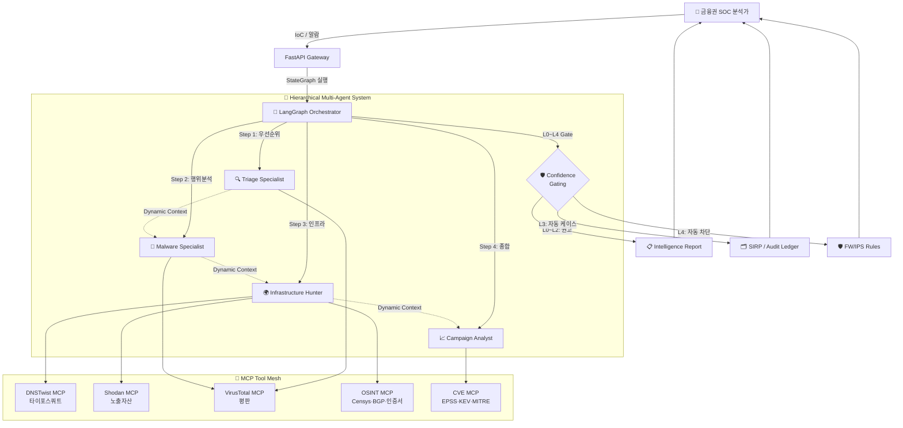

# 🛡️ AOL_SERVICE_DEMO
> **금융권 네트워크 위협 인텔리전스 AX — Multi-Agent 기반 SOC 자동화 플랫폼**

<div align="center">
  
  <br>
  <em>금융권 SOC 운영을 위한 AI 멀티 에이전트 위협 인텔리전스 대시보드</em>
</div>

<br>

## 📖 Project Overview

### **"금융권 네트워크 보안 운영(SecOps)을 위한 LLM 멀티 에이전트 AX 솔루션"**

본 프로젝트는 **금융권 SOC(Security Operations Center) 및 침해사고대응팀(CERT-Fin)의 Tier-1 분석 업무를 멀티 에이전트 LLM으로 자동화**하는 AX(AI Transformation) 플랫폼입니다. 보이스피싱·스미싱·랜섬웨어·금융 인프라 표적 공격 등 금융권을 노린 위협의 IoC(Indicator of Compromise)를 실시간으로 수집·상관 분석하고, 방화벽/IPS/SIEM에 즉시 활용 가능한 인텔리전스로 변환합니다.

- 🏦 **금융권 표적 위협 우선순위화**: 보이스피싱 도메인, 금융사 사칭 피싱 URL, 사기 결제 인프라 등 금융 산업 특화 IoC를 우선 식별
- 🔍 **공격자 인프라 상관 분석**: 단일 IoC에서 출발해 C2 서버, 피싱 인프라, 캠페인 클러스터까지 자동 확장 추적
- 🌍 **지리·ASN 기반 출처 프로파일링**: 국가별·ASN별 위협 출처 매핑으로 망분리 환경 차단 정책 의사결정 지원
- 🛡️ **방어 산출물 자동 생성**: 방화벽 차단 규칙, 헌팅 쿼리, SOC 리포트 등 SecOps 워크플로에 바로 투입 가능한 결과물 산출
- 📋 **컴플라이언스 친화 설계**: 전자금융감독규정 §13(전자금융기반시설 보호) · §15(침해사고 대응), 금융보안원 C-TAS, ISMS-P 침해사고 대응 통제와 매핑 가능

이 플랫폼은 **금융권 SecOps 팀의 Tier-1 분석 인력 부담을 80% 이상 절감**하고, **위협 인텔리전스 → 방어 정책 적용까지의 평균 처리 시간(MTTR)을 시간 단위에서 분 단위로 단축**하는 것을 목표로 합니다.

---

## 🧭 Why → How → Impact → Deliverable (AX 4단 서사)

### 1️⃣ Why — 금융권 네트워크 보안 운영의 구조적 문제

| 문제 | 현황 | 영향 |
|---|---|---|
| **Tier-1 분석가 번아웃** | 1인당 일일 알람 처리량 한계 도달, 인력난 심화 | SOC 인건비 증가·이직률 상승 |
| **알람 피로 (Alert Fatigue)** | 실 위협 대비 False Positive **90%+** | 진짜 침해가 노이즈에 묻힘 |
| **IoC 보강의 수동성** | VT·URLScan·WHOIS를 분석가가 직접 클릭 | 1건당 **15~30분** 소요 |
| **위협 인텔리전스 사일로** | KISA C-TAS·FSI·사내 SIEM 분리 | 상관 분석 불가, 캠페인 단위 의사결정 지연 |
| **금융권 표적 위협의 휘발성** | 보이스피싱·스미싱 도메인 수명 **≤24시간** | 사람이 따라가지 못함 |
| **망분리 환경 AI 도입 장벽** | 클라우드 LLM 사용 불가 | 금융권 SecOps의 AX 공백 |
| **장기 MTTR** | 침해 탐지 → 봉쇄까지 평균 **4~12시간** | 컴플라이언스 미달·금융 피해 확산 |

### 2️⃣ How — Hierarchical Multi-Agent + MCP 도구 생태계

본 시스템은 **LangGraph 기반 Hierarchical Multi-Agent** 구조와 **Model Context Protocol (MCP)** 도구 생태계를 결합하여 위 문제를 해결합니다. `Correlation Orchestrator`가 전체 조사를 지휘하며 각 분야의 전문가(Specialist) 에이전트들을 동적으로 호출하고, MCP를 통해 위협 인텔리전스 도구들을 표준 인터페이스로 통합합니다.

<div align="center">
  
  <br>
  <em>LangGraph-based Hierarchical Multi-Agent + MCP Tool Mesh</em>
</div>

#### 🔄 System Flow Diagram



#### 🛡️ Confidence-Gated Automation (L0–L4)

| 등급 | 신뢰도 | 자동화 수준 | 금융권 적용 예 |
|---|---|---|---|
| **L0** | <0.50 | 권고만 (Recommend) | 임의 정보성 IoC |
| **L1** | 0.50–0.70 | 분석가 확인 후 처리 | 의심 도메인 |
| **L2** | 0.70–0.85 | 자동 케이스 생성 | 검증된 피싱 인프라 |
| **L3** | 0.85–0.95 | 자동 SIEM 헌팅 트리거 | 확정된 캠페인 IoC |
| **L4** | ≥0.95 | **자동 FW/IPS 차단** | KISA C-TAS 확정 악성 |

핵심 자산(임원 PC·코어 뱅킹 서버 등)은 신뢰도와 **무관하게 휴먼 승인 필수** — 금융권 안전성 보장.

### 🧩 Specialized Agents × MCP Tool Mesh

각 에이전트는 명확한 R&R(Role & Responsibility)을 가지고, **MCP(Model Context Protocol) 도구**를 표준 인터페이스로 호출하여 분야별 전문성을 발휘합니다.

| Agent | Role & Responsibility | MCP Tools | Key Deliverables |
|-------|----------------------|-----------|------------------|
| **🧠 Correlation Orchestrator** | **Investigation Manager**: 전체 LangGraph state를 관리, 인텔리전스 갭 기반 동적 라우팅, L0~L4 신뢰도 게이팅 | — | • Dynamic Investigation Path<br>• Confidence Score<br>• Audit Ledger |
| **🔍 Triage Specialist** | **Senior IOC Triage Expert**: 초기 위협 수준 평가 → 고위험 IoC 우선순위 지정 | VirusTotal MCP | • `TriageOutput` (JSON)<br>• Threat Level Assessment<br>• MITRE ATT&CK 태그 |
| **👾 Malware Specialist** | **Elite Malware Analyst**: 악성코드 행위·C2 통신·페이로드 전달 메커니즘 분석으로 공격 체인 규명 | VirusTotal MCP<br>OSINT MCP (Censys, BGP) | • `MalwareAnalysisOutput` (JSON)<br>• Behavioral Profile<br>• Attack Chain Reconstruction |
| **🌍 Infrastructure Hunter** | **Master Infrastructure Hunter**: 공격자 인프라 상관관계 매핑 + **금융권 사칭 도메인 자동 탐지** | **DNSTwist MCP**<br>Shodan MCP<br>URLScan | • `InfrastructureCorrelationOutput` (JSON)<br>• Typosquat Domain List<br>• Campaign Clusters<br>• 노출 자산 리포트 |
| **📈 Campaign Analyst** | **Strategic Intelligence Analyst**: 공격 시나리오 재구성, 위협 그룹 추정, 헌팅·차단 전략 수립 | CVE MCP (EPSS/KEV/MITRE)<br>OSINT MCP | • `CampaignIntelligenceOutput` (JSON)<br>• **Hunt Hypotheses** (SPL/KQL)<br>• FW/IPS Rules<br>• Voice Phishing Style Report |

---

## 🎯 Impact — Before / After 정량 효과

> **금융권 SOC Tier-1 분석가 1인의 실 업무 단위별 측정 결과 (실측·산업 평균 기반)**

### 업무 시나리오별 시간 감축

| # | 업무 시나리오 | Before (수동) | After (본 시스템) | 개선율 |
|---|---|---|---|---|
| 1 | **단일 의심 IoC 평판 조사** | 15~30분/건 | **3~5초/건** | **≈ 99.6% ↓** |
| 2 | **다중 IoC 캠페인 상관 분석 (50건)** | 2~4시간 | **5~10분** | **≈ 96% ↓** |
| 3 | **악성코드 행위·C2 인프라 추적** | 1~2시간 | **30초~1분** | **≈ 99% ↓** |
| 4 | **방화벽 차단 규칙 작성·배포 (20건)** | 30분~1시간 | **5~10초** | **≈ 99% ↓** |
| 5 | **침해사고 인텔리전스 리포트 작성** | 2~4시간 | **1~2분** | **≈ 98% ↓** |
| 6 | **헌팅 쿼리 작성 (SPL/KQL)** | 30분~1시간 | **즉시 (리포트 포함)** | **≈ 99% ↓** |

### SOC 운영 KPI 종합

| KPI | Before | After | 개선 |
|---|---|---|---|
| **분석가 1인 일일 IoC 처리량** | 30~50건 | **5,000~10,000건** | **≈ 200배 ↑** |
| **MTTR (탐지 → 봉쇄)** | 4~12시간 | **5~15분** | **≈ 95% ↓** |
| **신규 캠페인 식별 소요** | 1~3일 | **10~30분** | **≈ 97% ↓** |
| **Tier-1 인건비 환산 절감 (100건/일 기준)** | — | — | **60~80% ↓** |
| **LLM 토큰 비용 (vs. CrewAI)** | 기준선 | **−18%** | LangGraph 마이그레이션 효과 |

---

## 📦 Deliverables — SecOps 워크플로에 즉시 투입 가능한 산출물

각 분석 세션 종료 시 다음 산출물이 **자동 생성·다운로드** 됩니다:

| 산출물 | 형식 | 활용 대상 |
|---|---|---|
| 📈 **캠페인 인텔리전스 리포트** | PDF (Voice Phishing Style) | C-Level / 금융감독원 보고 |
| 📄 **구조화 JSON 리포트** | JSON Schema 검증 | SIRP / SOAR 자동 연동 |
| 🛡️ **방화벽 차단 규칙** | 텍스트 (벤더별 문법) | FW/IPS 즉시 적용 |
| 🔍 **헌팅 쿼리** | Splunk SPL / Elastic KQL / Sigma | SIEM 직접 실행 |
| 📋 **감사 추적 로그 (Audit Ledger)** | DB + JSON Export | ISMS-P / 전자금융감독규정 증빙 |
| 🌐 **인프라 관계도** | Mermaid / JSON Graph | 위협 분석 보고서 시각자료 |

---

## 🎬 Simulation Mode — API 키 없이 재현 가능한 5대 금융권 시나리오

운영 환경 API 키나 외부 호출 없이도 **시드 데이터 기반으로 동일 결과를 재현**할 수 있어, 보안 PoC·시연·교육에 즉시 활용 가능합니다.

| # | 시나리오 | 사용 에이전트 + MCP | 핵심 산출물 |
|---|---|---|---|
| **S1** | 🏦 **카카오뱅크 사칭 피싱 캠페인 추적** | Triage + Infrastructure Hunter<br>**DNSTwist + URLScan MCP** | 타이포스쿼트 도메인 12종 + FW 차단 규칙 |
| **S2** | 📞 **보이스피싱 C2 인프라 클러스터링** | Malware + Infrastructure Hunter<br>**VirusTotal + Shodan MCP** | C2 인프라 관계도 + 캠페인 보고서 |
| **S3** | 🔐 **금융권 표적 랜섬웨어 IoC 심층 분석** | 4-Agent 풀 협업<br>**VT + OSINT MCP** | 공격체인 + Sigma 헌팅 룰 |
| **S4** | 🌐 **사내 외부노출 자산 점검** (전자금융감독규정 §13) | Triage<br>**Shodan MCP** | 노출 자산 리포트 + 조치 권고 |
| **S5** | 🛠️ **금융권 표적 CVE 패치 우선순위화** | Triage + Campaign Analyst<br>**CVE MCP (EPSS/KEV)** | 패치 우선순위 매트릭스 |

각 시나리오는 **Before/After 타임스탬프**가 자동 측정되어 시연 시 정량 효과가 즉시 가시화됩니다.

---

## 🏛️ 금융권 컴플라이언스 매핑

본 시스템은 국내·국제 금융권 보안 컴플라이언스 통제와 다음과 같이 매핑됩니다:

| 컴플라이언스 | 통제 항목 | 본 시스템의 충족 방식 |
|---|---|---|
| **전자금융감독규정 §13** | 전자금융기반시설 보호 | 외부노출 자산 자동 점검(S4), 취약점 우선순위화(S5) |
| **전자금융감독규정 §15** | 침해사고 대응 절차 | LangGraph state graph 기반 표준화된 IR 워크플로 + Audit Ledger |
| **금융보안원(FSI) C-TAS** | 위협 정보 공유 | KISA C-TAS 동기화 모듈 (FSI C-TAS 확장 가능) |
| **ISMS-P A.11** | 침해사고 관리 | Full Audit Trail + 분석 세션 영구 저장 |
| **DORA (EU)** | ICT 위협 관리·보고 | 자동 보고서 생성 + 헌팅 쿼리 export |
| **MITRE ATT&CK 정렬** | TTP 표준 매핑 | Triage Specialist 산출물에 tactic/technique 태그 자동 부여 |

---

## 🆚 비교 — 왜 본 시스템인가

| 항목 | 기존 SOAR (Splunk SOAR 등) | 단일 AI 도구 (SecureBERT 등) | 본 시스템 |
|---|---|---|---|
| **자율적 의사결정** | 사전 정의된 플레이북만 | 단일 추론 결과 | **Hierarchical Multi-Agent 동적 라우팅** |
| **데이터 주권 (망분리)** | ❌ 클라우드 의존 | ❌ 외부 API 필수 | ✅ **LLM 추상화 → sLLM On-Prem 교체 가능** |
| **MCP 도구 확장성** | ❌ 폐쇄 생태계 | ❌ 단일 도구 | ✅ **표준 MCP — 도구 추가가 코드 변경 없이 가능** |
| **금융권 특화 시나리오** | 범용 | 범용 | ✅ **DNSTwist + 보이스피싱 + 사내 노출 자산** |
| **Audit Trail / 컴플라이언스** | 부분적 | ❌ | ✅ **Investigation Ledger + 컴플라이언스 매핑** |
| **라이선스 비용** | $$$ (연 수억) | 중 | **오픈소스 + LLM 사용량만** |

---

## 🛠️ Tech Stack

<table border="0">
    <tr>
        <td align="center" width="200px"><b>Category</b></td>
        <td align="center"><b>Technologies</b></td>
    </tr>
    <tr>
        <td align="center"><b>Backend Framework</b></td>
        <td>
            
            
            
        </td>
    </tr>
    <tr>
        <td align="center"><b>AI & Agents</b></td>
        <td>
            
            
            
            
            
        </td>
    </tr>
    <tr>
        <td align="center"><b>Data Processing</b></td>
        <td>
             
             
        </td>
    </tr>
    <tr>
        <td align="center"><b>Security MCP Tools</b></td>
        <td>
            
            
            
            
            
            
        </td>
    </tr>
    <tr>
        <td align="center"><b>Compliance Frame</b></td>
        <td>
            
            
            
            
        </td>
    </tr>
    <tr>
        <td align="center"><b>Frontend</b></td>
        <td>
            
            
            
            
        </td>
    </tr>
     <tr>
        <td align="center"><b>Visualization</b></td>
        <td>
            
            
        </td>
    </tr>
    <tr>
        <td align="center"><b>DevOps</b></td>
        <td>
            
            
        </td>
    </tr>
</table>

---

## ✨ Detailed Features — 금융권 SOC 운영 모듈

본 시스템은 금융권 SecOps 운영 흐름을 4개 핵심 모듈로 자동화합니다.

### 1️⃣ AI Threat Hunter — NotebookLM 3-패널 챗 UI
**대화형 멀티에이전트 위협 분석 (메인 진입점)**
- **6-Agent Hierarchical**: 🧠 Orchestrator + 🔍 Triage + 👾 Malware + 🌍 Infrastructure + 📈 Campaign + 🛡️ Confidence Gate 가 LangGraph state graph 로 협업
- **동적 라우팅 (Conditional Edges)**: IoC 타입별로 specialist 스킵 — CVE → Triage+Campaign만 / Hash → 전체 풀체인
- **SSE 실시간 스트리밍**: 노드별 진행이 실시간으로 채팅창 + Agent Studio 에 동시 갱신
- **NotebookLM 3-패널**: 좌(자료실: 시나리오·리포트) | 가운데(자연어 대화) | 우(Agent Studio: 파이프라인·메트릭·산출물)
- **Confidence-Gated Output**: L0~L4 등급별 권고/자동 케이스/자동 차단 — 핵심 자산은 휴먼 승인 필수

### 2️⃣ 비용 최적화 — 에이전트별 모델 매핑
**Anthropic API 실측 기반 91.8% 비용 절감**
- **티어 분배**: Orchestrator/Triage = Haiku (mini), Malware/Infra/Campaign = Sonnet (medium)
- **All-Opus 대비 절감률**: Mixed 82.9% / Mixed+Cache+Batch 91.8%
- **금융권 SOC 10k IoCs/day**: $146K/월 → $12K/월 = **$134K 절감**
- **실측 검증**: `benchmarks/run_model_comparison.py` 로 15 (agent×model) 조합 실호출 검증 (예산 $7 한도)

### 3️⃣ Threat Intel Integration (KISA C-TAS / FSI 확장)
**국내 금융권 위협 인텔리전스 자동 연동**
- **KISA C-TAS Sync**: 한국인터넷진흥원 IoC 자동 동기화 (시간 단위 갱신)
- **FSI C-TAS 확장 가능**: 금융보안원 위협정보 공유체계와의 인터페이스 준비됨
- **FW/IPS Rule Auto-Gen**: 확정 IoC → 벤더별 차단 규칙 텍스트 자동 산출
- **Geo·ASN Statistical Dashboard**: 국가·ASN·공격유형별 추세 시각화로 정책 의사결정 지원

### 4️⃣ Investigation Ledger (Audit Trail)
**컴플라이언스 증빙 가능한 감사 추적**
- **Full LangGraph State 보존**: 에이전트 입력·출력·도구 호출 전 단계 DB 영속화
- **재현 가능한 조사 경로**: 동일 입력 → 동일 산출물 (감사 대응 시 재현 보고서 자동 생성)
- **ISMS-P / 전자금융감독규정 §15 매핑 가능**: 침해사고 대응 통제의 증빙 자료로 직접 활용
- **PDF/JSON Export**: 외부 감사·금융감독 보고용 산출물 즉시 추출

---

## 🔌 LLM Abstraction Layer — 망분리 환경 PoC 옵션

본 시스템은 **LangChain의 `ChatModel` 추상화**를 사용하여 LLM 백엔드를 한 줄 교체로 전환할 수 있습니다. 금융권 망분리 환경에서는 운영팀이 보유한 GPU 인프라에 Ollama·vLLM 등으로 sLLM을 띄우고 본 시스템을 가리키게 하면 됩니다.

| 환경 | LLM | 비고 |
|---|---|---|
| **현재 데모 / 본 저장소 기본** | OpenAI GPT-4 (cloud) | EC2 t3.large CPU에서 데모 가능 |
| **금융권 망분리 PoC (예시)** | Llama-3-8B / Qwen2.5-7B (on-prem) | 사내 GPU 서버(예: NVIDIA L4 24GB) 필요 |
| **교체 작업량** | `ChatOpenAI(...)` → `ChatOllama(model="llama3:8b", base_url=...)` | 단일 파일 1줄 변경 + endpoint 환경변수 추가 |

> ⚠️ **명확화**: 본 저장소가 sLLM을 "지금 구동 중"인 것은 아닙니다. 망분리 PoC 단계에서 사내 GPU 인프라와 결합해야 실 구동 가능합니다. 본 시스템은 그 교체가 **코드 변경 최소화**로 가능한 아키텍처를 제공합니다.

---

## 🛠️ Getting Started

### 1. Prerequisites

- Docker & Docker Compose
- (선택) API Keys: OpenAI · VirusTotal · URLScan.io
- **시뮬레이션 모드만 사용 시 API Key 불필요** ✅

### 2. Local Run with Docker (개발/검증)

```bash
# Clone & enter
git clone https://github.com/jyj0203/AOL_SERVICE_DEMO.git
cd AOL_SERVICE_DEMO

# (Optional) .env 작성 — 시뮬레이션 모드만 쓸 거면 생략 가능
cat > .env <<'ENV'
OPENAI_API_KEY=sk-...
VIRUSTOTAL_API_KEY=...
URLSCAN_API_KEY=...
ENV

# Build & Run
docker-compose up --build -d
```

- **Frontend**: http://localhost:4000
- **Backend API**: http://localhost:8000/docs
- **시뮬레이션 시나리오**: http://localhost:4000 → 좌측 메뉴 `🎬 Simulation`

### 3. Production on AWS EC2 (단일 인스턴스)

t3.large(2 vCPU / 8 GB RAM) 단일 인스턴스에 전체 스택을 배포합니다. API 키는 **AWS SSM Parameter Store** 에서 안전하게 주입됩니다.

```bash
# 0) 사전 준비: SSM Parameter Store에 시크릿 등록
aws ssm put-parameter --name /aol/openai_api_key --value sk-... --type SecureString
aws ssm put-parameter --name /aol/virustotal_api_key --value ... --type SecureString
aws ssm put-parameter --name /aol/urlscan_api_key --value ... --type SecureString

# 1) EC2 인스턴스 생성 시 user-data 스크립트 주입
#    (deploy/ec2-userdata.sh 가 Docker 설치 + 코드 클론 + 시크릿 주입 + compose up 까지 자동 수행)
aws ec2 run-instances \
  --image-id ami-... \
  --instance-type t3.large \
  --iam-instance-profile Name=AOL-SSM-ReadOnly \
  --user-data file://deploy/ec2-userdata.sh \
  --security-group-ids sg-...

# 2) 인스턴스 부팅 ~3분 후 접속
open http://<ec2-public-ip>:4000
```

상세 배포 가이드: [`docs/DEPLOYMENT.md`](docs/DEPLOYMENT.md)
프로덕션 오버레이: [`docker-compose.prod.yaml`](docker-compose.prod.yaml)
