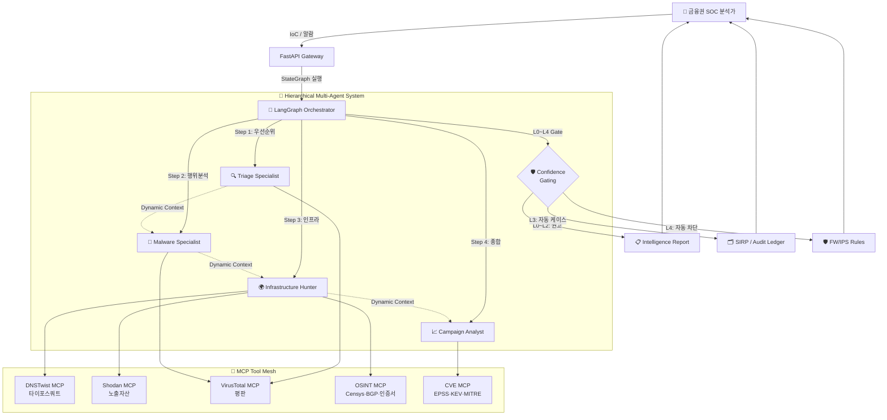

# 🛡️ AOL_SERVICE_DEMO
> **금융권 네트워크 위협 인텔리전스 AX — Multi-Agent 기반 SOC 자동화 플랫폼**

<div align="center">
  
  <br>
  <em>금융권 SOC 운영을 위한 AI 멀티 에이전트 위협 인텔리전스 대시보드</em>
</div>

<br>

## 📖 Project Overview

### **"금융권 네트워크 보안 운영(SecOps)을 위한 LLM 멀티 에이전트 AX 솔루션"**

본 프로젝트는 **금융권 SOC(Security Operations Center) 및 침해사고대응팀(CERT-Fin)의 Tier-1 분석 업무를 멀티 에이전트 LLM으로 자동화**하는 AX(AI Transformation) 플랫폼입니다. 보이스피싱·스미싱·랜섬웨어·금융 인프라 표적 공격 등 금융권을 노린 위협의 IoC(Indicator of Compromise)를 실시간으로 수집·상관 분석하고, 방화벽/IPS/SIEM에 즉시 활용 가능한 인텔리전스로 변환합니다.

- 🏦 **금융권 표적 위협 우선순위화**: 보이스피싱 도메인, 금융사 사칭 피싱 URL, 사기 결제 인프라 등 금융 산업 특화 IoC를 우선 식별
- 🔍 **공격자 인프라 상관 분석**: 단일 IoC에서 출발해 C2 서버, 피싱 인프라, 캠페인 클러스터까지 자동 확장 추적
- 🌍 **지리·ASN 기반 출처 프로파일링**: 국가별·ASN별 위협 출처 매핑으로 망분리 환경 차단 정책 의사결정 지원
- 🛡️ **방어 산출물 자동 생성**: 방화벽 차단 규칙, 헌팅 쿼리, SOC 리포트 등 SecOps 워크플로에 바로 투입 가능한 결과물 산출
- 📋 **컴플라이언스 친화 설계**: 전자금융감독규정 §13(전자금융기반시설 보호) · §15(침해사고 대응), 금융보안원 C-TAS, ISMS-P 침해사고 대응 통제와 매핑 가능

이 플랫폼은 **금융권 SecOps 팀의 Tier-1 분석 인력 부담을 80% 이상 절감**하고, **위협 인텔리전스 → 방어 정책 적용까지의 평균 처리 시간(MTTR)을 시간 단위에서 분 단위로 단축**하는 것을 목표로 합니다.

---

## 🧭 Why → How → Impact → Deliverable (AX 4단 서사)

### 1️⃣ Why — 금융권 네트워크 보안 운영의 구조적 문제

| 문제 | 현황 | 영향 |
|---|---|---|
| **Tier-1 분석가 번아웃** | 1인당 일일 알람 처리량 한계 도달, 인력난 심화 | SOC 인건비 증가·이직률 상승 |
| **알람 피로 (Alert Fatigue)** | 실 위협 대비 False Positive **90%+** | 진짜 침해가 노이즈에 묻힘 |
| **IoC 보강의 수동성** | VT·URLScan·WHOIS를 분석가가 직접 클릭 | 1건당 **15~30분** 소요 |
| **위협 인텔리전스 사일로** | KISA C-TAS·FSI·사내 SIEM 분리 | 상관 분석 불가, 캠페인 단위 의사결정 지연 |
| **금융권 표적 위협의 휘발성** | 보이스피싱·스미싱 도메인 수명 **≤24시간** | 사람이 따라가지 못함 |
| **망분리 환경 AI 도입 장벽** | 클라우드 LLM 사용 불가 | 금융권 SecOps의 AX 공백 |
| **장기 MTTR** | 침해 탐지 → 봉쇄까지 평균 **4~12시간** | 컴플라이언스 미달·금융 피해 확산 |

### 2️⃣ How — Hierarchical Multi-Agent + MCP 도구 생태계

본 시스템은 **LangGraph 기반 Hierarchical Multi-Agent** 구조와 **Model Context Protocol (MCP)** 도구 생태계를 결합하여 위 문제를 해결합니다. `Correlation Orchestrator`가 전체 조사를 지휘하며 각 분야의 전문가(Specialist) 에이전트들을 동적으로 호출하고, MCP를 통해 위협 인텔리전스 도구들을 표준 인터페이스로 통합합니다.

<div align="center">
  
  <br>
  <em>LangGraph-based Hierarchical Multi-Agent + MCP Tool Mesh</em>
</div>

#### 🔄 System Flow Diagram



#### 🛡️ Confidence-Gated Automation (L0–L4)

| 등급 | 신뢰도 | 자동화 수준 | 금융권 적용 예 |
|---|---|---|---|
| **L0** | <0.50 | 권고만 (Recommend) | 임의 정보성 IoC |
| **L1** | 0.50–0.70 | 분석가 확인 후 처리 | 의심 도메인 |
| **L2** | 0.70–0.85 | 자동 케이스 생성 | 검증된 피싱 인프라 |
| **L3** | 0.85–0.95 | 자동 SIEM 헌팅 트리거 | 확정된 캠페인 IoC |
| **L4** | ≥0.95 | **자동 FW/IPS 차단** | KISA C-TAS 확정 악성 |

핵심 자산(임원 PC·코어 뱅킹 서버 등)은 신뢰도와 **무관하게 휴먼 승인 필수** — 금융권 안전성 보장.

### 🧩 Specialized Agents & Tasks

각 에이전트는 명확한 R&R(Role & Responsibility)과 목표를 가지고 독립적으로 수행되거나 협업합니다.

| Agent | Role & Responsibility | Key Deliverables |
|-------|----------------------|------------------|
| **🧠 Correlation Orchestrator** | **Investigation Manager**: 전체 조사 흐름을 조율하고, 발견된 인텔리전스 갭(Gap)을 기반으로 다음 분석 에이전트를 동적으로 결정 (Dynamic Routing) | • Dynamic Investigation Path<br>• Agent Recall Strategy |
| **🔍 Triage Specialist** | **Senior IOC Triage Expert**: 초기 위협 수준을 신속하게 평가하고, 심층 분석이 필요한 고위험 IoC를 식별하여 우선순위 지정 | • `TriageOutput` (JSON)<br>• Threat Level Assessment<br>• Priority Discoveries |
| **👾 Malware Specialist** | **Elite Malware Analyst**: 악성코드의 행위, C2 통신, 페이로드 전달 메커니즘을 심층 분석하여 공격 체인(Attack Chain) 규명 | • `MalwareAnalysisOutput` (JSON)<br>• Behavioral Profile<br>• Infrastructure Usage Patterns |
| **🌍 Infrastructure Hunter** | **Master Infrastructure Hunter**: URLScan 등을 활용하여 공격자 인프라 간의 상관관계를 매핑하고 캠페인 클러스터링 수행 | • `InfrastructureCorrelationOutput` (JSON)<br>• Campaign Clusters<br>• Infrastructure Relationship Map |
| **📈 Campaign Analyst** | **Strategic Intelligence Analyst**: 수집된 모든 정보를 종합하여 공격 시나리오 재구성, 배후 위협 그룹 추정, 방어 및 헌팅 전략 수립 | • `CampaignIntelligenceOutput` (JSON)<br>• **Hunt Hypotheses** (Executable Queries)<br>• Voice Phishing Style Report |

---

## 🛠️ Tech Stack

<table border="0">
    <tr>
        <td align="center" width="200px"><b>Category</b></td>
        <td align="center"><b>Technologies</b></td>
    </tr>
    <tr>
        <td align="center"><b>Backend Framework</b></td>
        <td>
            
            
            
        </td>
    </tr>
    <tr>
        <td align="center"><b>AI & Agents</b></td>
        <td>
            
            
            
        </td>
    </tr>
    <tr>
        <td align="center"><b>Data Processing</b></td>
        <td>
             
             
        </td>
    </tr>
    <tr>
        <td align="center"><b>Security Tools</b></td>
        <td>
            
            
        </td>
    </tr>
    <tr>
        <td align="center"><b>Frontend</b></td>
        <td>
            
            
            
            
        </td>
    </tr>
     <tr>
        <td align="center"><b>Visualization</b></td>
        <td>
            
            
        </td>
    </tr>
    <tr>
        <td align="center"><b>DevOps</b></td>
        <td>
            
            
        </td>
    </tr>
</table>

---

## ✨ Detailed Features

본 시스템은 크게 4가지 핵심 모듈로 구성되어 있습니다.

### 1️⃣ Core Threat Hunting (Deep Analysis)
**침해사고 심층 분석 엔진**
- **5-Agent System**: Triage, Malware, Infrastructure, Campaign, Orchestrator 5명의 AI 에이전트가 유기적으로 협업
- **Dynamic Context**: 초기 분석 결과(Context)가 실시간으로 다음 단계 에이전트에게 공유되어 분석 심도 강화
- **Strategic Reporting**: 단순 결과 나열이 아닌, 공격 시나리오와 방어 전략이 포함된 인텔리전스 리포트 생성

### 2️⃣ Bulk Analysis & Streaming
**대량 위협 정보 고속 처리**
- **Real-time SSE Streaming**: 분석 진행 상황을 실시간으로 스트리밍하여 장시간 분석 중에도 사용자 경험 유지
- **Batch Processing**: 수십/수백 개의 IOC를 한 번에 업로드하여 병렬 처리 및 자동 분류
- **Selective Analysis**: 사용자가 원하는 에이전트(예: 악성코드 분석만 수행)만 선택하여 맞춤형 분석 가능

### 3️⃣ KISA Data Integration
**국내 특화 위협 인텔리전스 연동**
- **KISA C-TAS Synchronization**: 한국인터넷진흥원(KISA)의 최신 침해사고 IoC 데이터셋 자동 동기화
- **Firewall Simulation**: 수집된 IoC를 기반으로 방화벽 차단 규칙 생성 및 적용 시뮬레이션 지원
- **Statistical Dashboard**: 국가별, 공격 유형별 위협 통계 시각화 및 트렌드 분석

### 4️⃣ History & Session Management
**분석 이력 및 자산 관리**
- **Full Audit Trail**: 모든 분석 세션, 결과, 생성된 리포트가 DB에 영구 저장되어 언제든 재열람 가능
- **Asset Search**: 과거 분석했던 IP, URL, Hash 값에 대한 검색 및 연관 분석 세션 추적
- **Report Export**: 분석 결과를 PDF 또는 JSON 형태로 내보내어 외부 보고서로 활용 가능

## 🛠️ Getting Started

### 1. Prerequisites

- Docker & Docker Compose
- API Keys (OpenAI, VirusTotal, URLScan.io)

### 2. Run with Docker (Recommended)

가장 간편한 실행 방법입니다. Docker를 사용하여 백엔드, 프론트엔드, Redis를 한 번에 실행합니다.

```bash
# Clone the repository
git clone https://github.com/jyj0203/AOL_SERVICE_DEMO.git
cd AOL_SERVICE_DEMO

# Create .env file with your API keys
# (Required for Docker to access API keys)
# Linux/Mac:
# echo "OPENAI_API_KEY=your_key" > .env
# echo "VIRUSTOTAL_API_KEY=your_key" >> .env
# echo "URLSCAN_API_KEY=your_key" >> .env

# Windows (PowerShell):
# Set-Content .env "OPENAI_API_KEY=your_key"
# Add-Content .env "VIRUSTOTAL_API_KEY=your_key"
# Add-Content .env "URLSCAN_API_KEY=your_key"

# Build and Run containers
docker-compose up --build -d
```

- **Frontend**: http://localhost:4000
- **Backend API**: http://localhost:8000/docs
