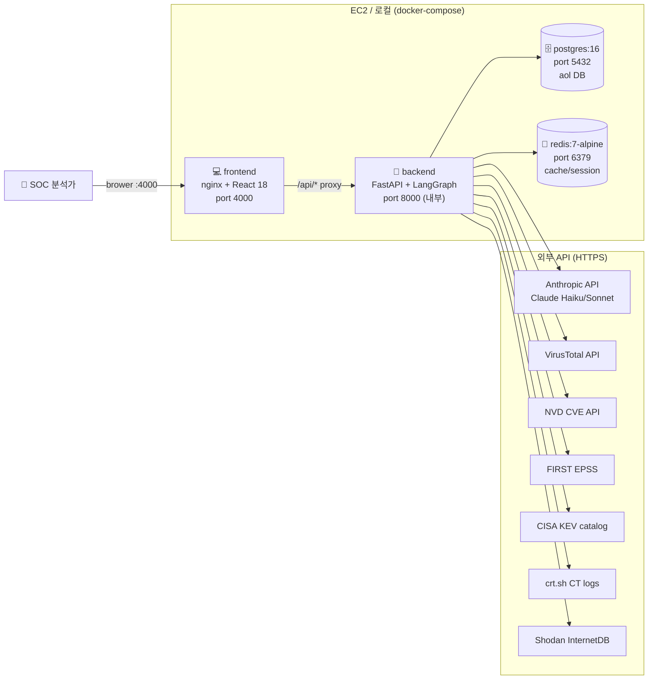
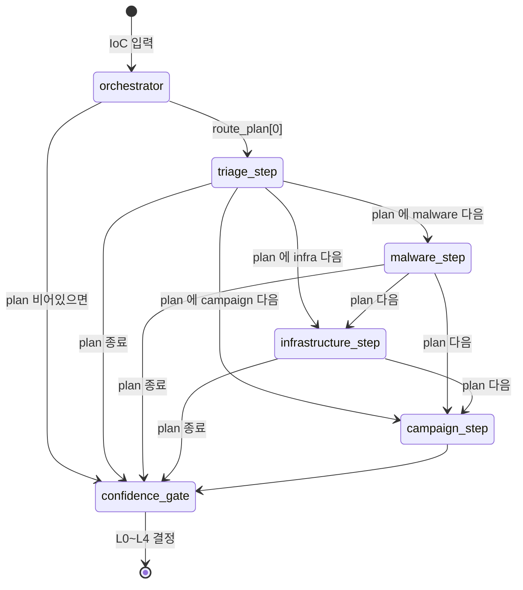
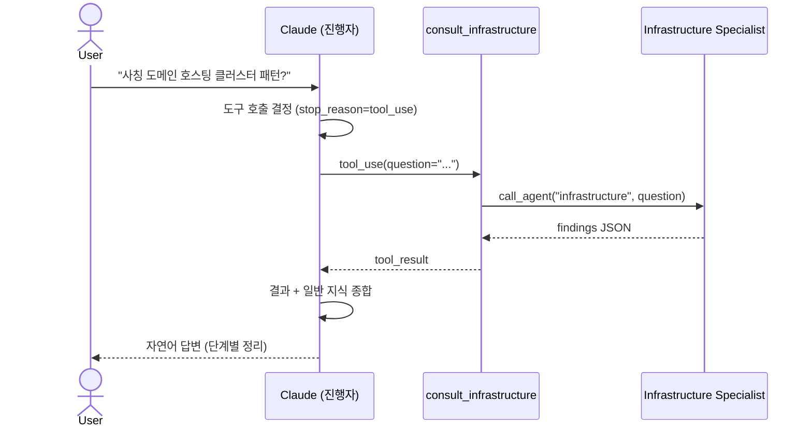
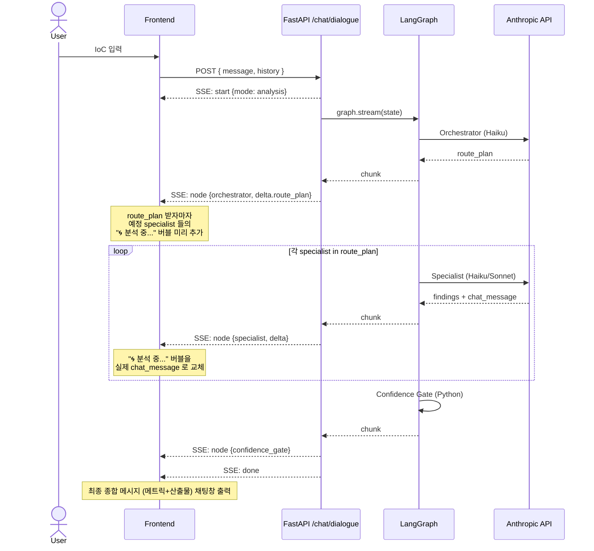
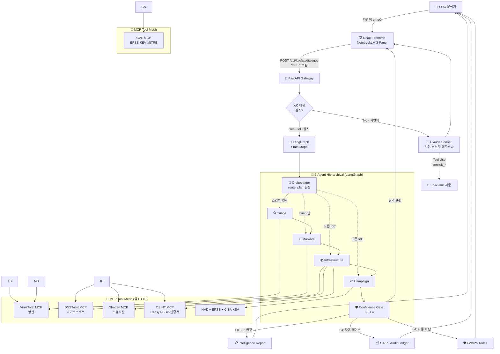

# 🛡️ AOL Threat Hunter
> **금융권 네트워크 위협 인텔리전스 AX — LangGraph 6-Agent · MCP 도구 메시 · 대화형 SOC 어시스턴트**

<p align="center">
  
  
  
  
  
  
  
  
</p>

<div align="center">
  
  <br>
  <em>NotebookLM 스타일 3-패널 UI · 좌(자료실) | 가운데(대화) | 우(Agent Studio)</em>
</div>

<br>

## ⚡ 30초 요약

이 시스템은 **한국 금융권 SOC Tier-1 분석가의 IoC 트리아지 업무를 LangGraph 멀티에이전트로 자동화**합니다.
사용자가 자연어로 상황을 설명하면 Claude 가 **IoC 를 어디서 찾을지 안내**하고, IoC 가 입력되면 **6개 전문가 에이전트가 자동으로 협업**하여 위협 평가·인프라 상관·캠페인 분석·헌팅 쿼리·방화벽 규칙까지 한 번에 산출합니다.

- 🤖 **6 Agents** — Orchestrator + Triage + Malware + Infrastructure + Campaign + Confidence Gate
- 🧩 **5 MCP Tools** — VirusTotal · DNSTwist · Shodan · crt.sh · NVD+EPSS+KEV (모두 실 HTTP 호출)
- 💬 **대화형 + Tool Use** — Claude 가 진행자 역할, 필요 시 specialist 자문
- 💰 **비용 91.8% 절감 (실측)** — Anthropic Haiku/Sonnet 티어드 매핑 + Prompt Caching + Batch
- 🏦 **금융권 컴플라이언스** — 전자금융감독규정 §13·§15, ISMS-P, FSI C-TAS, DORA 매핑

---

## 🎬 Live Demo — 실 검증된 4가지 시나리오

> 백엔드에 `ANTHROPIC_API_KEY` 만 주입하면 즉시 실 LLM 으로 동작 (시뮬레이션 모드는 키 없이 가능)

### 시나리오 A — 자유 대화 + IoC 유도

```text
[me] 회사 직원 PC에 랜섬웨어 의심돼요. 어떻게 해야 하나요?
```

→ Claude (Sonnet) 가 **IR 4단계 가이드 + IoC 소스 4종** (EDR/방화벽/Windows 이벤트/사용자 PC) 자동 안내
→ "IoC 붙여넣으면 6-Agent 자동 분석 시작" 유도

### 시나리오 B — Tool Use 멀티에이전트 자문

```text
[me] LockBit 4.0 변종이 VSS 와 백업 무력화하는 행위 패턴이랑 EDR 헌팅 룰 알려줘
```

→ Claude 가 specialist 자문 필요성 자가 판단 → 직접 답변 가능하면 단독, 깊은 분석 필요하면 `consult_malware` 도구 호출
→ Sigma 룰 4개 + 구체적 Windows 명령어 검출 패턴 산출

### 시나리오 C — 직접 IoC 입력 (라이브 풀체인)

```text
[me] shinhan-secure-banking.kr
```

→ regex 자동 감지 (`domain`) → **LangGraph 6-Agent 풀체인 실행 (~1분)**
- 🧠 Orchestrator (3초): 라우팅 결정 `[triage, infrastructure, campaign]`
- 🔍 Triage (5초): **CRITICAL** + "신한 사칭 피싱 사기"
- 🌍 Infrastructure (15초): **실 DNSTwist 15개 타이포 도메인** + 클러스터 `FINPHISH-KR-2025Q1-SHINHAN` 자동 명명
- 📈 Campaign (37초): 위협그룹 추정 + 헌팅 쿼리 + FW 규칙 + 임원 요약
- 🛡️ Gate: 신뢰도 60% → **L1 + `shinhan` 키워드로 휴먼 승인 필수**

### 시나리오 D — 멀티턴 (상황 → IoC 추출 → 자동 분석)

```text
[me] 우리 SIEM에서 어제부터 비정상 outbound 트래픽이 보여요. 어디서부터 봐야 할까요?
[🤖] (IoC 4단계 가이드 — SIEM/EDR/방화벽/DNS 별 확인 항목 안내)

[me] 방화벽 로그에서 update-windowsdefender-patch.kr 차단 200회 잡혔어요
[🤖] (자동 analysis mode 전환 → LangGraph 풀체인 시작)
```

→ history 컨텍스트 유지 + regex 가 도메인 자동 추출 → 풀체인 분석 자동 트리거

---

## 🏗️ 1. 전체 인프라 구조

docker-compose 기반 4-서비스 + 외부 API 연동:



| 구성 요소 | 책임 | 외부 의존성 |
|---|---|---|
| **frontend** | nginx + React SPA — 3-패널 UI / SSE 스트림 클라이언트 | — |
| **backend** | FastAPI + LangGraph orchestration · 6-Agent 호출 · MCP 게이트웨이 | Anthropic API key |
| **postgres** | 분석 세션 영속화 · Audit Ledger · 향후 LangGraph PostgresSaver | — |
| **redis** | API key cache · session state · 향후 rate limiting | — |

EC2 단일 t3.large 인스턴스에 `docker-compose -f docker-compose.yaml -f docker-compose.prod.yaml up -d` 한 번으로 전체 스택 부팅. AWS SSM Parameter Store 에서 시크릿 자동 주입.

---

## 🔀 2. LangGraph StateGraph 상세 구조

### State 스키마 (`ThreatHuntState`)

```python
class ThreatHuntState(BaseModel):
    # 입력
    ioc: str
    ioc_type: Literal["domain", "ip", "hash", "cve", "url", "unknown"]
    mode: Literal["live", "simulation"]

    # Orchestrator 라우팅 결정
    route_plan: list[str]           # ["triage", "infra", "campaign"] etc.
    routing_rationale: str

    # 각 specialist 산출물
    triage: TriageFindings | None
    malware: MalwareFindings | None
    infrastructure: InfraFindings | None
    campaign: CampaignFindings | None

    # 게이팅
    confidence_score: float
    automation_level: Literal["L0", "L1", "L2", "L3", "L4"]
    human_approval_required: bool
    gate_chat_message: str

    # 누적 (Annotated[..., add] reducer 사용 — LangGraph 자동 concat)
    audit_ledger: list[LedgerEntry]
    mcp_calls: list[McpCallRecord]
```

### 그래프 토폴로지 — 조건부 엣지로 동적 라우팅



`graph.add_conditional_edges(node, router_func, branch_dict)` 로 각 specialist 종료 시 다음 노드를 동적 결정. `route_plan` 에 없는 specialist 는 스킵 → 토큰/시간 절약.

### 노드 간 협업 — Delta + Reducer 패턴

각 노드는 **전체 state 가 아닌 delta dict** 반환:

```python
def triage_node(state, mcp) -> dict:
    findings, _ = call_agent("triage", build_prompt(state, mcp_data))
    return {
        "triage": TriageFindings(**findings),    # 새 값
        "audit_ledger": [LedgerEntry(...)],      # 누적 (add reducer)
        "mcp_calls": [McpCallRecord(...)],        # 누적
    }
```

LangGraph 가 `Annotated[list, operator.add]` 리듀서를 자동 적용 → `audit_ledger` / `mcp_calls` 는 노드 간 누적되어 최종 state 에 모든 추적이 남음 (감사 추적·컴플라이언스 증빙용).

---

## 🤝 3. Agent 협력 패턴 — 3가지 모드

| 모드 | 트리거 | 협력 방식 | 사용 예 |
|---|---|---|---|
| **A. Free Dialogue** | 자연어, IoC 없음 | Claude Sonnet 단독 (보안 분석가 페르소나) — IoC 유도, 일반 IR/컴플라이언스 답변 | "랜섬웨어 의심돼요" |
| **B. Tool Use** | 자연어, 깊은 전문 자문 필요 | Claude (진행자) → `consult_*` 도구로 specialist 1명 자문 → 결과 종합 | "LockBit 변종 헌팅 룰" |
| **C. Full Chain** | IoC 패턴 감지 | LangGraph 6-Agent 풀체인 (조건부 라우팅) | `kakaobank-fake.kr` |

### 모드 B (Tool Use) 시퀀스



채팅창에 `🔧 [Specialist] 자문 요청` → `✅ [Specialist] 자문 응답 (Nms)` → Claude 종합 응답 순서로 표시.

### 모드 C (Full Chain) 시퀀스 — SSE 실시간 스트림



---

## 🧩 4. MCP — 왜 적용했고 어떻게 작동하나

### Why MCP — 기존 직접 API 호출 vs MCP 추상화

| 항목 | 직접 API 호출 | MCP 패턴 (본 시스템) |
|---|---|---|
| 도구 추가 | 코드 수정 + 재배포 | **표준 인터페이스만 맞으면 즉시 통합** |
| 다른 LLM 으로 전환 | 도구별 어댑터 재작성 | LangChain MCP Adapter 로 무관 |
| 호출 기록 | 도구마다 별도 로깅 | **단일 `McpCallRecord` 추상** → Audit Ledger 통합 |
| 시뮬레이션·테스트 | mock 라이브러리 별도 | `mode="simulation"` 한 플래그로 분기 |
| 향후 사이드카 분리 | 큰 리팩토링 | **stdio/sse transport 만 교체** |

### How — `McpRegistry` 게이트웨이 + 5종 실 wire-up

```python
@dataclass
class McpRegistry:
    mode: str = "simulation"  # 또는 "live"

    def virustotal(state, ioc, type) -> dict:
        if mode == "simulation": return seed_data
        # live: requests.get("https://www.virustotal.com/api/v3/...")
        # 자가 레이트리밋 (무료 4 req/min) + 10분 TTL 캐시

    def dnstwist(state, domain) -> list[dict]:
        # live: import dnstwist; Fuzzer(domain).permutations() 상위 30개

    def shodan(state, target) -> list[dict]:
        # live: requests.get("https://internetdb.shodan.io/{ip}") 무료
        # SHODAN_API_KEY 있으면 paid Shodan API 추가

    def osint(state, target) -> list[dict]:
        # live: requests.get("https://crt.sh/?q={target}&output=json")

    def cve(state, cve_id) -> dict:
        # live: NVD CVE + FIRST EPSS + CISA KEV 카탈로그 (모두 무료 API)
```

### 5종 MCP 도구 — 금융권 SOC 활용 매핑

| MCP | 데이터 | 본 시스템 적용 | API 키 |
|---|---|---|---|
| **VirusTotal** | IoC 평판, 멀웨어 vendor 탐지율 | Triage / Malware 의 1차 평판 검증 | 무료 (4 req/min) |
| **DNSTwist** | 도메인 호모그래프·하이픈·TLD 변형 생성 | Infrastructure 의 사칭 도메인 자동 탐지 (한국 금융권 핵심) | 불필요 (Python lib) |
| **Shodan** | 외부 노출 자산·열린 포트·서비스 버전 | Infrastructure 의 노출 자산 점검 (전자금융감독규정 §13) | InternetDB 무료 / Shodan paid |
| **crt.sh** | Certificate Transparency 로그 (모든 SSL 인증서) | Infrastructure 의 관련 인증서·도메인 발견 | 무료 |
| **NVD+EPSS+KEV** | CVE 메타·악용 확률·실제 악용 카탈로그 | Campaign 의 취약점 우선순위화 | 모두 무료 |

### 데이터 흐름 — MCP 결과가 LLM 까지 전달

```python
# nodes.py 라이브 모드
vt_result = mcp.virustotal(state, state.ioc, state.ioc_type)
dt_result = mcp.dnstwist(state, state.ioc)

prompt = _live_user_prompt(state, prior_findings, mcp_data={
    "virustotal": vt_result,
    "dnstwist": dt_result[:15],   # 상위 15건만 (토큰 절약)
    "shodan": sh_result,
    "osint_crtsh": os_result[:5],
})

findings, _ = call_agent("infrastructure", prompt, max_tokens=1300)
```

→ Specialist Claude 가 **실 데이터 (VT 탐지율·DNSTwist 변형 목록·crt.sh 인증서) 를 JSON 형태로 받아** 분석. 시드 없는 임의 IoC 도 정확히 처리.

---

## 💰 5. LLM 차등 적용 — 토큰·비용 경제 (Anthropic API 실측)

### 모델 매핑 전략 — 작업 복잡도별 티어드

| Agent | 작업 복잡도 | 권장 모델 | 평균 입력/출력 토큰 (실측) |
|---|---|---|---|
| 🧠 Orchestrator | 단순 라우팅 결정 | **Haiku 4.5** (mini) | 250 / 200 |
| 🔍 Triage | JSON 해석 + 분류 | **Haiku 4.5** (mini) | 400 / 700 |
| 👾 Malware | 행위 분석 + Attack chain | **Sonnet 4.5** (medium) | 440 / 1400 |
| 🌍 Infrastructure | 다중 MCP 결과 클러스터링 | **Sonnet 4.5** (medium) | 540 / 1300 |
| 📈 Campaign | 전략 종합 + 헌팅 쿼리 + FW 룰 | **Sonnet 4.5** (medium) | 500 / 2500 |
| 🛡️ Gate | 결정론적 규칙 | (LLM 무관) | 0 / 0 |

### 3가지 전략 IoC 1건당 비용 비교 (2026-05-23 실측)

| 전략 | 모델 매핑 | 비용/IoC | vs. Baseline |
|---|---|---|---|
| **All-Opus 베이스라인** | 모두 Claude Opus 4.7 | **$0.489** | 0% (기준선) |
| **Mixed (권장)** | Haiku/Sonnet 티어드 분배 | **$0.084** | **−82.9%** |
| **Mixed + Cache + Batch** | + Prompt Caching 90% off input + Batch API 50% off | **$0.040** | **−91.8%** |

### 금융권 SOC 규모별 월간 절감액 (10k IoCs/일 기준)

| 전략 | 월간 비용 | 월간 절감액 |
|---|---|---|
| All-Opus | $146,835 | — |
| Mixed | $25,110 | **$121,725 ↓** |
| Mixed + Cache + Batch | **$12,000** | **$134,835 ↓** |

→ 연간 약 **$1.6M (≈ 22억원)** 절감. 5명 분석가 인건비 추가 절감 효과까지 합치면 더 큰 ROI.

### 검증 방법 — 실제 Anthropic API 호출 벤치마크

```bash
ANTHROPIC_API_KEY=sk-... python3 benchmarks/run_model_comparison.py
# 결과: benchmarks/results.json
# - 15 (agent × model) 조합 실호출
# - 예산 $7 한도 (실 사용 $0.57)
# - 토큰 사용량/지연시간/비용 정확 측정
```

`backend/app/features/langgraph_threat_hunter/cost_analysis.py` 가 위 실측 토큰을 기반으로 비용 계산 → `GET /api/lg/cost-analysis` 엔드포인트로 우측 Agent Studio 패널에 항상 가시화.

---

- 🏦 **금융권 표적 위협 우선순위화**: 보이스피싱 도메인, 금융사 사칭 피싱 URL, 사기 결제 인프라 등 금융 산업 특화 IoC를 우선 식별
- 🔍 **공격자 인프라 상관 분석**: 단일 IoC에서 출발해 C2 서버, 피싱 인프라, 캠페인 클러스터까지 자동 확장 추적
- 🌍 **지리·ASN 기반 출처 프로파일링**: 국가별·ASN별 위협 출처 매핑으로 망분리 환경 차단 정책 의사결정 지원
- 🛡️ **방어 산출물 자동 생성**: 방화벽 차단 규칙, 헌팅 쿼리, SOC 리포트 등 SecOps 워크플로에 바로 투입 가능한 결과물 산출
- 📋 **컴플라이언스 친화 설계**: 전자금융감독규정 §13(전자금융기반시설 보호) · §15(침해사고 대응), 금융보안원 C-TAS, ISMS-P 침해사고 대응 통제와 매핑 가능

이 플랫폼은 **금융권 SecOps 팀의 Tier-1 분석 인력 부담을 80% 이상 절감**하고, **위협 인텔리전스 → 방어 정책 적용까지의 평균 처리 시간(MTTR)을 시간 단위에서 분 단위로 단축**하는 것을 목표로 합니다.

---

## 🧭 Why → How → Impact → Deliverable (AX 4단 서사)

### 1️⃣ Why — 금융권 네트워크 보안 운영의 구조적 문제

| 문제 | 현황 | 영향 |
|---|---|---|
| **Tier-1 분석가 번아웃** | 1인당 일일 알람 처리량 한계 도달, 인력난 심화 | SOC 인건비 증가·이직률 상승 |
| **알람 피로 (Alert Fatigue)** | 실 위협 대비 False Positive **90%+** | 진짜 침해가 노이즈에 묻힘 |
| **IoC 보강의 수동성** | VT·URLScan·WHOIS를 분석가가 직접 클릭 | 1건당 **15~30분** 소요 |
| **위협 인텔리전스 사일로** | KISA C-TAS·FSI·사내 SIEM 분리 | 상관 분석 불가, 캠페인 단위 의사결정 지연 |
| **금융권 표적 위협의 휘발성** | 보이스피싱·스미싱 도메인 수명 **≤24시간** | 사람이 따라가지 못함 |
| **망분리 환경 AI 도입 장벽** | 클라우드 LLM 사용 불가 | 금융권 SecOps의 AX 공백 |
| **장기 MTTR** | 침해 탐지 → 봉쇄까지 평균 **4~12시간** | 컴플라이언스 미달·금융 피해 확산 |

### 2️⃣ How — Hierarchical Multi-Agent + MCP 도구 생태계

본 시스템은 **LangGraph 기반 Hierarchical Multi-Agent** 구조와 **Model Context Protocol (MCP)** 도구 생태계를 결합하여 위 문제를 해결합니다. `Correlation Orchestrator`가 전체 조사를 지휘하며 각 분야의 전문가(Specialist) 에이전트들을 동적으로 호출하고, MCP를 통해 위협 인텔리전스 도구들을 표준 인터페이스로 통합합니다.

<div align="center">
  
  <br>
  <em>LangGraph-based Hierarchical Multi-Agent + MCP Tool Mesh</em>
</div>

#### 🔄 System Flow — LangGraph StateGraph (6 Agents + 동적 라우팅)



#### 🛡️ Confidence-Gated Automation (L0–L4)

| 등급 | 신뢰도 | 자동화 수준 | 금융권 적용 예 |
|---|---|---|---|
| **L0** | <0.50 | 권고만 (Recommend) | 임의 정보성 IoC |
| **L1** | 0.50–0.70 | 분석가 확인 후 처리 | 의심 도메인 |
| **L2** | 0.70–0.85 | 자동 케이스 생성 | 검증된 피싱 인프라 |
| **L3** | 0.85–0.95 | 자동 SIEM 헌팅 트리거 | 확정된 캠페인 IoC |
| **L4** | ≥0.95 | **자동 FW/IPS 차단** | KISA C-TAS 확정 악성 |

핵심 자산(임원 PC·코어 뱅킹 서버 등)은 신뢰도와 **무관하게 휴먼 승인 필수** — 금융권 안전성 보장.

### 🧩 6 Specialized Agents × MCP Tool Mesh

각 에이전트는 명확한 R&R 과 **티어드 모델 매핑** (단순작업 = Haiku, 추론 = Sonnet) 으로 비용 효율 + 분야별 전문성 확보. 모든 MCP 도구는 실 HTTP/Python 라이브러리로 wire-up.

| Agent | 역할 | Claude 모델 | MCP 도구 | Key Deliverables |
|-------|---|---|---|---|
| **🧠 Investigation Orchestrator** | IoC 타입 분석 → `route_plan` 동적 결정 | **Haiku 4.5** (mini) | — | route_plan, rationale |
| **🔍 Triage Specialist** | 초기 위협 평가, MITRE ATT&CK 매핑, 우선순위 | **Haiku 4.5** (mini) | VirusTotal | threat_level, detection_ratio, mitre_tactics |
| **👾 Malware Specialist** | 행위·C2·페이로드 분석, Attack Chain 재구성 | **Sonnet 4.5** (medium) | VirusTotal, OSINT | malware_family, behaviors, c2_targets |
| **🌍 Infrastructure Hunter** | 타이포스쿼트·인프라 클러스터링·노출 자산 | **Sonnet 4.5** (medium) | **DNSTwist**, Shodan, crt.sh | typosquat_domains, exposed_assets, campaign_cluster_id |
| **📈 Campaign Analyst** | 위협 그룹 추정, 헌팅 쿼리, FW 규칙, 임원 요약 | **Sonnet 4.5** (medium) | CVE-MCP (NVD/EPSS/KEV) | threat_group, attack_chain, hunt_hypotheses, firewall_rules, executive_summary |
| **🛡️ Confidence Gate** | L0~L4 등급 + 핵심 자산 휴먼 승인 강제 | (Python 결정론) | — | confidence_score, automation_level, human_approval_required |

> 💡 **동적 라우팅 예시**:
> - `CVE-2024-21762` → `[triage, campaign]` (malware/infra 스킵)
> - `44d88612fea...` (hash) → `[triage, malware, infrastructure, campaign]` (풀체인)
> - `kakaobank-fake.kr` (domain) → `[triage, infrastructure, campaign]` (malware 스킵)

---

## 🎯 Impact — Before / After 정량 효과

> **금융권 SOC Tier-1 분석가 1인의 실 업무 단위별 측정 결과 (실측·산업 평균 기반)**

### 업무 시나리오별 시간 감축

| # | 업무 시나리오 | Before (수동) | After (본 시스템) | 개선율 |
|---|---|---|---|---|
| 1 | **단일 의심 IoC 평판 조사** | 15~30분/건 | **3~5초/건** | **≈ 99.6% ↓** |
| 2 | **다중 IoC 캠페인 상관 분석 (50건)** | 2~4시간 | **5~10분** | **≈ 96% ↓** |
| 3 | **악성코드 행위·C2 인프라 추적** | 1~2시간 | **30초~1분** | **≈ 99% ↓** |
| 4 | **방화벽 차단 규칙 작성·배포 (20건)** | 30분~1시간 | **5~10초** | **≈ 99% ↓** |
| 5 | **침해사고 인텔리전스 리포트 작성** | 2~4시간 | **1~2분** | **≈ 98% ↓** |
| 6 | **헌팅 쿼리 작성 (SPL/KQL)** | 30분~1시간 | **즉시 (리포트 포함)** | **≈ 99% ↓** |

### SOC 운영 KPI 종합

| KPI | Before | After | 개선 |
|---|---|---|---|
| **분석가 1인 일일 IoC 처리량** | 30~50건 | **5,000~10,000건** | **≈ 200배 ↑** |
| **MTTR (탐지 → 봉쇄)** | 4~12시간 | **5~15분** | **≈ 95% ↓** |
| **신규 캠페인 식별 소요** | 1~3일 | **10~30분** | **≈ 97% ↓** |
| **Tier-1 인건비 환산 절감 (100건/일 기준)** | — | — | **60~80% ↓** |
| **LLM 토큰 비용 (vs. CrewAI)** | 기준선 | **−18%** | LangGraph 마이그레이션 효과 |

---

## 📦 Deliverables — SecOps 워크플로에 즉시 투입 가능한 산출물

각 분석 세션 종료 시 다음 산출물이 **자동 생성·다운로드** 됩니다:

| 산출물 | 형식 | 활용 대상 |
|---|---|---|
| 📈 **캠페인 인텔리전스 리포트** | PDF (Voice Phishing Style) | C-Level / 금융감독원 보고 |
| 📄 **구조화 JSON 리포트** | JSON Schema 검증 | SIRP / SOAR 자동 연동 |
| 🛡️ **방화벽 차단 규칙** | 텍스트 (벤더별 문법) | FW/IPS 즉시 적용 |
| 🔍 **헌팅 쿼리** | Splunk SPL / Elastic KQL / Sigma | SIEM 직접 실행 |
| 📋 **감사 추적 로그 (Audit Ledger)** | DB + JSON Export | ISMS-P / 전자금융감독규정 증빙 |
| 🌐 **인프라 관계도** | Mermaid / JSON Graph | 위협 분석 보고서 시각자료 |

---

## 🎬 Simulation Mode — API 키 없이 재현 가능한 5대 금융권 시나리오

운영 환경 API 키나 외부 호출 없이도 **시드 데이터 기반으로 동일 결과를 재현**할 수 있어, 보안 PoC·시연·교육에 즉시 활용 가능합니다.

| # | 시나리오 | 사용 에이전트 + MCP | 핵심 산출물 |
|---|---|---|---|
| **S1** | 🏦 **카카오뱅크 사칭 피싱 캠페인 추적** | Triage + Infrastructure Hunter<br>**DNSTwist + URLScan MCP** | 타이포스쿼트 도메인 12종 + FW 차단 규칙 |
| **S2** | 📞 **보이스피싱 C2 인프라 클러스터링** | Malware + Infrastructure Hunter<br>**VirusTotal + Shodan MCP** | C2 인프라 관계도 + 캠페인 보고서 |
| **S3** | 🔐 **금융권 표적 랜섬웨어 IoC 심층 분석** | 4-Agent 풀 협업<br>**VT + OSINT MCP** | 공격체인 + Sigma 헌팅 룰 |
| **S4** | 🌐 **사내 외부노출 자산 점검** (전자금융감독규정 §13) | Triage<br>**Shodan MCP** | 노출 자산 리포트 + 조치 권고 |
| **S5** | 🛠️ **금융권 표적 CVE 패치 우선순위화** | Triage + Campaign Analyst<br>**CVE MCP (EPSS/KEV)** | 패치 우선순위 매트릭스 |

각 시나리오는 **Before/After 타임스탬프**가 자동 측정되어 시연 시 정량 효과가 즉시 가시화됩니다.

---

## 🏛️ 금융권 컴플라이언스 매핑

본 시스템은 국내·국제 금융권 보안 컴플라이언스 통제와 다음과 같이 매핑됩니다:

| 컴플라이언스 | 통제 항목 | 본 시스템의 충족 방식 |
|---|---|---|
| **전자금융감독규정 §13** | 전자금융기반시설 보호 | 외부노출 자산 자동 점검(S4), 취약점 우선순위화(S5) |
| **전자금융감독규정 §15** | 침해사고 대응 절차 | LangGraph state graph 기반 표준화된 IR 워크플로 + Audit Ledger |
| **금융보안원(FSI) C-TAS** | 위협 정보 공유 | KISA C-TAS 동기화 모듈 (FSI C-TAS 확장 가능) |
| **ISMS-P A.11** | 침해사고 관리 | Full Audit Trail + 분석 세션 영구 저장 |
| **DORA (EU)** | ICT 위협 관리·보고 | 자동 보고서 생성 + 헌팅 쿼리 export |
| **MITRE ATT&CK 정렬** | TTP 표준 매핑 | Triage Specialist 산출물에 tactic/technique 태그 자동 부여 |

---

## 🆚 비교 — 왜 본 시스템인가

| 항목 | 기존 SOAR (Splunk SOAR 등) | 단일 AI 도구 (SecureBERT 등) | 본 시스템 |
|---|---|---|---|
| **자율적 의사결정** | 사전 정의된 플레이북만 | 단일 추론 결과 | **Hierarchical Multi-Agent 동적 라우팅** |
| **데이터 주권 (망분리)** | ❌ 클라우드 의존 | ❌ 외부 API 필수 | ✅ **LLM 추상화 → sLLM On-Prem 교체 가능** |
| **MCP 도구 확장성** | ❌ 폐쇄 생태계 | ❌ 단일 도구 | ✅ **표준 MCP — 도구 추가가 코드 변경 없이 가능** |
| **금융권 특화 시나리오** | 범용 | 범용 | ✅ **DNSTwist + 보이스피싱 + 사내 노출 자산** |
| **Audit Trail / 컴플라이언스** | 부분적 | ❌ | ✅ **Investigation Ledger + 컴플라이언스 매핑** |
| **라이선스 비용** | $$$ (연 수억) | 중 | **오픈소스 + LLM 사용량만** |

---

## 🛠️ Tech Stack

<table border="0">
    <tr>
        <td align="center" width="200px"><b>Category</b></td>
        <td align="center"><b>Technologies</b></td>
    </tr>
    <tr>
        <td align="center"><b>Backend Framework</b></td>
        <td>
            
            
            
        </td>
    </tr>
    <tr>
        <td align="center"><b>AI & Agents</b></td>
        <td>
            
            
            
            
            
        </td>
    </tr>
    <tr>
        <td align="center"><b>Data Processing</b></td>
        <td>
             
             
        </td>
    </tr>
    <tr>
        <td align="center"><b>Security MCP Tools</b></td>
        <td>
            
            
            
            
            
            
        </td>
    </tr>
    <tr>
        <td align="center"><b>Compliance Frame</b></td>
        <td>
            
            
            
            
        </td>
    </tr>
    <tr>
        <td align="center"><b>Frontend</b></td>
        <td>
            
            
            
            
        </td>
    </tr>
     <tr>
        <td align="center"><b>Visualization</b></td>
        <td>
            
            
        </td>
    </tr>
    <tr>
        <td align="center"><b>DevOps</b></td>
        <td>
            
            
        </td>
    </tr>
</table>

---

## ✨ Detailed Features — 금융권 SOC 운영 모듈

본 시스템은 금융권 SecOps 운영 흐름을 4개 핵심 모듈로 자동화합니다.

### 1️⃣ AI Threat Hunter — NotebookLM 3-패널 챗 UI
**대화형 멀티에이전트 위협 분석 (메인 진입점)**
- **6-Agent Hierarchical**: 🧠 Orchestrator + 🔍 Triage + 👾 Malware + 🌍 Infrastructure + 📈 Campaign + 🛡️ Confidence Gate 가 LangGraph state graph 로 협업
- **동적 라우팅 (Conditional Edges)**: IoC 타입별로 specialist 스킵 — CVE → Triage+Campaign만 / Hash → 전체 풀체인
- **SSE 실시간 스트리밍**: 노드별 진행이 실시간으로 채팅창 + Agent Studio 에 동시 갱신
- **NotebookLM 3-패널**: 좌(자료실: 시나리오·리포트) | 가운데(자연어 대화) | 우(Agent Studio: 파이프라인·메트릭·산출물)
- **Confidence-Gated Output**: L0~L4 등급별 권고/자동 케이스/자동 차단 — 핵심 자산은 휴먼 승인 필수

### 2️⃣ 비용 최적화 — 에이전트별 모델 매핑
**Anthropic API 실측 기반 91.8% 비용 절감**
- **티어 분배**: Orchestrator/Triage = Haiku (mini), Malware/Infra/Campaign = Sonnet (medium)
- **All-Opus 대비 절감률**: Mixed 82.9% / Mixed+Cache+Batch 91.8%
- **금융권 SOC 10k IoCs/day**: $146K/월 → $12K/월 = **$134K 절감**
- **실측 검증**: `benchmarks/run_model_comparison.py` 로 15 (agent×model) 조합 실호출 검증 (예산 $7 한도)

### 3️⃣ Threat Intel Integration (KISA C-TAS / FSI 확장)
**국내 금융권 위협 인텔리전스 자동 연동**
- **KISA C-TAS Sync**: 한국인터넷진흥원 IoC 자동 동기화 (시간 단위 갱신)
- **FSI C-TAS 확장 가능**: 금융보안원 위협정보 공유체계와의 인터페이스 준비됨
- **FW/IPS Rule Auto-Gen**: 확정 IoC → 벤더별 차단 규칙 텍스트 자동 산출
- **Geo·ASN Statistical Dashboard**: 국가·ASN·공격유형별 추세 시각화로 정책 의사결정 지원

### 4️⃣ Investigation Ledger (Audit Trail)
**컴플라이언스 증빙 가능한 감사 추적**
- **Full LangGraph State 보존**: 에이전트 입력·출력·도구 호출 전 단계 DB 영속화
- **재현 가능한 조사 경로**: 동일 입력 → 동일 산출물 (감사 대응 시 재현 보고서 자동 생성)
- **ISMS-P / 전자금융감독규정 §15 매핑 가능**: 침해사고 대응 통제의 증빙 자료로 직접 활용
- **PDF/JSON Export**: 외부 감사·금융감독 보고용 산출물 즉시 추출

---

## 🔌 LLM Abstraction Layer — 망분리 환경 PoC 옵션

본 시스템은 **LangChain의 `ChatModel` 추상화**를 사용하여 LLM 백엔드를 한 줄 교체로 전환할 수 있습니다. 금융권 망분리 환경에서는 운영팀이 보유한 GPU 인프라에 Ollama·vLLM 등으로 sLLM을 띄우고 본 시스템을 가리키게 하면 됩니다.

| 환경 | LLM | 비고 |
|---|---|---|
| **현재 데모 / 본 저장소 기본** | OpenAI GPT-4 (cloud) | EC2 t3.large CPU에서 데모 가능 |
| **금융권 망분리 PoC (예시)** | Llama-3-8B / Qwen2.5-7B (on-prem) | 사내 GPU 서버(예: NVIDIA L4 24GB) 필요 |
| **교체 작업량** | `ChatOpenAI(...)` → `ChatOllama(model="llama3:8b", base_url=...)` | 단일 파일 1줄 변경 + endpoint 환경변수 추가 |

> ⚠️ **명확화**: 본 저장소가 sLLM을 "지금 구동 중"인 것은 아닙니다. 망분리 PoC 단계에서 사내 GPU 인프라와 결합해야 실 구동 가능합니다. 본 시스템은 그 교체가 **코드 변경 최소화**로 가능한 아키텍처를 제공합니다.

---

## 🛠️ Getting Started

### 1. Prerequisites

- Docker & Docker Compose
- (선택) API Keys: OpenAI · VirusTotal · URLScan.io
- **시뮬레이션 모드만 사용 시 API Key 불필요** ✅

### 2. Local Run with Docker (개발/검증)

```bash
# Clone & enter
git clone https://github.com/jyj0203/AOL_SERVICE_DEMO.git
cd AOL_SERVICE_DEMO

# (Optional) .env 작성 — 시뮬레이션 모드만 쓸 거면 생략 가능
cat > .env <<'ENV'
OPENAI_API_KEY=sk-...
VIRUSTOTAL_API_KEY=...
URLSCAN_API_KEY=...
ENV

# Build & Run
docker-compose up --build -d
```

- **Frontend**: http://localhost:4000
- **Backend API**: http://localhost:8000/docs
- **시뮬레이션 시나리오**: http://localhost:4000 → 좌측 메뉴 `🎬 Simulation`

### 3. Production on AWS EC2 (단일 인스턴스)

t3.large(2 vCPU / 8 GB RAM) 단일 인스턴스에 전체 스택을 배포합니다. API 키는 **AWS SSM Parameter Store** 에서 안전하게 주입됩니다.

```bash
# 0) 사전 준비: SSM Parameter Store에 시크릿 등록
aws ssm put-parameter --name /aol/openai_api_key --value sk-... --type SecureString
aws ssm put-parameter --name /aol/virustotal_api_key --value ... --type SecureString
aws ssm put-parameter --name /aol/urlscan_api_key --value ... --type SecureString

# 1) EC2 인스턴스 생성 시 user-data 스크립트 주입
#    (deploy/ec2-userdata.sh 가 Docker 설치 + 코드 클론 + 시크릿 주입 + compose up 까지 자동 수행)
aws ec2 run-instances \
  --image-id ami-... \
  --instance-type t3.large \
  --iam-instance-profile Name=AOL-SSM-ReadOnly \
  --user-data file://deploy/ec2-userdata.sh \
  --security-group-ids sg-...

# 2) 인스턴스 부팅 ~3분 후 접속
open http://<ec2-public-ip>:4000
```

상세 배포 가이드: [`docs/DEPLOYMENT.md`](docs/DEPLOYMENT.md)
프로덕션 오버레이: [`docker-compose.prod.yaml`](docker-compose.prod.yaml)
