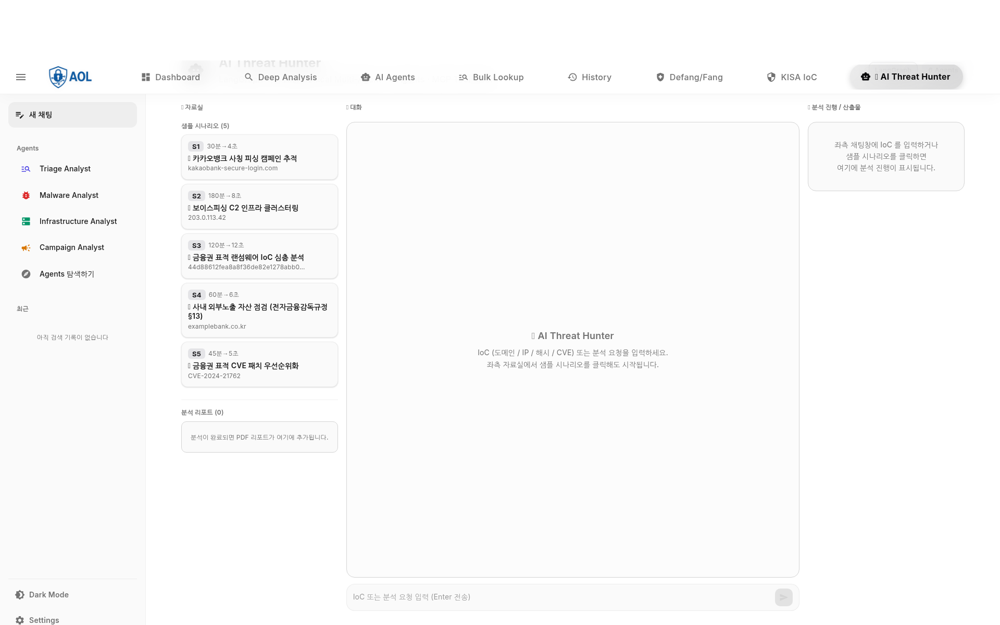
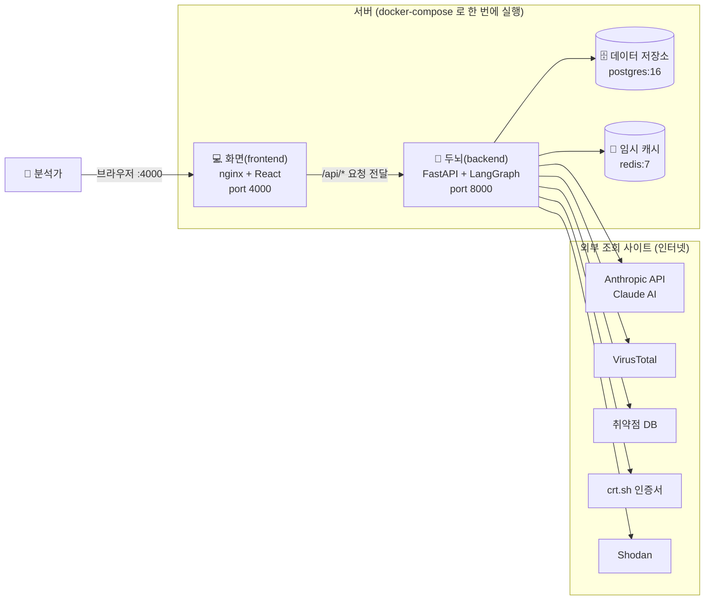
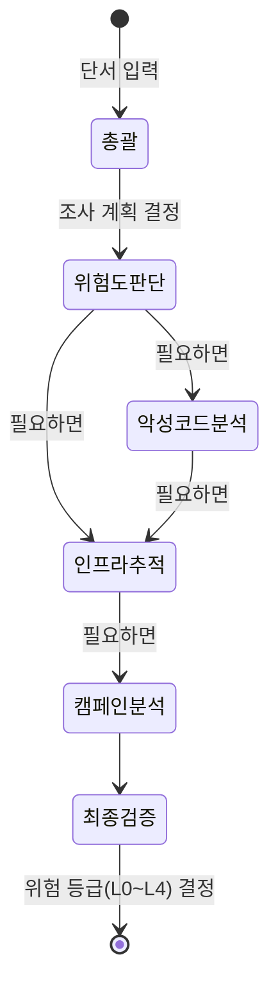
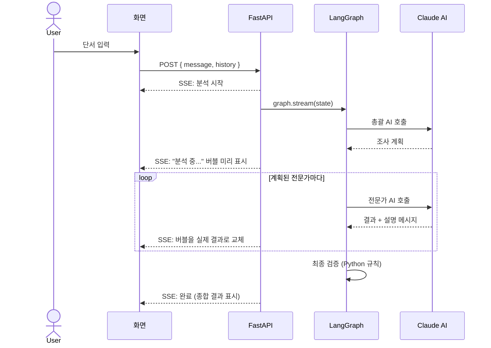

# 🛡️ AOL IOC Intelligence

> **금융권 보안관제 업무를 도와주는 대화형 AI 분석 도우미** — 여러 개의 AI가 협력해서 "이 인터넷 주소/파일이 위험한지" 조사하고, 막을 방법까지 정리해 줍니다.

<p align="center">
  
  
  
  
  
  
  
</p>

<div align="center">
  
  <br>
  <em>NotebookLM 스타일 3-패널 화면 · 왼쪽(자료실) | 가운데(대화) | 오른쪽(분석 과정 보기)</em>
</div>

<br>

---

## 📖 이게 뭔가요? (1분 설명)

은행·증권 같은 금융회사에는 **보안관제실(SOC)** 이 있습니다. 여기서 일하는 분석가들은 하루 종일 "이 인터넷 주소가 악성인가?", "이 파일이 바이러스인가?" 같은 의심 신호를 하나하나 확인합니다. 그런데 신호가 너무 많고, 하나를 조사하려면 여러 사이트를 일일이 찾아봐야 해서 시간이 오래 걸립니다.

**이 프로젝트는 그 반복 조사 작업을 AI가 대신 해 줍니다.**

사용자가 채팅창에 평소 말하듯이 상황을 설명하면(예: *"직원 PC가 랜섬웨어에 걸린 것 같아요"*), AI가 어디를 확인해야 하는지 안내합니다. 그리고 의심스러운 주소나 파일 정보를 입력하면, **6개의 AI 전문가가 자동으로 나눠서 조사**하고 — 얼마나 위험한지, 공격자가 쓰는 다른 주소는 없는지, 어떻게 차단하면 되는지까지 — 한 번에 정리해 줍니다.

마지막 결정과 실제 차단은 **사람이 검토한 뒤** 하도록 설계되어 있어서, AI가 멋대로 중요한 조치를 하지 않습니다.

---

## 🔑 먼저, 자주 나오는 용어부터

이 문서에 나오는 줄임말과 보안 용어를 먼저 풀어 둡니다.

| 용어 | 쉽게 말하면 |
|---|---|
| **SOC (보안관제실)** | 회사의 보안 상황을 24시간 지켜보는 팀/공간. "Security Operations Center" |
| **분석가 (Tier-1)** | 들어오는 의심 신호를 가장 먼저 확인하는 1차 담당자 |
| **IoC (침해지표)** | "공격당했다는 흔적/단서". 예를 들면 악성 인터넷 주소(도메인), 의심스러운 IP, 파일의 지문값(해시) 같은 것 |
| **AI 에이전트** | 한 가지 역할을 맡아 스스로 판단하고 일하는 AI. 이 프로젝트는 역할이 다른 6개의 에이전트가 협력합니다 |
| **LLM / Claude** | 사람 말을 이해하고 답하는 거대 AI 모델. 여기서는 Anthropic의 Claude를 사용합니다 |
| **MCP** | AI가 외부 보안 조회 도구(바이러스 검사 사이트 등)를 표준화된 방식으로 불러 쓰게 해 주는 연결 규격 |
| **LangGraph** | 여러 AI 에이전트가 "누가 먼저, 누가 다음에" 일할지 흐름을 짜 주는 도구 |
| **피싱 / 사칭 도메인** | 진짜 은행 사이트인 척 흉내 낸 가짜 주소 (예: `shinhan-secure-banking.kr`) |
| **방화벽 규칙 / 헌팅 쿼리** | 공격을 막거나(차단), 내부에 같은 흔적이 더 있는지 찾아내는(검색) 설정·명령문 |

> 더 자세한 내용을 보기 전에, 이 표만 알고 있어도 아래 내용을 따라올 수 있습니다.

---

## ⚡ 핵심 기능 요약

- 🤖 **6개의 AI 전문가** — 총괄(Orchestrator) + 위험도 판단 + 악성코드 분석 + 인프라 추적 + 캠페인 분석 + 최종 검증(Confidence Gate)
- 🧩 **5개의 외부 조회 도구 연동** — VirusTotal(평판 조회) · DNSTwist(사칭 도메인 탐지) · Shodan(노출 자산 점검) · crt.sh(인증서 조회) · 취약점 DB(NVD/EPSS/KEV). 모두 실제로 인터넷에서 조회합니다
- 💬 **그냥 말로 물어보면 됩니다** — AI가 진행자 역할을 하고, 깊은 분석이 필요하면 알아서 전문가 AI에게 자문을 구합니다
- 💰 **비용 효율** — 쉬운 일은 저렴한 모델(Haiku), 어려운 일은 똑똑한 모델(Sonnet)로 나눠서 처리. Anthropic API로 실제 측정한 결과 Sonnet만 쓸 때보다 약 59% 저렴 (자세한 측정은 아래 비용 섹션)
- 🏦 **금융권 맞춤** — 보이스피싱·은행 사칭 같은 한국 금융권에서 자주 보이는 위협 유형에 초점. 전자금융감독규정·ISMS-P 등 컴플라이언스 항목과의 연결 관계도 매핑 자료로 제공

---

## 🎬 직접 써 보는 4가지 방식

> 백엔드에 `ANTHROPIC_API_KEY`(Claude 사용 키)만 넣으면 실제 AI로 동작합니다. 키가 없어도 미리 준비된 예시 데이터로 똑같이 시연할 수 있습니다(시뮬레이션 모드).

### 방식 A — 그냥 상황을 설명하기

```text
[나] 회사 직원 PC에 랜섬웨어가 의심돼요. 어떻게 해야 하나요?
```

→ AI가 **대응 4단계 가이드와, 단서를 어디서 찾을 수 있는지**(백신 프로그램/방화벽/Windows 기록/직원 PC)를 안내합니다.
→ "찾은 흔적을 붙여넣으면 6개 AI가 자동 분석을 시작합니다"라고 알려 줍니다.

### 방식 B — 전문 지식을 물어보기

```text
[나] LockBit 4.0 랜섬웨어 변종이 백업을 무력화하는 행동 패턴과, 이를 잡아낼 탐지 규칙을 알려줘
```

→ AI가 "이건 깊은 분석이 필요하겠다"고 스스로 판단해서, 필요하면 악성코드 전문 AI에게 자문을 구합니다.
→ 탐지 규칙(Sigma)과 구체적인 Windows 명령어 패턴을 정리해 줍니다.

### 방식 C — 의심스러운 주소를 바로 입력하기

```text
[나] shinhan-secure-banking.kr
```

→ 입력값이 도메인 주소임을 자동 인식 → **6개 AI가 순서대로 약 1분간 조사**합니다.
- 🧠 총괄 AI: 어떤 전문가들을 부를지 결정
- 🔍 위험도 판단: **위험(CRITICAL)** + "신한은행 사칭 피싱으로 추정"
- 🌍 인프라 추적: **실제로 비슷한 사칭 도메인 15개**를 찾아내고, 같은 공격 묶음으로 자동 분류
- 📈 캠페인 분석: 공격 그룹 추정 + 탐지용 검색문 + 차단 규칙 + 경영진 보고용 요약
- 🛡️ 최종 검증: 신뢰도가 충분치 않거나 'shinhan' 같은 민감 키워드가 있으면 **사람의 승인을 반드시 거치도록** 표시

### 방식 D — 대화하면서 단서 찾아가기

```text
[나] SIEM에서 어제부터 이상한 외부 통신이 보여요. 어디부터 봐야 할까요?
[🤖] (어디를 확인하면 되는지 단계별 안내 — SIEM/백신/방화벽/DNS 기록)

[나] 방화벽 로그에서 update-windowsdefender-patch.kr 차단이 200번 잡혔어요
[🤖] (자동으로 분석 모드로 전환 → 6개 AI 조사 시작)
```

→ 앞 대화 내용을 기억하면서, 메시지에서 도메인 주소를 자동으로 뽑아내 분석을 시작합니다.

---

## 🏗️ 1. 전체 시스템 구성

이 시스템은 Docker라는 도구로 4개의 프로그램을 한 번에 띄웁니다. 아래 그림이 전체 구조입니다.



| 구성 요소 | 하는 일 |
|---|---|
| **화면 (frontend)** | 분석가가 보는 웹 화면. 3-패널 구성, 분석 진행을 실시간으로 보여 줌 |
| **두뇌 (backend)** | 실제 분석 로직. 6개 AI를 부르고, 외부 도구를 호출하는 핵심 |
| **데이터 저장소 (postgres)** | 분석 기록을 영구 보관 (나중에 감사·증빙용) |
| **임시 캐시 (redis)** | 자주 쓰는 값을 잠깐 저장해서 속도를 높임 |

> AWS EC2 서버 한 대에 명령어 한 줄로 전체를 띄울 수 있게 만들어 두었습니다. 비밀 키들은 AWS의 안전한 보관소(SSM Parameter Store)에서 자동으로 불러옵니다.

---

## 🔀 2. 6개의 AI가 협력하는 방식 (LangGraph)

여러 AI가 무작정 다 같이 일하면 느리고 비쌉니다. 그래서 **입력된 단서의 종류에 따라 필요한 전문가만 골라서** 일하게 했습니다. 이 "누가 다음에 일할지" 흐름을 LangGraph로 짰습니다.



예를 들어 **취약점 번호**가 들어오면 악성코드·인프라 단계는 건너뛰고, **파일 해시값**이 들어오면 전체 단계를 다 거칩니다. 필요 없는 단계를 건너뛰니 시간과 비용이 절약됩니다.

또한 각 AI가 한 일은 모두 **감사 기록(audit ledger)** 에 차곡차곡 쌓입니다. 나중에 "왜 이런 결론을 냈는지" 추적하거나 컴플라이언스 증빙으로 쓸 수 있습니다.

<details>
<summary>📂 기술 상세 — 내부 상태(State) 구조와 동작 원리 (펼쳐 보기)</summary>

각 AI는 전체 데이터가 아니라 자기가 바꾼 부분(delta)만 돌려주고, LangGraph가 이를 자동으로 합칩니다.

```python
class ThreatHuntState(BaseModel):
    ioc: str                               # 입력된 단서
    ioc_type: Literal["domain", "ip", "hash", "cve", "url", "unknown"]
    route_plan: list[str]                  # 부를 전문가 목록
    triage / malware / infrastructure / campaign  # 각 전문가 결과
    confidence_score: float                # 신뢰도 점수
    automation_level: Literal["L0", "L1", "L2", "L3", "L4"]
    human_approval_required: bool          # 사람 승인 필요 여부
    audit_ledger: list[LedgerEntry]        # 누적되는 감사 기록
    mcp_calls: list[McpCallRecord]         # 누적되는 외부 도구 호출 기록
```

`audit_ledger`와 `mcp_calls`는 `Annotated[list, operator.add]` 리듀서로 노드 간 자동 누적됩니다.

</details>

---

## 🤝 3. AI가 일하는 3가지 모드

상황에 따라 AI가 알아서 다르게 동작합니다.

| 모드 | 언제 | 어떻게 |
|---|---|---|
| **A. 일반 대화** | 단서 없이 그냥 물어볼 때 | Claude 한 명이 보안 전문가처럼 답하고, 어디서 단서를 찾을지 안내 |
| **B. 전문가 자문** | 깊은 전문 지식이 필요할 때 | Claude(진행자)가 필요한 전문 AI 한 명을 호출해서 자문받고 종합 |
| **C. 전체 조사** | 의심 단서(IoC)가 입력됐을 때 | 6개 AI가 순서대로 풀 조사 (위 2번 흐름) |

<details>
<summary>📂 기술 상세 — 모드 C의 실시간 스트리밍 동작 (펼쳐 보기)</summary>



채팅창에 진행 상황이 실시간으로 나타났다가, 분석이 끝나면 실제 결과로 바뀝니다.

</details>

---

## 🧩 4. 외부 보안 도구 연동 (MCP) — 왜, 어떻게?

AI 혼자서는 "이 주소가 위험한지" 알 수 없습니다. 실제 보안 데이터베이스를 조회해야 합니다. 이때 **MCP**라는 표준 방식으로 도구들을 붙였습니다.

**왜 MCP를 썼나요?** 도구를 그냥 직접 호출하면, 도구를 추가하거나 AI 모델을 바꿀 때마다 코드를 많이 고쳐야 합니다. MCP라는 표준 인터페이스로 감싸 두면, 새 도구를 붙이거나 다른 AI로 바꿔도 손이 훨씬 덜 갑니다. 또 모든 도구 호출이 한 가지 형식(`McpCallRecord`)으로 기록되어 감사에도 좋습니다.

### 연동된 5개 도구 — 금융권에서 이렇게 쓰입니다

| 도구 | 무슨 데이터 | 이 시스템에서 하는 일 | 비용 |
|---|---|---|---|
| **VirusTotal** | 주소·파일의 평판, 백신 탐지율 | 1차로 "이미 알려진 악성인가?" 확인 | 무료 (분당 4회) |
| **DNSTwist** | 사칭용으로 만들 수 있는 도메인 변형들 | **은행 사칭 가짜 도메인을 자동으로 찾아냄** (금융권 핵심) | 무료 (파이썬 라이브러리) |
| **Shodan** | 인터넷에 노출된 자산·열린 포트 | 우리 자산이 외부에 위험하게 노출됐는지 점검 | 무료(InternetDB) |
| **crt.sh** | 발급된 SSL 인증서 기록 | 공격자가 만든 관련 도메인·인증서 추적 | 무료 |
| **취약점 DB (NVD/EPSS/KEV)** | 알려진 취약점, 악용 확률, 실제 악용 여부 | 어떤 취약점부터 막아야 할지 우선순위 결정 | 무료 |

이렇게 조회한 **실제 데이터를 AI에게 전달**해서 분석하게 합니다. 그래서 미리 준비된 예시가 아닌, 처음 보는 주소가 들어와도 제대로 조사할 수 있습니다.

<details>
<summary>📂 기술 상세 — McpRegistry 게이트웨이 코드 (펼쳐 보기)</summary>

```python
@dataclass
class McpRegistry:
    mode: str = "simulation"  # 또는 "live" (실제 조회)

    def virustotal(state, ioc, type) -> dict:
        # live: requests.get("https://www.virustotal.com/api/v3/...")
        # 무료 한도(분당 4회) 자가 제한 + 10분 캐시

    def dnstwist(state, domain) -> list[dict]:
        # live: dnstwist 로 변형 도메인 생성 후 상위 30개

    def shodan / osint(crt.sh) / cve(NVD+EPSS+KEV) ...
```

라이브 모드에서는 위 결과를 모아 프롬프트로 만들어 전문가 AI에게 넘깁니다. 토큰 절약을 위해 변형 도메인은 상위 15개만 전달합니다.

</details>

---

## 💰 5. 비용은 어떻게 아꼈나 (실제 측정값)

AI 모델은 똑똑할수록 비쌉니다. 그래서 **쉬운 일은 저렴한 모델(Haiku), 어려운 일은 똑똑한 모델(Sonnet)** 로 나눴습니다.

| AI 역할 | 일의 난이도 | 쓰는 모델 |
|---|---|---|
| 🧠 총괄 / 🔍 위험도 판단 | 단순 분류 | **Haiku** (저렴) |
| 👾 악성코드 / 🌍 인프라 / 📈 캠페인 | 복잡한 추론 | **Sonnet** (성능) |
| 🛡️ 최종 검증 | AI 없이 규칙으로 처리 | (모델 사용 안 함) |

**단서 1건을 조사하는 비용** (Anthropic API로 실제 측정, 2026-05-24 기준):

| 전략 | 단서 1건당 비용 | Sonnet만 쓸 때 대비 |
|---|---|---|
| Sonnet만 사용 (기준) | $0.087 | — |
| 모델 나눠 쓰기 (Mixed) | $0.072 | **-18%** |
| **모델 나눠 쓰기 + Batch 할인** | **$0.036** | **-59%** ← 가장 현실적인 최선 |

> **정직하게 밝히는 점:** 예전에는 "Prompt Caching으로 90% 절감" 가정을 넣었지만, 실제로 측정해 보니 시스템 프롬프트 길이가 짧아 캐싱이 거의 작동하지 않았습니다(0%). 진짜 효과는 **Batch API 50% 할인**에서 나옵니다. 그래서 과장 없이 **"Sonnet 대비 -59%"** 를 기준 수치로 씁니다.

검증 방법: `ANTHROPIC_API_KEY=sk-... python3 benchmarks/run_model_comparison.py` (15개 조합을 실제로 호출, 실측 비용 $0.57). 이 측정값은 화면 오른쪽 패널에서도 항상 볼 수 있습니다.

---

## 🏦 SOC에서 이렇게 활용할 수 있습니다

이 시스템이 보안관제 업무에서 자동화하는 일들입니다. **모든 결과물은 분석가가 검토한 뒤 적용하는 "초안"** 입니다.

- 🔍 **의심 주소·파일 1차 조사 자동화** — 여러 사이트를 일일이 안 찾아봐도, VirusTotal·crt.sh·DNSTwist 결과를 모아서 요약
- 🎣 **은행 사칭 가짜 도메인 찾기** — 진짜 은행 주소를 흉내 낸 변형 주소들을 자동으로 생성·확인 (한국 금융권에서 특히 유용)
- 🕸️ **공격 인프라 확장 추적** — 단서 하나에서 출발해 연관된 도메인·인증서·노출 자산까지 넓혀 가며 조사
- 🛡️ **방어 설정 초안 만들기** — 방화벽 차단 규칙, 내부 검색용 헌팅 쿼리, 보고서를 자동 생성 (검토 후 적용)
- 📋 **감사·컴플라이언스 기록** — 모든 조사 과정이 자동 기록되어 사후 추적·증빙에 활용

### 🛡️ 위험 등급에 따른 자동화 단계 (L0~L4)

AI가 매긴 신뢰도에 따라 어디까지 자동으로 할지 정해 둡니다. 신뢰도가 낮으면 사람이 더 많이 개입합니다.

| 등급 | 신뢰도 | 자동화 수준 |
|---|---|---|
| **L0** | 0.50 미만 | 참고용 제안만 |
| **L1** | 0.50~0.70 | 분석가가 확인 후 처리 |
| **L2** | 0.70~0.85 | 자동으로 사건 등록 |
| **L3** | 0.85~0.95 | 자동으로 내부 검색(헌팅) 시작 |
| **L4** | 0.95 이상 | 자동 차단 |

> ⚠️ **중요:** 임원 PC나 핵심 뱅킹 서버 같은 중요한 자산과 관련된 일은, 신뢰도가 아무리 높아도 **반드시 사람이 승인**하도록 막아 두었습니다. AI가 멋대로 중요한 차단을 하지 않습니다.

### 6개 AI 전문가의 역할

| AI | 맡은 일 | 쓰는 모델 | 사용하는 도구 |
|---|---|---|---|
| 🧠 **총괄 (Orchestrator)** | 단서 종류를 보고 어떤 전문가를 부를지 결정 | Haiku | — |
| 🔍 **위험도 판단 (Triage)** | 초기 위험도 평가, 공격 기법 분류, 우선순위 매기기 | Haiku | VirusTotal |
| 👾 **악성코드 분석 (Malware)** | 악성코드의 행동·통신 방식 분석 | Sonnet | VirusTotal |
| 🌍 **인프라 추적 (Infrastructure)** | 사칭 도메인 탐지, 연관 인프라 묶기, 노출 자산 점검 | Sonnet | DNSTwist, Shodan, crt.sh |
| 📈 **캠페인 분석 (Campaign)** | 공격 그룹 추정, 헌팅 쿼리·방화벽 규칙·요약 작성 | Sonnet | 취약점 DB |
| 🛡️ **최종 검증 (Confidence Gate)** | 위험 등급 결정, 중요 자산은 사람 승인 강제 | (규칙 기반) | — |

### 자동으로 만들어 주는 결과물

| 결과물 | 형식 | 어디에 쓰나 |
|---|---|---|
| 📈 위협 분석 리포트 | PDF | 경영진·금융감독 보고용 |
| 📄 구조화된 데이터 | JSON | 다른 보안 시스템과 자동 연동 |
| 🛡️ 방화벽 차단 규칙 | 텍스트 | 방화벽에 바로 적용 (검토 후) |
| 🔍 헌팅 쿼리 | Splunk/Elastic/Sigma | 내부에 같은 흔적이 더 있는지 검색 |
| 📋 감사 기록 | DB + JSON | 컴플라이언스 증빙 |

---

## 🎬 API 키 없이 체험하는 시뮬레이션 모드

외부 API 키 없이도 미리 준비된 예시 데이터로 똑같은 결과를 재현할 수 있습니다. 시연·교육·평가(PoC)에 바로 쓸 수 있습니다.

| 시나리오 | 내용 |
|---|---|
| **S1** | 🏦 카카오뱅크 사칭 피싱 캠페인 추적 |
| **S2** | 📞 보이스피싱 공격 인프라 묶어 보기 |
| **S3** | 🔐 금융권 표적 랜섬웨어 심층 분석 |
| **S4** | 🌐 외부에 노출된 사내 자산 점검 |
| **S5** | 🛠️ 어떤 보안 취약점부터 패치할지 우선순위 |

---

## 🏛️ 컴플라이언스 매핑 (참고 자료)

> 이 표는 "이 시스템의 기능이 어떤 규정 항목과 연결되는지" 정리한 **참고 매핑**입니다. 인증을 받았다는 뜻은 아닙니다.

| 규정 | 항목 | 연결되는 기능 |
|---|---|---|
| **전자금융감독규정 §13** | 전자금융기반시설 보호 | 외부 노출 자산 점검, 취약점 우선순위화 |
| **전자금융감독규정 §15** | 침해사고 대응 | 표준화된 조사 흐름 + 감사 기록 |
| **ISMS-P** | 침해사고 관리 | 전체 조사 과정 기록·보관 |
| **금융보안원 C-TAS** | 위협 정보 공유 | 위협 정보 연동 (확장 가능) |

---

## 🛠️ 기술 스택

| 분류 | 사용 기술 |
|---|---|
| **백엔드** | FastAPI, Python, Pydantic |
| **AI / 에이전트** | LangGraph, LangChain, MCP, Anthropic Claude |
| **데이터** | PostgreSQL 16, Redis |
| **보안 도구** | VirusTotal, DNSTwist, Shodan, crt.sh, NVD/EPSS/KEV |
| **프론트엔드** | React 18, Tailwind CSS, Recoil, Axios |
| **인프라** | Docker, Docker Compose, AWS EC2 + SSM |

> 💡 **망분리 환경 참고:** LLM 부분을 LangChain의 표준 인터페이스로 감싸 두어서, 인터넷이 안 되는 금융권 내부망에서는 회사가 보유한 GPU에 자체 AI 모델(Llama 등)을 띄워 연결하도록 바꿀 수 있는 구조입니다. (단, 이 저장소가 지금 자체 모델을 돌리고 있는 것은 아니며, 교체 작업이 최소화되도록 설계했다는 의미입니다.)

---

## 🚀 시작하기

### 1. 준비물

- Docker & Docker Compose
- (선택) API 키: Anthropic(Claude)·VirusTotal 등
- **시뮬레이션 모드만 쓸 거면 키 없이도 됩니다** ✅

### 2. 로컬에서 실행

```bash
git clone https://github.com/jyj0203/AOL_SERVICE_DEMO.git
cd AOL_SERVICE_DEMO

# (선택) .env 작성 — 시뮬레이션 모드만 쓸 거면 생략 가능
cat > .env <<'ENV'
ANTHROPIC_API_KEY=sk-...
VIRUSTOTAL_API_KEY=...
ENV

docker-compose up --build -d
```

- **화면**: http://localhost:4000
- **백엔드 API 문서**: http://localhost:8000/docs
- **시뮬레이션 시나리오**: 화면 왼쪽 메뉴 `🎬 Simulation`

### 3. AWS EC2 배포

t3.large 서버 한 대에 전체를 배포할 수 있습니다. 비밀 키는 AWS SSM Parameter Store에서 안전하게 주입됩니다. 자세한 내용은 [`docs/DEPLOYMENT.md`](docs/DEPLOYMENT.md)를 참고하세요.
