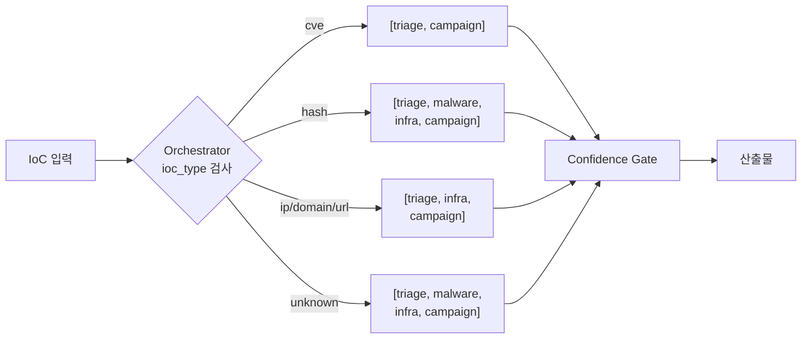
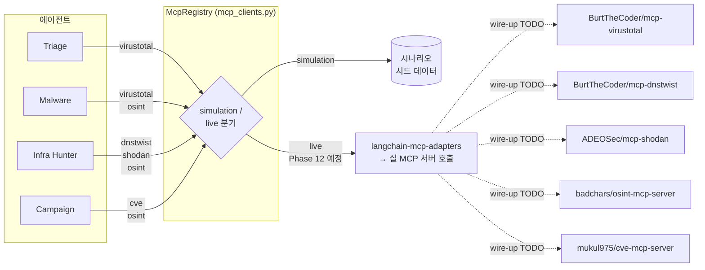
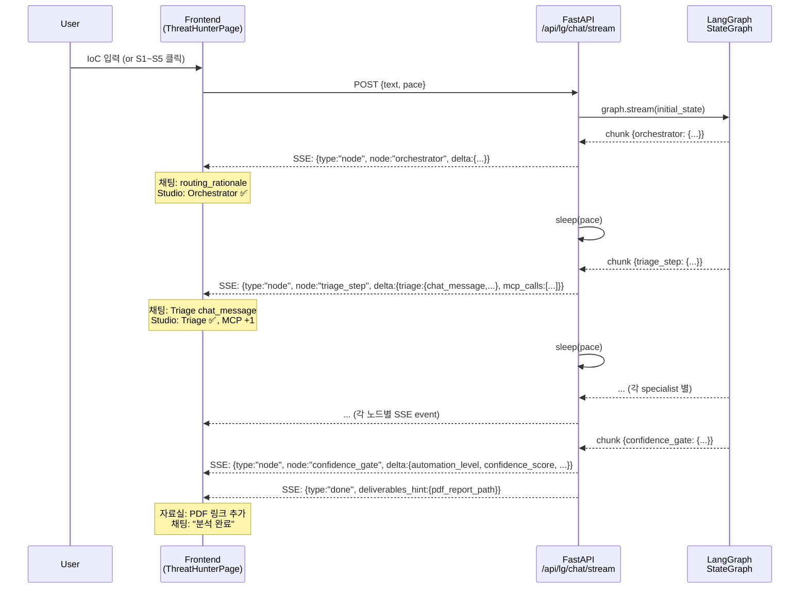

# ARCHITECTURE — AOL Threat Hunter

> **금융권 네트워크 보안 AX 플랫폼**의 현행 아키텍처 문서.
> Hierarchical Multi-Agent (LangGraph) + MCP Tool Mesh + NotebookLM 3-패널 UI 로
> 구성. 옛 CrewAI/osint_profiler 기반 모듈은 [`backend/app/legacy/`](backend/app/legacy/)
> 에 보존만, 본 문서는 최신 LangGraph 구조를 기준으로 작성.

진행 기록: [`docs/PHASE_LOG.md`](docs/PHASE_LOG.md)
배포 가이드: [`docs/DEPLOYMENT.md`](docs/DEPLOYMENT.md)
이슈 트래킹: [`docs/TROUBLESHOOTING.md`](docs/TROUBLESHOOTING.md)

---

## 1. 시스템 전체 흐름

```mermaid
flowchart TB
    User[🏦 금융권 SOC 분석가] -->|IoC 입력| FE[💻 React Frontend<br/>NotebookLM 3-Panel]
    FE -->|POST /api/lg/chat/stream<br/>POST /api/lg/simulate/&#123;id&#125;| API[🚀 FastAPI Gateway]
    API -->|StreamingResponse SSE| FE

    API --> LG[🧠 LangGraph StateGraph]

    subgraph "🤖 Hierarchical Multi-Agent (6 Agents)"
        ORCH[Investigation Orchestrator] -->|route_plan| T[Triage Specialist]
        ORCH -->|route_plan| M[Malware Specialist]
        ORCH -->|route_plan| I[Infrastructure Hunter]
        ORCH -->|route_plan| C[Campaign Analyst]
        T --> M
        M --> I
        I --> C
        C --> G[Confidence Gate]
    end

    LG --> ORCH

    subgraph "🧩 MCP Tool Mesh"
        VT[VirusTotal MCP]
        DT[DNSTwist MCP]
        SH[Shodan MCP]
        OS[OSINT MCP<br/>Censys/BGP/Cert]
        CVE[CVE MCP<br/>EPSS/KEV/MITRE]
    end

    T --> VT
    M --> VT
    M --> OS
    I --> DT
    I --> SH
    I --> OS
    C --> CVE
    C --> OS

    G --> DB[(🗄️ PostgreSQL 16<br/>Audit Ledger)]
    G --> PDF[📄 PDF Report<br/>reportlab]
    G --> FW[🛡️ FW Rules]
    G --> HQ[🔍 Hunt Queries<br/>SPL/KQL/Sigma]

    DB --> FE
    PDF --> FE
```



---

## 2. 6-Agent Pipeline + 동적 라우팅

### 에이전트 카탈로그

| # | Agent | 역할 | 도구 (MCP) | 권장 모델 | 입출력 토큰 |
|---|---|---|---|---|---|
| 1 | **🧠 Investigation Orchestrator** | IoC 타입 분석 → `route_plan` 결정 | — | mini (Haiku) | 250/200 |
| 2 | **🔍 Triage Specialist** | 위협 수준 평가, MITRE 전술 매핑 | VirusTotal | mini (Haiku) | 400/700 |
| 3 | **👾 Malware Specialist** | 행위 분석, C2 추적, Attack chain | VirusTotal · OSINT | medium (Sonnet) | 440/1400 |
| 4 | **🌍 Infrastructure Hunter** | 타이포스쿼트, 노출자산, 캠페인 클러스터링 | DNSTwist · Shodan · OSINT | medium (Sonnet) | 540/1300 |
| 5 | **📈 Campaign Analyst** | 위협 그룹 추정, 헌팅 쿼리, FW 규칙, 임원 요약 | CVE-MCP · OSINT | medium (Sonnet) | 500/2500 |
| 6 | **🛡️ Confidence Gate** | L0~L4 등급 + 핵심 자산 휴먼 승인 강제 | (Python 결정론) | — | 0/0 |

### 동적 라우팅 규칙



코드 위치:
- 라우팅 규칙: [`nodes.py::ROUTING_RULES`](backend/app/features/langgraph_threat_hunter/nodes.py)
- StateGraph: [`graph.py::build_graph`](backend/app/features/langgraph_threat_hunter/graph.py)
- 조건부 엣지: `add_conditional_edges("orchestrator", _route_after_orchestrator, ...)`

### L0~L4 Confidence Gating

| 등급 | 신뢰도 | 자동화 수준 | 핵심 자산이면 |
|---|---|---|---|
| L0 | <0.50 | 권고만 | 휴먼 승인 |
| L1 | 0.50~0.70 | 분석가 확인 후 처리 | 휴먼 승인 |
| L2 | 0.70~0.85 | 자동 케이스 생성 | 휴먼 승인 |
| L3 | 0.85~0.95 | 자동 SIEM 헌팅 트리거 | 휴먼 승인 |
| L4 | ≥0.95 | **자동 FW/IPS 차단** | **항상 휴먼 승인** |

핵심 자산 키워드 (예): `core-banking`, `exec-pc`, `swift`, `trading-engine`,
`kakaobank`, `shinhan`, `kbstar`, `wooribank`, `hanafn`, `ibk` — 매칭 시
등급과 무관하게 휴먼 승인 강제. ([`confidence.py`](backend/app/features/langgraph_threat_hunter/confidence.py))

---

## 3. MCP Tool Mesh



모든 호출은 `McpCallRecord` 로 자동 기록 (tool / input_key / elapsed_ms /
cached / simulation 플래그) — Audit Ledger 에 누적되어 컴플라이언스 증빙
자료로 활용 가능.

---

## 4. SSE 스트리밍 시퀀스



채팅 패널 = 자연어 `chat_message` 만, Agent Studio = 기술 산출물 (ledger,
mcp_calls, findings, deliverables) — **관심사 분리**.

---

## 5. NotebookLM 3-패널 UI 매핑

```
┌─────────────────────┬─────────────────────────┬─────────────────────────┐
│ 📚 자료실 (좌)       │ 💬 대화 (가운데)         │ 📊 Agent Studio (우)     │
│  SourcesPanel.jsx   │  ChatPanel.jsx          │  ResultsSidebar.jsx     │
├─────────────────────┼─────────────────────────┼─────────────────────────┤
│ 샘플 시나리오 5개    │ user / assistant       │ AgentPipelinePanel       │
│ (S1~S5 카드)        │ 메시지 버블             │ (6 agents 진행 바)       │
│                     │                         │                         │
│ 분석 리포트 보관함   │ 입력창 + 자동 스크롤    │ Metric 4-Card           │
│ (PDF 다운로드)      │                         │ (등급/신뢰도/시간/승인)   │
│                     │                         │                         │
│                     │ 데이터 출처:            │ CostAnalysisCard         │
│                     │  - chat_message (자연어) │ (3 전략 비용 비교)       │
│                     │  - SSE 실시간 갱신      │                         │
│                     │                         │ PDF 다운로드 버튼        │
│                     │                         │ FW Rules / Hunt Queries │
│                     │                         │ MCP Tool Calls          │
└─────────────────────┴─────────────────────────┴─────────────────────────┘

데이터 흐름:
  SSE event → ThreatHunterPage.handleEvent →
    chat_message 류 → ChatPanel
    findings/ledger/mcp_calls/deliverables → ResultsSidebar
    done 이벤트의 pdf_report_path → SourcesPanel 의 reports 목록
```

---

## 6. 비용 모델 (Phase 26 실측 — caching 가정 제거)

2026-05-24 Anthropic API 실측 ([`benchmarks/caching_measurement.json`](../../benchmarks/caching_measurement.json) +
[`benchmarks/run_model_comparison.py`](../../benchmarks/run_model_comparison.py)):

| 전략 | IoC 1건 비용 | vs Sonnet (현실) | vs Opus (naive) | 월간 10k IoCs |
|---|---|---|---|---|
| **All-Opus** (naive baseline) | $0.437 | +400% | 0% | $130,995 |
| **All-Sonnet** (★ 현실 baseline) | $0.087 | 0% | -80% | $26,199 |
| All-Haiku | $0.007 | -91.7% (품질 trade-off) | -98.3% | $2,183 |
| Mixed (모델 매핑만) | $0.072 | **-18.0%** | -83.6% | $21,490 |
| **★ Mixed + Batch (실현)** | **$0.036** | **-59.0%** | **-91.8%** | **$10,745** |
| Mixed + Cache + Batch (가정) | $0.032 | -63.0% | -92.6% | $9,701 |

> **★ Phase 26 발견**: 옛 cost_analysis 의 "Prompt Caching 90% hit" 가정이
> Anthropic API 실측 0% — system 프롬프트 (chars 967~1491, est tokens
> 241~372) 가 minimum cache tokens (Sonnet 1024 / Haiku 2048) 미달.
> caching 적용분은 가정값 +4%pt 만 (mixed_cached_batch -63% vs mixed_batch -59%),
> **Batch API 50% off 가 진짜 가치**. caching 가정 제거한 `mixed_batch` 가
> 실현 가능 best.
>
> 옛 -91.8% 헤드라인은 mixed_cached_batch vs Opus 기준. **새 mixed_batch
> vs Opus 도 -91.8%** — 같은 수치 도달, 그러나 caching 가정 없는 정직한 길.

엔드포인트: `GET /api/lg/cost-analysis` — `headline_savings.realized_*`
(실측) + `assumed_*` (caching 가정) 둘 다 반환.

---

## 7. 모듈 인벤토리

```
backend/app/features/langgraph_threat_hunter/
├── __init__.py
├── state.py          ThreatHuntState, Findings, Annotated reducers
├── confidence.py     L0~L4 게이팅 + 핵심 자산 키워드 매칭
├── mcp_clients.py    McpRegistry (5 도구, sim/live 분기)
├── simulations.py    5대 시나리오 시드 + chat_message 사전 정의
├── nodes.py          Orchestrator + 5 specialist + Gate 노드
├── graph.py          StateGraph 빌더 + 조건부 엣지
├── pdf_report.py     reportlab 기반 한 페이지 리포트
├── cost_analysis.py  모델 매핑 + 가격표 + 3 전략 비용
└── router.py         FastAPI 엔드포인트
                       GET  /api/lg/health
                       GET  /api/lg/scenarios
                       GET  /api/lg/cost-analysis
                       POST /api/lg/simulate/{id}
                       GET  /api/lg/simulate/{id}/stream     (SSE)
                       GET  /api/lg/simulate/{id}/report.pdf (PDF)
                       POST /api/lg/chat/stream              (SSE, 메인)
                       POST /api/lg/investigate              (live mode placeholder)

backend/tests/             51 케이스 / 0.8초 / 100% 통과
benchmarks/                Anthropic API 실측 벤치마크 (gitignored 결과)

frontend/src/components/threat-hunter/
├── ThreatHunterPage.jsx       3-패널 그리드 + SSE 스트림 파싱
├── SourcesPanel.jsx           좌: 시나리오 + 분석 리포트
├── ChatPanel.jsx              가운데: 순수 대화
├── ResultsSidebar.jsx         우: 메트릭 + 산출물 컨테이너
├── AgentPipelinePanel.jsx     6-Agent 진행 바
└── CostAnalysisCard.jsx       3 전략 비용 비교 카드
```

---

## 8. 외부 인터페이스 요약

| 엔드포인트 | 메서드 | 용도 |
|---|---|---|
| `/api/lg/health` | GET | 그래프 컴파일 확인 |
| `/api/lg/scenarios` | GET | 5 시나리오 목록 |
| `/api/lg/cost-analysis` | GET | 비용 분석 (3 전략) |
| `/api/lg/simulate/{id}` | POST | 시나리오 1회 실행 (sync) |
| `/api/lg/simulate/{id}/stream` | GET | 시나리오 SSE 스트림 |
| `/api/lg/simulate/{id}/report.pdf` | GET | PDF 리포트 (inline) |
| `/api/lg/chat/stream` | POST | 자유 텍스트 챗 SSE (메인) |
| `/api/lg/investigate` | POST | 라이브 모드 (Phase 12 wire-up 예정) |

---

## 9. 다음 단계 (Phase 12+)

- [ ] **Phase 12** — docker compose 실 기동 + 브라우저 데모 검증
- [ ] **Phase 14** — MCP 라이브 모드 wire-up (`langchain-mcp-adapters` 통해 실 MCP 서버)
- [ ] **Phase 15** — LangGraph PostgresSaver 체크포인터 — 장시간 분석 재개 가능
- [ ] **Phase 16** — MITRE ATT&CK 매핑 자동화 (CVE-MCP 결과 연동)
- [ ] **Phase 17** — 합숙·면접용 데모 영상/스크린샷 자동 캡처
