# 🧬 MCP · LangChain · LangGraph — 작동 구조 다이어그램

> AOL Threat Hunter 가 의존하는 3개 핵심 프레임워크/프로토콜이 **각각 어떤
> 구조로 작동**하고, **어떻게 한 시스템 안에서 합쳐지는지**를 다이어그램으로
> 정리한 문서. 모든 그림은 이 레포의 실제 코드에 근거한다.

| 레이어 | 무엇을 담당하나 | 한 줄 요약 | 본 레포 구현 위치 |
|---|---|---|---|
| **MCP** | 도구(외부 인텔리전스) 연결 | "LLM ↔ 도구" 표준 배선 | `mcp_clients.py` · `mcp_live_client.py` · `mcp_servers/` |
| **LangChain** | LLM 공급자 추상화 | "어느 회사 모델이든 같은 인터페이스" | `app/utils/llm_service.py` |
| **LangGraph** | 멀티 에이전트 제어 흐름 | "노드+엣지 = 상태 기계" | `langgraph_threat_hunter/graph.py` |

세 레이어의 역할은 직교(orthogonal)한다 — 서로 겹치지 않고 한 축씩 책임진다:

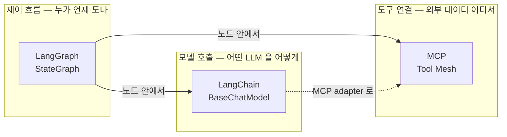

---

## 1. MCP (Model Context Protocol)

### 1.1 MCP 가 푸는 문제 — N×M 배선을 N+M 으로

도구 5개를 에이전트 4개가 쓰면 직접 배선은 최대 5×4 = 20 가닥. MCP 는 그
사이에 **표준 프로토콜 한 겹**을 끼워 N+M 으로 줄인다.

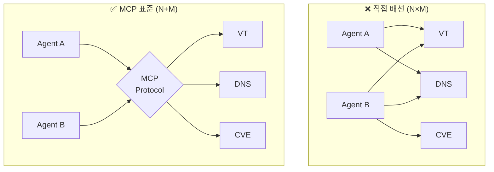

### 1.2 MCP 프로토콜 3대 구성요소

MCP 는 **Host(LLM 앱) ↔ Client ↔ Server** 3계층. 통신은 **JSON-RPC 2.0**
메시지를 **transport**(본 레포는 SSE) 위로 주고받는다.

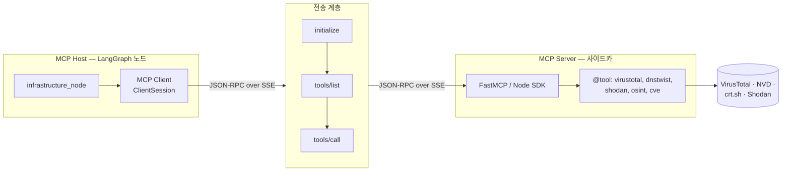

핸드셰이크 시퀀스 (`mcp_live_client.py::_session` → `call_tool`):

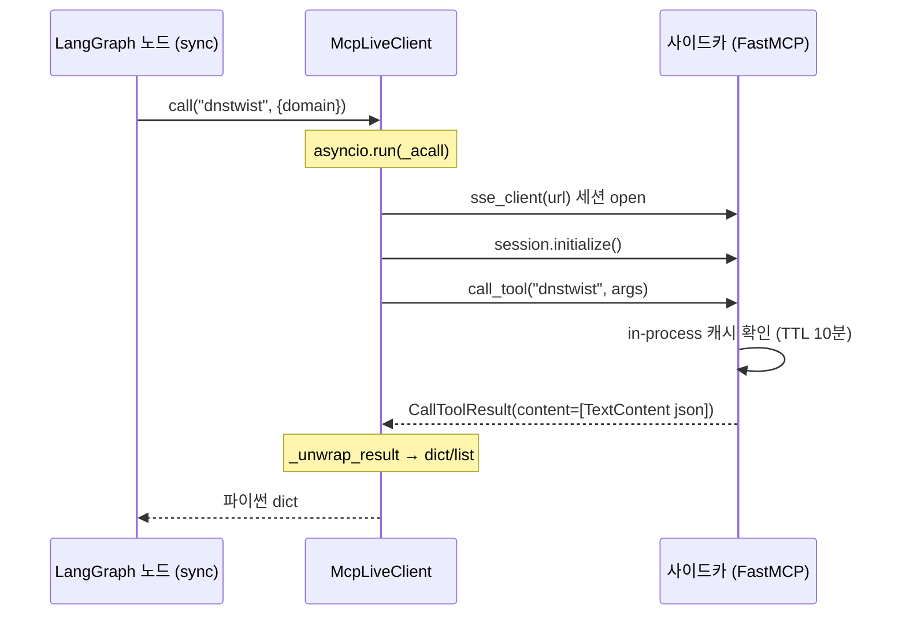

### 1.3 본 레포의 MCP 추상화 — `McpRegistry` 게이트웨이

`McpRegistry`(`mcp_clients.py`)가 **단일 인터페이스 뒤에서 4개 모드로 분기**
한다. 노드 코드는 모드를 몰라도 `mcp.dnstwist(state, domain)` 만 호출.

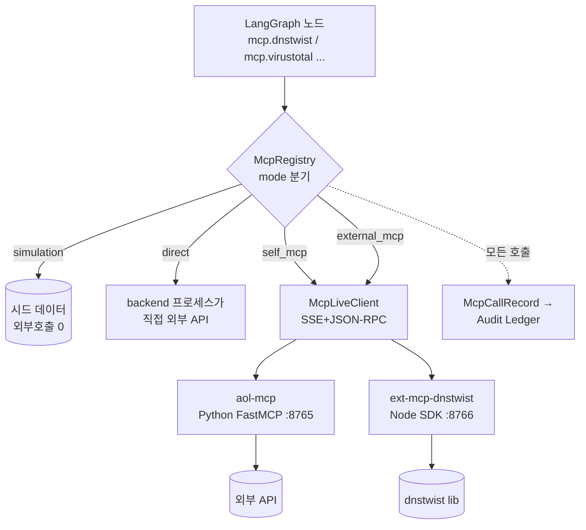

| 모드 | 외부 호출 | 사이드카 | 언제 |
|---|---|---|---|
| `simulation` | 0회 (시드) | 없음 | 데모/테스트 |
| `direct` | backend 직접 | 없음 | 의존성 최소 |
| `self_mcp` | 사이드카 경유 | aol-mcp (Python) | **운영 권장** |
| `external_mcp` | 사이드카 경유 | Node + Python 폴백 | 언어 무관 입증 |

> 상세 모드 비교·실측 latency 는 [`mcp.md`](mcp.md) 참고. 핵심: `self_mcp`
> warm 30~50ms, MCP 가 Python↔Node 언어 무관 표준임을 `external_mcp` 로 입증.

---

## 2. LangChain

### 2.1 LangChain 이 푸는 문제 — 공급자별 SDK 파편화

OpenAI / Anthropic / Google 은 SDK 시그니처·메시지 포맷·파라미터 이름이 전부
다르다(`max_tokens` vs `max_output_tokens` 등). LangChain 은 `BaseChatModel`
이라는 **공통 추상 클래스**로 이를 통일한다.

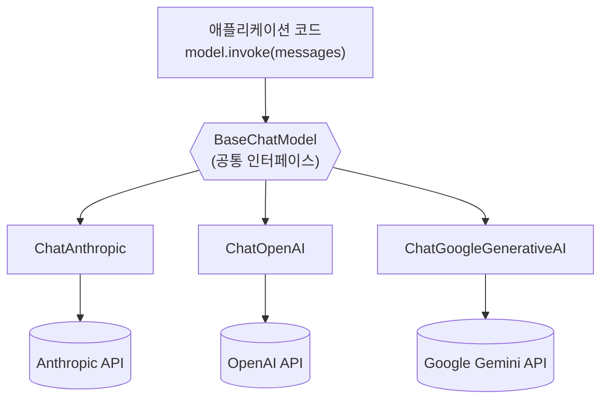

### 2.2 본 레포의 LangChain 사용 — `LLMService` 레지스트리

`app/utils/llm_service.py` 는 모델 인스턴스를 `model_id` 로 등록해 두고
호출 시 꺼내 쓰는 **레지스트리 패턴**. 메시지는 LangChain 의
`SystemMessage` / `HumanMessage` 로 표준화.

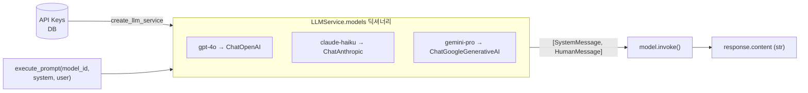

코드 위치: `LLMService.register_model` / `execute_prompt`
(`app/utils/llm_service.py:19,80`). CrewAI 기반 기능(`crew_solo`,
`deep_analysis`)이 이 레이어로 모델을 주입받는다.

### 2.3 ⚠ 정직성 메모 — Threat Hunter 는 LangChain 을 우회한다

LangGraph 6-agent 파이프라인의 LLM 호출(`agent_prompts.py::call_agent`)은
**Anthropic SDK 를 직접 호출**한다 (`anthropic.Anthropic().messages.create`,
`agent_prompts.py:263`). Prompt Caching 의 `cache_control` 마커를 직접 제어
하기 위함. 즉 본 레포에서 LangChain 의 역할은:

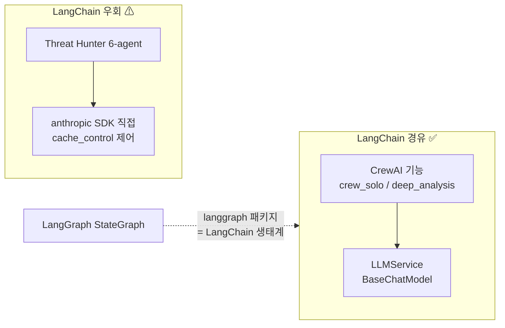

> langchain-core 메시지 타입과 `langchain-mcp-adapters` 의존성은 설치돼 있으나
> (`backend/requirements.txt:16-31`), threat hunter 의 실 LLM 호출은 latency·
> 캐시 제어를 위해 SDK 직결을 택했다. 과장 없이 기록.

---

## 3. LangGraph

### 3.1 LangGraph 가 푸는 문제 — 멀티 에이전트 제어 흐름의 명시화

체인(LangChain)은 직선이다. 실제 위협 분석은 **IoC 타입에 따라 다른 경로**로
가고, 노드 사이에 **상태를 누적**해야 한다. LangGraph 는 이를 노드(작업) +
엣지(전이) + 공유 State 의 **상태 기계(state machine)**로 표현한다.

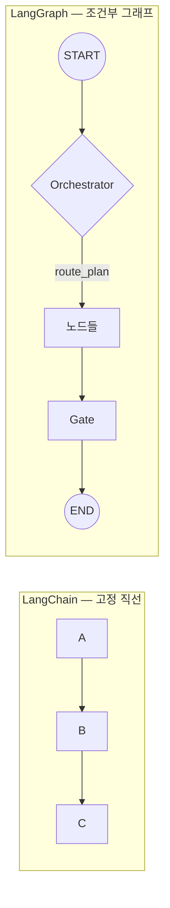

### 3.2 3대 구성요소 — State · Node · Edge

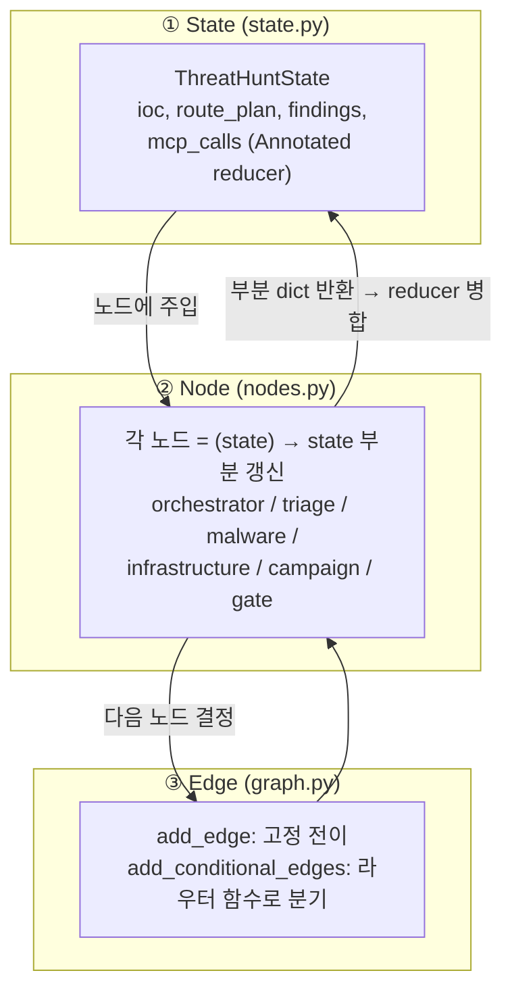

- **State**: `ThreatHuntState`. `mcp_calls` 같은 필드는 `Annotated` reducer 로
  노드 반환값을 **누적 병합**(덮어쓰기 X).
- **Node**: `(state) → 부분 state`. `graph.py:62-67` 에서 `lambda s: triage_node(s, mcp)`
  로 MCP 게이트웨이를 클로저로 주입.
- **Edge**: `add_edge`(고정) + `add_conditional_edges`(라우터 함수).

### 3.3 본 레포의 그래프 — Orchestrator + 동적 조건부 라우팅

`build_graph`(`graph.py:58`)가 컴파일하는 실제 그래프. Orchestrator 가 채운
`route_plan` 을 라우터 함수(`_route_after_orchestrator`, `_route_after`)가
읽어 다음 노드를 고른다. **CrewAI 의 hierarchical Process 를 명시적 state
machine 으로 재현**.

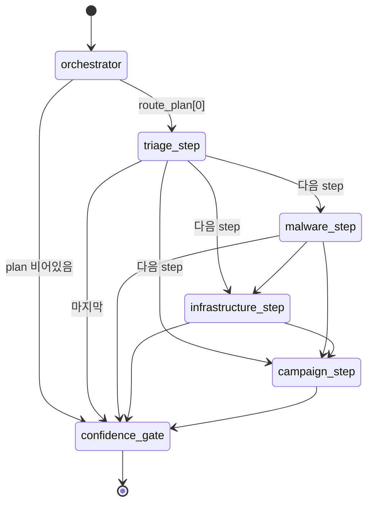

라우팅 규칙 (`nodes.py::ROUTING_RULES`):

| IoC 타입 | route_plan |
|---|---|
| `cve` | `[triage, campaign]` |
| `hash` | `[triage, malware, infrastructure, campaign]` |
| `ip`/`domain`/`url` | `[triage, infrastructure, campaign]` |
| `unknown` | 전체 4단계 |

> 6-agent 의 역할·모델·산출물 상세는 [`agents.md`](agents.md) 참고.

---

## 4. 세 레이어의 합류 — End-to-End

한 번의 IoC 분석에서 세 레이어가 어떻게 맞물리는지. **LangGraph 가 흐름을
제어**하고, 각 노드 안에서 **MCP 로 데이터를 모으고**, **LLM(SDK 또는
LangChain)으로 추론**한다.

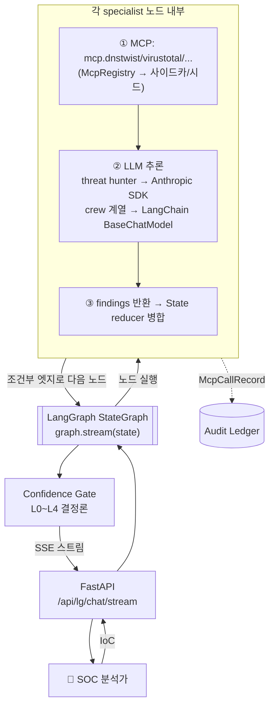

| 단계 | 담당 레이어 | 코드 |
|---|---|---|
| 흐름 제어 / 노드 전이 | **LangGraph** | `graph.py` |
| 도구 데이터 수집 | **MCP** | `mcp_clients.py`, `mcp_live_client.py` |
| LLM 추론 (crew) | **LangChain** | `llm_service.py` |
| LLM 추론 (threat hunter) | Anthropic SDK 직결 | `agent_prompts.py` |
| 등급 결정 | Python 결정론 | `confidence.py` |

---

## 5. 한눈 요약

```mermaid
mindmap
  root((AOL<br/>Threat Hunter))
    MCP
      Host-Client-Server 3계층
      JSON-RPC over SSE
      McpRegistry 4모드 분기
      Python↔Node 언어 무관
    LangChain
      BaseChatModel 공통 인터페이스
      LLMService 레지스트리
      crew 계열에서 사용
      threat hunter 는 SDK 직결
    LangGraph
      State+Node+Edge 상태기계
      Orchestrator 동적 라우팅
      Annotated reducer 누적
      6-agent 파이프라인
```

- **MCP** = *도구를 어떻게 붙이나* — 표준 프로토콜로 N×M → N+M.
- **LangChain** = *어떤 모델을 어떻게 부르나* — 공급자 추상화.
- **LangGraph** = *누가 언제 도나* — 조건부 상태 기계.

세 축이 직교하기에, 모델을 바꿔도(LangChain) 흐름은 그대로(LangGraph)고,
도구를 추가해도(MCP) 노드 코드는 안 바뀐다 — 이 분리가 본 시스템의 확장성
근거다.

---

> 관련 문서: [`README.md`](README.md) (전체 아키텍처) · [`mcp.md`](mcp.md)
> (MCP 모드·실측) · [`agents.md`](agents.md) (6-agent 상세)
