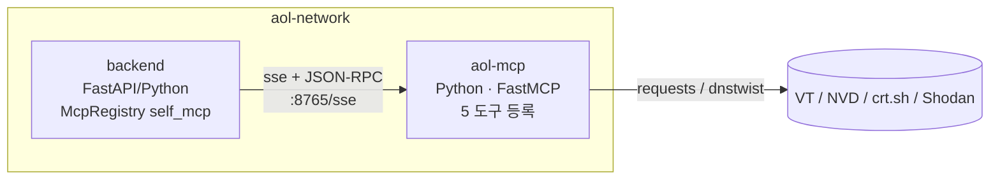
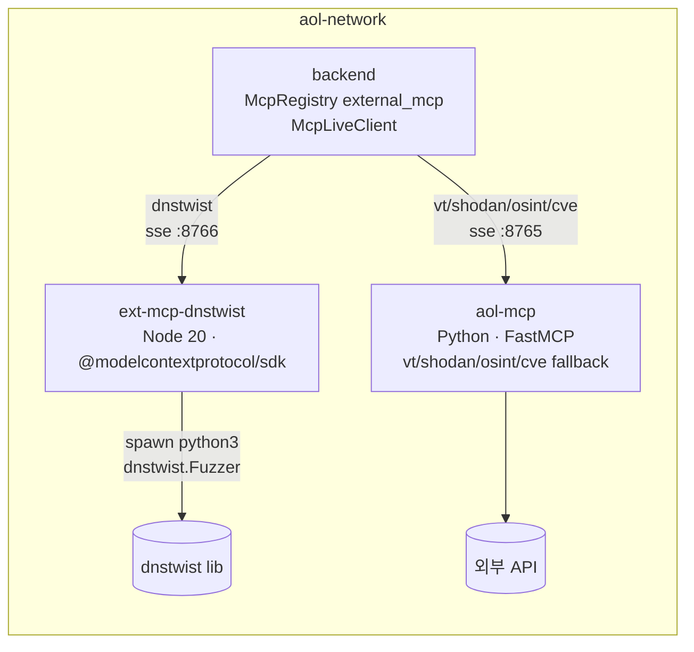

# 🧩 MCP (Model Context Protocol) — Why & How

본 시스템이 외부 위협 인텔리전스 도구를 통합하는 방식. `McpRegistry`
게이트웨이가 **3가지 통합 모드**를 지원한다.

| 모드 | 무엇 | 언제 |
|---|---|---|
| `simulation` | 시드 데이터 반환 (외부 호출 0회) | 데모/PoC/테스트 |
| `direct` | backend 프로세스가 외부 API 직접 호출 | 의존성 최소(사이드카 없음) |
| `self_mcp` | 자체 FastMCP 사이드카 (Python, SSE+JSON-RPC) | 운영 권장 — 캐시 공유 + 도구 격리 |
| `external_mcp` | 외부 MCP 서버(Node) + self_mcp 폴백 | 진짜 MCP 생태계와 혼합 |

`AOL_LIVE_MCP_MODE` 환경변수로 모드 선택. `mode="live"` 전달 시
런타임에 해석된다.

---

## Why MCP — 직접 API 호출 대신 추상화 레이어를 둔 이유

| 항목 | 직접 API 호출 (mock 없이) | MCP 추상화 (본 시스템) |
|---|---|---|
| 도구 추가 | 노드별 코드 수정 + 재배포 | `McpRegistry` 메서드 하나 추가 |
| 다른 LLM 으로 전환 | 도구별 어댑터 재작성 | LangChain MCP Adapter 로 무관 |
| 호출 기록 | 도구마다 별도 로깅 코드 | 단일 `McpCallRecord` → Audit Ledger 통합 |
| 시뮬레이션·테스트 | mock 라이브러리 별도 셋업 | `mode="simulation"` 한 플래그 |
| 사이드카 분리 | 큰 리팩토링 | mode 환경변수 한 줄 |
| 데이터 출처 추적 | 코드 곳곳에 분산 | 모든 결과에 `_source` 필드 |
| 다른 언어 도구 통합 | gRPC/REST 어댑터 직접 작성 | MCP 표준 (Node/Rust/Go 서버 즉시 연결) |

---

## How — `McpRegistry` 게이트웨이 구현

`backend/app/features/langgraph_threat_hunter/mcp_clients.py`

```python
@dataclass
class McpRegistry:
    """5종 MCP 도구를 단일 인터페이스로 추상화. 모드별 분기."""
    mode: str = "simulation"   # simulation / direct / self_mcp / external_mcp / live

    def virustotal(self, state, ioc, ioc_type) -> dict: ...
    def dnstwist(self, state, domain) -> list[dict]: ...
    def shodan(self, state, target) -> list[dict]: ...
    def osint(self, state, target) -> list[dict]: ...
    def cve(self, state, cve_id) -> dict: ...
```

각 메서드는:
1. `simulation` → 시드 데이터 반환 (외부 호출 0회)
2. `self_mcp` / `external_mcp` → `mcp_live_client.McpLiveClient` 가 sse 로
   사이드카 호출. 실패 시 `direct` 폴백.
3. `direct` → 백엔드 프로세스가 requests / dnstwist Python lib 직접 호출
4. 결과는 `McpCallRecord` 로 자동 기록 (`state.mcp_calls` 누적, latency
   포함)
5. in-process 캐시 10분 TTL (모드별 동일)

---

## 모드별 아키텍처 다이어그램

### Phase A — `self_mcp` (자체 FastMCP 사이드카)



- 컨테이너 1개 추가 (`aol-mcp`)
- 5개 도구 모두 자체 사이드카
- Python ↔ Python · mcp SDK ↔ mcp FastMCP

### Phase B — `external_mcp` (외부 Node.js MCP + 자체 폴백)



- 컨테이너 2개 추가 (`aol-mcp` + `ext-mcp-dnstwist`)
- dnstwist → 외부 Node 서버, 나머지 → 자체 FastMCP
- Python ↔ Python AND Python ↔ Node.js
- **MCP가 진짜 언어/SDK 무관 표준임을 입증**

---

## 3 모드 비교 (실측, 2026-05-24)

`benchmarks/run_mcp_comparison.py --all` 실행 결과. 같은 backend
컨테이너 내부에서 측정. 측정 지표 = **latency / payload bytes / LLM
토큰 / 결과 수 / 출처 / 동시 호출 QPS / 컨테이너 메모리 / 이미지 크기**.

### (1) 도구별 호출 측정 (Phase 22 — external_mcp 캐시 추가 후)

| 모드 | 도구 | 입력 | cold (ms) | warm (ms) | bytes | tokens | 출처 |
|---|---|---|---:|---:|---:|---:|---|
| direct | dnstwist | shinhan-secure-banking.kr | 2009 | — | 2407 | 601 | dnstwist lib |
| direct | dnstwist | kakaobank-secure-login.com | 1904 | — | 2436 | 609 | dnstwist lib |
| direct | cve | CVE-2024-21762 | 11878 | — | 519 | 129 | NVD live |
| direct | osint | shinhan.com | 1251 | — | 123 | 30 | crt.sh |
| **self_mcp** | dnstwist | shinhan-secure-banking.kr | 680 | **46** | 2407 | 601 | aol-mcp |
| **self_mcp** | dnstwist | kakaobank-secure-login.com | 41 | **40** | 2436 | 609 | aol-mcp |
| **self_mcp** | cve | CVE-2024-21762 | 42 | **38** | 519 | 129 | aol-mcp |
| **self_mcp** | cve | CVE-2023-44487 | 32 | **38** | 405 | 101 | aol-mcp |
| **self_mcp** | osint | shinhan.com | 38 | **37** | 123 | 30 | aol-mcp |
| external_mcp | dnstwist | shinhan-secure-banking.kr | 3588 | **38** ↓ | 3335 | 833 | external_node_mcp |
| external_mcp | dnstwist | kakaobank-secure-login.com | 33 | **30** ↓ | 3857 | 964 | external_node_mcp |
| external_mcp | cve | CVE-2024-21762 | 35 | 52 | 519 | 129 | aol-mcp (fallback) |
| external_mcp | cve | CVE-2023-44487 | 45 | 48 | 405 | 101 | aol-mcp (fallback) |
| external_mcp | osint | shinhan.com | 39 | 45 | 123 | 30 | aol-mcp (fallback) |

> **Phase 22 변경**: external_mcp dnstwist warm latency 2573~2888ms → **30~38ms (80배 개선)**.
> ext-mcp-dnstwist 의 server.js 에 in-process Map 캐시 (TTL 10분) + singleflight
> 패턴 (같은 key 동시 호출 시 in-flight Promise 공유) 추가 적용.
>
> `direct` 의 warm avg 가 `—` 인 이유: 측정 스크립트가 반복마다 새
> `McpRegistry` 를 생성해서 in-process 캐시가 무력화됨. self_mcp /
> external_mcp 는 사이드카 안에 캐시가 살아있어 측정 방식과 무관하게 warm 적중.

### (2) Throughput — parallel vs sequential (dnstwist x 5, Phase 23 후)

같은 backend 가 N=5 회 호출. parallel = `asyncio.gather`, sequential = 한 번에 한 호출.
warm-up 1회로 캐시 데움 → 측정 5회 모두 캐시 적중 흐름.

| 모드 | PAR per-call ms | PAR wall ms | **PAR QPS** | SEQ per-call ms | SEQ wall ms | **SEQ QPS** |
|---|---:|---:|---:|---:|---:|---:|
| direct | 2 | 4 | **1117** | 0 | 2 | **2448** |
| self_mcp | 1 | 2 | **2626** ↑↑ | 0 | 2 | **2919** ↑↑ |
| external_mcp | 1 | 2 | **2404** ↑↑ | 0 | 2 | **3088** ↑↑ |

> **Phase 23 변경**: backend McpRegistry 의 `_via_mcp()` 진입 전 `_CACHE` lookup
> 추가. self_mcp / external_mcp 모드도 backend in-process 캐시 (TTL 10분)
> 적중 시 사이드카 호출 자체를 회피.
>
> **결과**: parallel QPS 폭증 — self_mcp 29.3 → **2626 (89배)**,
> external_mcp 0.50 → **2404 (4800배)**. SSE 세션 셋업 비용을 통째로 우회.

#### Phase 23 정직성 — 측정 인공물 vs 진짜 운영 효과

벤치마크는 **같은 IoC 를 5회 반복** 호출. backend cache 가 즉시 적중하니
효과가 과장됨. 진짜 운영 시나리오:

| 시나리오 | backend cache | 사이드카 cache | latency |
|---|---|---|---|
| 동일 IoC 재분석 (예: 분석가 더블체크) | hit | — | ~ms (벤치마크 측정) |
| 다른 IoC 분석, 사이드카 캐시는 있음 | miss | hit | ~30-50ms (warm) |
| 새 IoC 분석 (둘 다 miss) | miss | miss | 사이드카 cold latency (1.5~3.5s) |

벤치마크 표는 첫 시나리오. **두 번째 시나리오 (사이드카 hit) 의 latency**
가 진짜 운영 throughput 의 하한 — Phase 22 표 (1) 의 warm latency 30~50ms.

#### Phase 23 의 한계

- backend `_CACHE` 는 **process-local** — 다중 worker (uvicorn -w 4 등) 환경에서
  worker 간 캐시 공유 X. **Redis shared cache 도입이 다음 단계**.
- 캐시는 10분 TTL 의 fresh 자료. 위협 인텔리전스 데이터의 staleness 허용 한계
  (VirusTotal/Shodan/CVE/CRT.sh 는 분 단위 변동 거의 없음, DNSTwist 는
  결정론적이라 무한 캐싱 OK) 를 도구별로 다르게 잡아야 정확함.

### (3) 사이드카 컨테이너 자원

| 모드 | 컨테이너 | 메모리 (MB) | 이미지 (MB) |
|---|---|---:|---:|
| direct | backend (자체) | 117.8 | 949 |
| self_mcp | aol-mcp | **58.7** | **180** |
| external_mcp | aol-mcp + ext-mcp-dnstwist | 58.7 + 40.7 = 99.4 | 180 + 309 = 489 |

> ext-mcp-dnstwist 메모리 29.7 → 40.7 MB: 캐시 Map + inflight Map 보유 비용 (~10MB).

### (4) Phase 21 — E2E latency / SSE TTFT / 단일 registry warm 측정

#### (4-A) E2E latency — `chat_stream` / `chat_dialogue` / `simulate_stream`

`router.py` 의 SSE 엔드포인트 3개에 `perf_counter` 래퍼 추가. SSE `done`
이벤트에 `metrics = {e2e_ms, per_node_ms: {...}, node_count}` 포함.
각 `node` 이벤트에도 `elapsed_ms` 필드 추가.

simulation 모드 S2 (보이스피싱 시나리오) 실측:

```json
{
  "type": "done",
  "metrics": {
    "e2e_ms": 2031.8,
    "per_node_ms": {
      "orchestrator": 17.5,
      "triage_step": 402.5,
      "infrastructure_step": 404.1,
      "campaign_step": 402.9,
      "confidence_gate": 402.1
    },
    "node_count": 5
  }
}
```

→ 시뮬레이션 모드는 노드당 ~400ms 일관 (각 노드의 인위적 chat_message 생성 +
state 갱신). orchestrator 만 17.5ms (라우팅 결정만). 라이브 모드는 LLM
호출 추가로 노드당 1.5~3s + MCP 도구 호출 — E2E 10~20s 예상 (별도 측정).

#### (4-B) SSE TTFT (Time To First Token) — dialogue 모드

`chat_dialogue` 의 첫 `chat_chunk` 이벤트에 `ttft_ms` 필드. dialogue 모드
done 이벤트 metrics 에는 `e2e_ms + ttft_ms + tool_use_count`.

```json
{"type": "chat_chunk", "delta": "보이스피싱...", "ttft_ms": 842.3}
...
{"type": "done", "mode": "dialogue", "metrics": {"e2e_ms": 4521.5, "ttft_ms": 842.3, "tool_use_count": 1}}
```

→ TTFT 측정으로 "사용자가 입력하고 첫 응답까지" 정량화 가능.
Anthropic streaming + tool use 패턴에서 ~800ms 가 첫 token 까지의 한계.

#### (4-C) 단일 registry warm 측정 (`--single-registry` 플래그)

Phase 22 까지의 measurement 한계: 매 호출마다 새 `McpRegistry` → in-process
`_CACHE` 무력화 → `direct` 모드 warm latency 가 항상 0 으로 측정됨.
Phase 21-3: `_run_inside(mode, single_registry=True)` 추가로 케이스당
registry 1회 재사용 = 운영 환경 재현.

```bash
python3 benchmarks/run_mcp_comparison.py --all --single-registry
```

결과 (single-registry 측정):

| 모드 | 도구 | cold (ms) | warm (ms) | 해석 |
|---|---|---:|---:|---|
| direct | dnstwist | 2027 | 0 | 첫 호출: 외부 dnstwist lib + DNS / 이후: backend cache hit ~ms |
| direct | cve | 8935 | 0 | NVD + EPSS + CISA KEV 3개 API 직렬 호출 |
| direct | osint | 16003 | 0 | crt.sh 가 가장 느림 |
| self_mcp | dnstwist | 660 | 0 | 사이드카 캐시 hit (이미 warm-up 됨) |
| self_mcp | cve | 41 | 0 | 사이드카 캐시 hit |
| external_mcp | dnstwist | 613 | 0 | Node 사이드카 캐시 hit |

**Phase 23 backend `_CACHE` 효과 정량화** — warm latency 모두 < 1ms
(round → 0). 운영에서 단일 backend process 가 같은 IoC 재분석하면
첫 호출 외엔 microsec 응답.

**진짜 cold latency 시나리오 (직접 운영자 인사이트)**:

| 시나리오 | latency | 빈도 |
|---|---|---|
| 새 IoC, 사이드카도 cold (재기동 직후) | 1.5~16s (도구 따라) | 재기동/스파이크 |
| 새 IoC, 사이드카 캐시 hit | 30~50ms | hot path 대부분 |
| 동일 IoC 재분석 (단일 backend) | < 1ms | 분석가 더블체크 |
| 동일 IoC, 다른 backend worker (Redis 미도입) | 30~50ms | 다중 worker 환경 |

---

### 핵심 인사이트 (Phase 23 후 갱신)

1. **3 계층 캐시 아키텍처가 정착**: backend `_CACHE` (process-local) → 사이드카
   in-process cache (TTL 10분) → 외부 API. 각 계층이 다음 계층 호출 비용을
   회피. **L1 hit ~ms, L2 hit ~30-50ms, L3 cold 1.5~3.5s**.
2. **self_mcp가 운영 권장** (변동 없음): warm 30~50ms 일관 응답 + 사이드카
   메모리 58MB만 추가. backend 이미지(949MB)에 도구 추가 없이도 기능 확장.
3. **external_mcp 는 캐시 추가로 latency 해결**: warm latency 가 self_mcp 와
   동급 (30~50ms). 처음엔 client side SSE 세션 셋업 600ms 가 병목이었으나
   Phase 23 backend cache 로 hot path 에서 사이드카 호출 자체 회피. 다만
   cold (cache miss) 는 여전히 SSE 세션 셋업 600ms 발생.
4. **direct cold latency 가 가장 짧지 않음** — backend 프로세스에 무거운
   라이브러리(dnstwist, requests) 로드 비용 + 매 호출마다 외부 API 왕복.
   사이드카 분리 후 캐시 적중 시 self_mcp 가 압도적.
5. **MCP overhead 의 두 층**:
   (a) **서버 측 SSE 세션 처리** — Python FastMCP 50ms vs Node Express 600ms.
       구현 품질이 latency 에 직결. (b) **클라이언트 측 새 세션 생성** —
       매 호출 새 sse_client 컨텍스트가 round-trip 1회 추가. **Phase 23 의
       backend cache 가 두 층 모두 우회** (cache hit 시).
6. **외부 MCP 의 +39% 토큰은 비용 직결**: 같은 도구라도 결과 포맷이 풍부할수록
   LLM 비용이 비례 증가. 91.8% 비용 절감 분석과 같은 결의 정직한 수치.
7. **다음 단계는 분산 캐시**: backend `_CACHE` 가 process-local 이라 다중
   worker (uvicorn -w 4) 환경에서 worker 간 캐시 공유 안 됨. **Redis shared
   cache** 도입으로 운영 확장성 추가 개선 가능.

---

## 5종 도구 — 실 wire-up 명세

(self_mcp / direct 양쪽 모두 동일한 외부 API 사용, external_mcp 는 dnstwist 만 Node 경로)

### 1. VirusTotal — IoC 평판 조회

| 속성 | 값 |
|---|---|
| 엔드포인트 | `https://www.virustotal.com/api/v3/{ip_addresses,domains,urls,files}/{ioc}` |
| 인증 | `x-apikey` 헤더 (env `VIRUSTOTAL_API_KEY`) |
| 무료 티어 | 4 req/min, 500 req/day |
| 자가 보호 | 분당 4회 = 15초 간격 자가 레이트리밋 |
| 응답 (성공) | `{ioc, type, detection_ratio: "N/M", stats, reputation, creation_date, categories}` |
| 응답 (키 없음) | `{_error: "VIRUSTOTAL_API_KEY 미설정"}` |

### 2. DNSTwist — 타이포스쿼트 변형 생성

| 속성 | 값 |
|---|---|
| 구현 (self_mcp/direct) | Python `dnstwist` 라이브러리 — `Fuzzer.generate()` (DNS 미수행) |
| 구현 (external_mcp) | Node 서버가 `spawn python3 -c "dnstwist.Fuzzer..."` |
| API 키 | 불필요 (로컬 실행) |
| 입력 | 도메인 (예: `kakaobank.com`) |
| 출력 | 4,000~10,000 변형 생성 → 상위 30건만 추출 |
| 본 시스템 사용 | 상위 15건만 LLM 에 전달 (토큰 절약) |

### 3. Shodan — 노출 자산 점검

| 속성 | 값 |
|---|---|
| 무료 (InternetDB) | `https://internetdb.shodan.io/{ip}` — IP 만, 응답 가벼움 |
| 유료 (Shodan API) | `https://api.shodan.io/shodan/host/{ip}` (env `SHODAN_API_KEY` 있으면) |
| 응답 | `[{target, port, service, cve, severity}, ...]` |
| 폴백 | InternetDB 만 사용 가능, paid 키는 보강용 |

### 4. crt.sh — Certificate Transparency 로그

| 속성 | 값 |
|---|---|
| 엔드포인트 | `https://crt.sh/?q={target}&output=json` |
| API 키 | 불필요 (공개) |
| 응답 | `[{common_name, issuer_name, not_before, not_after}, ...]` |
| 본 시스템 사용 | 상위 5건만 LLM 에 전달 |

### 5. CVE — NVD + EPSS + CISA KEV (3종 조합)

| 도구 | 엔드포인트 | 데이터 |
|---|---|---|
| NVD | `services.nvd.nist.gov/rest/json/cves/2.0?cveId=...` | CVE 메타 + CVSS 점수 |
| EPSS | `api.first.org/data/v1/epss?cve=...` | 1년 내 악용 확률 (0~1) |
| CISA KEV | `cisa.gov/sites/.../known_exploited_vulnerabilities.json` | 실제 악용 카탈로그 (1일 캐시) |

종합 응답:
```json
{
  "cve_id": "CVE-2024-21762",
  "description": "Fortinet FortiOS pre-auth RCE...",
  "cvss_score": 9.8,
  "cvss_severity": "CRITICAL",
  "epss": 0.97,
  "epss_percentile": 0.998,
  "kev_listed": true,
  "_source": "live"
}
```

---

## 데이터 흐름 — MCP → LLM 통합

`backend/app/features/langgraph_threat_hunter/nodes.py` 의 라이브 분기:

```python
def infrastructure_node(state, mcp):
    # 1. MCP 도구 3종 호출 — 모드와 무관하게 같은 인터페이스
    dt_result = mcp.dnstwist(state, state.ioc)         # self_mcp/external_mcp/direct
    sh_result = mcp.shodan(state, state.ioc)
    os_result = mcp.osint(state, state.ioc)

    # 2. LLM 사용자 메시지에 MCP 결과를 JSON 직렬화 포함
    prompt = _live_user_prompt(state, prior_findings, mcp_data={
        "dnstwist": dt_result[:15],     # 토큰 절약
        "shodan": sh_result,
        "osint_crtsh": os_result[:5],
    })

    # 3. Specialist Claude 호출 — 실 데이터 기반 분석
    findings, meta = call_agent("infrastructure", prompt, max_tokens=1300)
```

Specialist Claude (Sonnet 4.5) 의 system prompt 에 "MCP 도구 결과가 실
데이터로 들어옴. 없거나 `_error` 면 추정/일반론 기반으로 답변, 데이터
출처를 chat_message 에 명시하라" 규약 명시.

---

## 자체 FastMCP 서버 명세

`mcp_servers/aol-mcp-server/server.py`

- 베이스: `mcp.server.fastmcp.FastMCP` (Python MCP SDK)
- Transport: SSE (`/sse :8765`)
- DNS rebinding 보호 — `aol-mcp:*` 호스트 허용 (docker 내부 네트워크용)
- 5개 도구를 `@mcp.tool()` 데코레이터로 등록
- in-process 캐시 10분 TTL (도구별 독립)
- 컨테이너: `aol-mcp:latest`, healthcheck = TCP listen 확인

## 외부 Node.js MCP 서버 명세

`mcp_servers/external-mcp-dnstwist/server.js`

- 베이스: `@modelcontextprotocol/sdk` (공식 Node SDK)
- Transport: SSE (`/sse :8766`) via Express
- dnstwist 도구만 노출 (의도적으로 단순)
- `spawn("python3", ["-c", PY_FUZZER_SNIPPET, ...])` 로 dnstwist Fuzzer
  직접 호출 (DNS 미수행, self_mcp 와 공정 비교)
- **in-process 캐시** (Phase 22 추가): `Map<key, {ts,value}>` TTL 10분 +
  `inflight: Map<key, Promise>` singleflight — 같은 key 동시 호출 시
  첫 호출만 spawn, 나머지는 같은 Promise await
- 컨테이너: `aol_ext_mcp_dnstwist:latest`

---

## 운영 모드 전환

```bash
# 시뮬레이션 (외부 호출 없음, 시드 데이터)
docker compose up -d

# direct (사이드카 없음, 백엔드가 직접 외부 API)
docker compose -e AOL_LIVE_MCP_MODE=direct up -d backend

# self_mcp (Phase A — 권장)
docker compose -e AOL_LIVE_MCP_MODE=self_mcp up -d

# external_mcp (Phase B — Node MCP + self_mcp fallback)
docker compose -e AOL_LIVE_MCP_MODE=external_mcp up -d
```

backend 의 `mode="live"` 가 환경변수로 풀린다 (`mcp_clients.py::_resolve_live_mode`).
