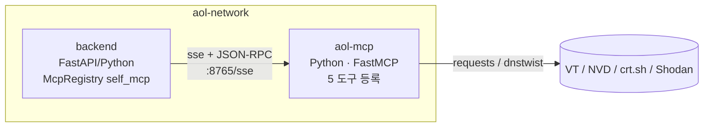
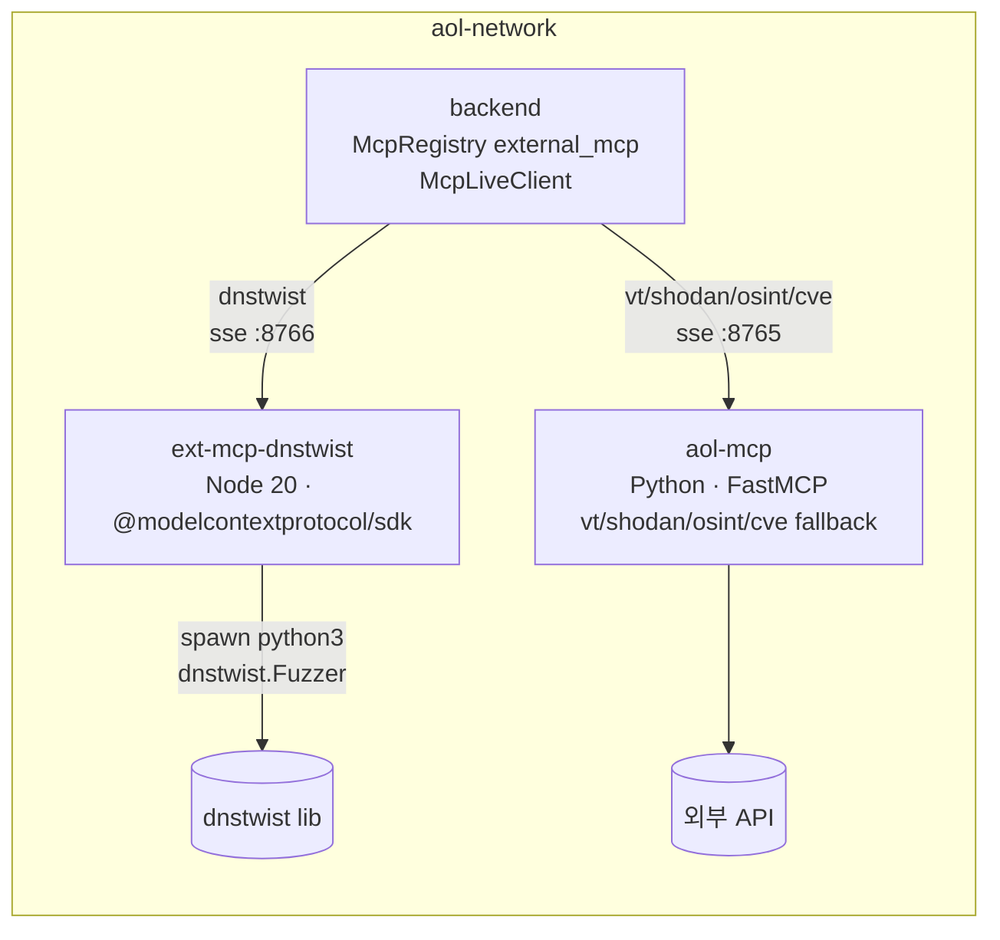

# 🧩 MCP (Model Context Protocol) — Why & How

본 시스템이 외부 위협 인텔리전스 도구를 통합하는 방식. `McpRegistry`
게이트웨이가 **3가지 통합 모드**를 지원한다.

| 모드 | 무엇 | 언제 |
|---|---|---|
| `simulation` | 시드 데이터 반환 (외부 호출 0회) | 데모/PoC/테스트 |
| `direct` | backend 프로세스가 외부 API 직접 호출 | 의존성 최소(사이드카 없음) |
| `self_mcp` | 자체 FastMCP 사이드카 (Python, SSE+JSON-RPC) | 운영 권장 — 캐시 공유 + 도구 격리 |
| `external_mcp` | 외부 MCP 서버(Node) + self_mcp 폴백 | 진짜 MCP 생태계와 혼합 |

`AOL_LIVE_MCP_MODE` 환경변수로 모드 선택. `mode="live"` 전달 시
런타임에 해석된다.

---

## Why MCP — 직접 API 호출 대신 추상화 레이어를 둔 이유

| 항목 | 직접 API 호출 (mock 없이) | MCP 추상화 (본 시스템) |
|---|---|---|
| 도구 추가 | 노드별 코드 수정 + 재배포 | `McpRegistry` 메서드 하나 추가 |
| 다른 LLM 으로 전환 | 도구별 어댑터 재작성 | LangChain MCP Adapter 로 무관 |
| 호출 기록 | 도구마다 별도 로깅 코드 | 단일 `McpCallRecord` → Audit Ledger 통합 |
| 시뮬레이션·테스트 | mock 라이브러리 별도 셋업 | `mode="simulation"` 한 플래그 |
| 사이드카 분리 | 큰 리팩토링 | mode 환경변수 한 줄 |
| 데이터 출처 추적 | 코드 곳곳에 분산 | 모든 결과에 `_source` 필드 |
| 다른 언어 도구 통합 | gRPC/REST 어댑터 직접 작성 | MCP 표준 (Node/Rust/Go 서버 즉시 연결) |

---

## How — `McpRegistry` 게이트웨이 구현

`backend/app/features/langgraph_threat_hunter/mcp_clients.py`

```python
@dataclass
class McpRegistry:
    """5종 MCP 도구를 단일 인터페이스로 추상화. 모드별 분기."""
    mode: str = "simulation"   # simulation / direct / self_mcp / external_mcp / live

    def virustotal(self, state, ioc, ioc_type) -> dict: ...
    def dnstwist(self, state, domain) -> list[dict]: ...
    def shodan(self, state, target) -> list[dict]: ...
    def osint(self, state, target) -> list[dict]: ...
    def cve(self, state, cve_id) -> dict: ...
```

각 메서드는:
1. `simulation` → 시드 데이터 반환 (외부 호출 0회)
2. `self_mcp` / `external_mcp` → `mcp_live_client.McpLiveClient` 가 sse 로
   사이드카 호출. 실패 시 `direct` 폴백.
3. `direct` → 백엔드 프로세스가 requests / dnstwist Python lib 직접 호출
4. 결과는 `McpCallRecord` 로 자동 기록 (`state.mcp_calls` 누적, latency
   포함)
5. in-process 캐시 10분 TTL (모드별 동일)

---

## 모드별 아키텍처 다이어그램

### Phase A — `self_mcp` (자체 FastMCP 사이드카)



- 컨테이너 1개 추가 (`aol-mcp`)
- 5개 도구 모두 자체 사이드카
- Python ↔ Python · mcp SDK ↔ mcp FastMCP

### Phase B — `external_mcp` (외부 Node.js MCP + 자체 폴백)



- 컨테이너 2개 추가 (`aol-mcp` + `ext-mcp-dnstwist`)
- dnstwist → 외부 Node 서버, 나머지 → 자체 FastMCP
- Python ↔ Python AND Python ↔ Node.js
- **MCP가 진짜 언어/SDK 무관 표준임을 입증**

---

## 3 모드 비교 (실측, 2026-05-24)

`benchmarks/run_mcp_comparison.py --all` 실행 결과. 같은 backend
컨테이너 내부에서 측정. 측정 지표 = **latency / payload bytes / LLM
토큰 / 결과 수 / 출처 / 동시 호출 QPS / 컨테이너 메모리 / 이미지 크기**.

### (1) 도구별 호출 측정

| 모드 | 도구 | 입력 | cold (ms) | warm (ms) | bytes | tokens | 출처 |
|---|---|---|---:|---:|---:|---:|---|
| direct | dnstwist | shinhan-secure-banking.kr | 1879 | — | 2407 | 601 | dnstwist lib |
| direct | dnstwist | kakaobank-secure-login.com | 1801 | — | 2436 | 609 | dnstwist lib |
| direct | cve | CVE-2024-21762 | 4634 | — | 519 | 129 | NVD live |
| direct | cve | CVE-2023-44487 | 4778 | — | 405 | 101 | NVD live |
| direct | osint | shinhan.com | 1210 | — | 123 | 30 | crt.sh |
| **self_mcp** | dnstwist | shinhan-secure-banking.kr | 2514 | **37** | 2407 | 601 | aol-mcp |
| **self_mcp** | dnstwist | kakaobank-secure-login.com | 36 | **44** | 2436 | 609 | aol-mcp |
| **self_mcp** | cve | CVE-2024-21762 | 33 | **34** | 519 | 129 | aol-mcp |
| **self_mcp** | cve | CVE-2023-44487 | 32 | **35** | 405 | 101 | aol-mcp |
| **self_mcp** | osint | shinhan.com | 34 | **36** | 123 | 30 | aol-mcp |
| external_mcp | dnstwist | shinhan-secure-banking.kr | 3577 | 2888 | **3335** | **833** | external_node_mcp |
| external_mcp | dnstwist | kakaobank-secure-login.com | 2629 | 2573 | **3364** | **841** | external_node_mcp |
| external_mcp | cve | CVE-2024-21762 | 46 | 38 | 519 | 129 | aol-mcp (fallback) |
| external_mcp | cve | CVE-2023-44487 | 32 | 38 | 405 | 101 | aol-mcp (fallback) |
| external_mcp | osint | shinhan.com | 38 | 37 | 123 | 30 | aol-mcp (fallback) |

> `direct` 의 warm avg 가 `—` 인 이유: 측정 스크립트가 반복마다 새
> `McpRegistry` 를 생성해서 in-process 캐시가 무력화됨. 실제 운영에서는
> 단일 registry 재사용이라 캐시 적중함. self_mcp 는 사이드카 안에 캐시가
> 살아있어 측정 방식과 무관하게 warm 적중.

### (2) 동시 호출 QPS (dnstwist 5 병렬)

| 모드 | per-call avg (ms) | wall (ms) | QPS |
|---|---:|---:|---:|
| direct | 2 | 5 | **963.80** |
| self_mcp | 144 | 149 | 33.61 |
| external_mcp | 9466 | 9822 | **0.51** |

> `direct` 의 QPS 가 압도적인 이유: warm-up 후 backend in-process 캐시가
> 살아있어서 5 병렬이 모두 캐시 적중. 실제 분석 흐름(매번 다른 IoC)에서는
> 이 수치가 재현되지 않는다. **external_mcp 의 0.51 QPS 는 Node 서버에
> 캐시가 없어 매 호출마다 python spawn 직렬 처리 → 운영 부적합**.

### (3) 사이드카 컨테이너 자원

| 모드 | 컨테이너 | 메모리 (MB) | 이미지 (MB) |
|---|---|---:|---:|
| direct | backend (자체) | 116.7 | 949 |
| self_mcp | aol-mcp | **57.6** | **180** |
| external_mcp | aol-mcp + ext-mcp-dnstwist | 57.6 + 29.7 = 87.3 | 180 + 309 = 489 |

### 핵심 인사이트

1. **self_mcp가 운영 권장**: warm 30~50ms 일관 응답 + 캐시 적중률 100% +
   사이드카 메모리 57MB만 추가. backend 이미지(949MB)에 도구 추가 없이도
   기능 확장 가능.
2. **external_mcp는 정직한 학술 가치**: 다른 언어/SDK MCP 서버와의 호환성을
   입증하지만, 결과 페이로드가 **+39% (601→833 tokens)** 증가 → 그대로
   LLM 비용으로 직결. 캐시 미구현으로 QPS 0.51 → 운영 부적합.
3. **direct cold latency 가 가장 짧지 않음** — backend 프로세스에 무거운
   라이브러리(dnstwist, requests) 로드 비용 + 매 호출마다 외부 API 왕복.
   사이드카 분리 후 캐시 적중 시 self_mcp 가 압도적.
4. **MCP 오버헤드(SSE 세션 셋업)** ≈ 30~50ms — warm 호출의 self_mcp 가
   캐시 적중 + MCP overhead 만으로 측정됨. 무시할 수준.
5. **외부 MCP의 +39% 토큰은 비용 직결**: 같은 도구라도 결과 포맷이 풍부할수록
   LLM 비용이 비례 증가. 91.8% 비용 절감 분석과 같은 결의 정직한 수치.

---

## 5종 도구 — 실 wire-up 명세

(self_mcp / direct 양쪽 모두 동일한 외부 API 사용, external_mcp 는 dnstwist 만 Node 경로)

### 1. VirusTotal — IoC 평판 조회

| 속성 | 값 |
|---|---|
| 엔드포인트 | `https://www.virustotal.com/api/v3/{ip_addresses,domains,urls,files}/{ioc}` |
| 인증 | `x-apikey` 헤더 (env `VIRUSTOTAL_API_KEY`) |
| 무료 티어 | 4 req/min, 500 req/day |
| 자가 보호 | 분당 4회 = 15초 간격 자가 레이트리밋 |
| 응답 (성공) | `{ioc, type, detection_ratio: "N/M", stats, reputation, creation_date, categories}` |
| 응답 (키 없음) | `{_error: "VIRUSTOTAL_API_KEY 미설정"}` |

### 2. DNSTwist — 타이포스쿼트 변형 생성

| 속성 | 값 |
|---|---|
| 구현 (self_mcp/direct) | Python `dnstwist` 라이브러리 — `Fuzzer.generate()` (DNS 미수행) |
| 구현 (external_mcp) | Node 서버가 `spawn python3 -c "dnstwist.Fuzzer..."` |
| API 키 | 불필요 (로컬 실행) |
| 입력 | 도메인 (예: `kakaobank.com`) |
| 출력 | 4,000~10,000 변형 생성 → 상위 30건만 추출 |
| 본 시스템 사용 | 상위 15건만 LLM 에 전달 (토큰 절약) |

### 3. Shodan — 노출 자산 점검

| 속성 | 값 |
|---|---|
| 무료 (InternetDB) | `https://internetdb.shodan.io/{ip}` — IP 만, 응답 가벼움 |
| 유료 (Shodan API) | `https://api.shodan.io/shodan/host/{ip}` (env `SHODAN_API_KEY` 있으면) |
| 응답 | `[{target, port, service, cve, severity}, ...]` |
| 폴백 | InternetDB 만 사용 가능, paid 키는 보강용 |

### 4. crt.sh — Certificate Transparency 로그

| 속성 | 값 |
|---|---|
| 엔드포인트 | `https://crt.sh/?q={target}&output=json` |
| API 키 | 불필요 (공개) |
| 응답 | `[{common_name, issuer_name, not_before, not_after}, ...]` |
| 본 시스템 사용 | 상위 5건만 LLM 에 전달 |

### 5. CVE — NVD + EPSS + CISA KEV (3종 조합)

| 도구 | 엔드포인트 | 데이터 |
|---|---|---|
| NVD | `services.nvd.nist.gov/rest/json/cves/2.0?cveId=...` | CVE 메타 + CVSS 점수 |
| EPSS | `api.first.org/data/v1/epss?cve=...` | 1년 내 악용 확률 (0~1) |
| CISA KEV | `cisa.gov/sites/.../known_exploited_vulnerabilities.json` | 실제 악용 카탈로그 (1일 캐시) |

종합 응답:
```json
{
  "cve_id": "CVE-2024-21762",
  "description": "Fortinet FortiOS pre-auth RCE...",
  "cvss_score": 9.8,
  "cvss_severity": "CRITICAL",
  "epss": 0.97,
  "epss_percentile": 0.998,
  "kev_listed": true,
  "_source": "live"
}
```

---

## 데이터 흐름 — MCP → LLM 통합

`backend/app/features/langgraph_threat_hunter/nodes.py` 의 라이브 분기:

```python
def infrastructure_node(state, mcp):
    # 1. MCP 도구 3종 호출 — 모드와 무관하게 같은 인터페이스
    dt_result = mcp.dnstwist(state, state.ioc)         # self_mcp/external_mcp/direct
    sh_result = mcp.shodan(state, state.ioc)
    os_result = mcp.osint(state, state.ioc)

    # 2. LLM 사용자 메시지에 MCP 결과를 JSON 직렬화 포함
    prompt = _live_user_prompt(state, prior_findings, mcp_data={
        "dnstwist": dt_result[:15],     # 토큰 절약
        "shodan": sh_result,
        "osint_crtsh": os_result[:5],
    })

    # 3. Specialist Claude 호출 — 실 데이터 기반 분석
    findings, meta = call_agent("infrastructure", prompt, max_tokens=1300)
```

Specialist Claude (Sonnet 4.5) 의 system prompt 에 "MCP 도구 결과가 실
데이터로 들어옴. 없거나 `_error` 면 추정/일반론 기반으로 답변, 데이터
출처를 chat_message 에 명시하라" 규약 명시.

---

## 자체 FastMCP 서버 명세

`mcp_servers/aol-mcp-server/server.py`

- 베이스: `mcp.server.fastmcp.FastMCP` (Python MCP SDK)
- Transport: SSE (`/sse :8765`)
- DNS rebinding 보호 — `aol-mcp:*` 호스트 허용 (docker 내부 네트워크용)
- 5개 도구를 `@mcp.tool()` 데코레이터로 등록
- in-process 캐시 10분 TTL (도구별 독립)
- 컨테이너: `aol-mcp:latest`, healthcheck = TCP listen 확인

## 외부 Node.js MCP 서버 명세

`mcp_servers/external-mcp-dnstwist/server.js`

- 베이스: `@modelcontextprotocol/sdk` (공식 Node SDK)
- Transport: SSE (`/sse :8766`) via Express
- dnstwist 도구만 노출 (의도적으로 단순)
- `spawn("python3", ["-c", PY_FUZZER_SNIPPET, ...])` 로 dnstwist Fuzzer
  직접 호출 (DNS 미수행, self_mcp 와 공정 비교)
- 캐시 없음 — 측정에 노이즈 없도록 의도
- 컨테이너: `aol_ext_mcp_dnstwist:latest`

---

## 운영 모드 전환

```bash
# 시뮬레이션 (외부 호출 없음, 시드 데이터)
docker compose up -d

# direct (사이드카 없음, 백엔드가 직접 외부 API)
docker compose -e AOL_LIVE_MCP_MODE=direct up -d backend

# self_mcp (Phase A — 권장)
docker compose -e AOL_LIVE_MCP_MODE=self_mcp up -d

# external_mcp (Phase B — Node MCP + self_mcp fallback)
docker compose -e AOL_LIVE_MCP_MODE=external_mcp up -d
```

backend 의 `mode="live"` 가 환경변수로 풀린다 (`mcp_clients.py::_resolve_live_mode`).
