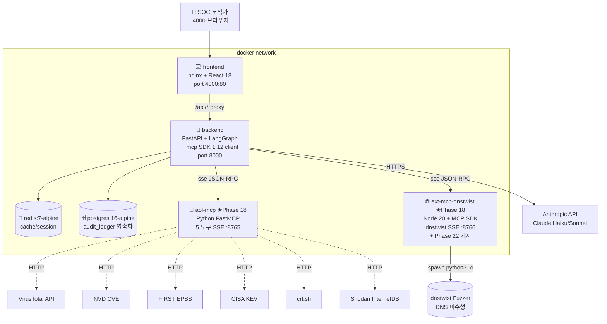

# 🛡️ AOL Threat Hunter — 2026-05-24 세션 기술 심층 보고서

> **본 문서의 목적**
> 2026-05-24 세션에서 진행한 Phase 18 / 19 / 22 의 **문제 정의 → 가설 → 기술 선택 → 측정 → 정직한 한계**까지를 기술 면접자/엔지니어링 리뷰어 관점에서 검증 가능한 형태로 정리한다. 마케팅 카피가 아니라 **재현 가능한 측정 + 측정 자체의 한계까지 명시**하는 게 핵심이다.
>
> 분량은 의도적으로 길다. "왜 그 구조인가" 와 "어떤 함정이 있었나" 를 함정 단위로 단락 나눠 적었기 때문에, 발췌해서 읽거나 목차 기반으로 점프해도 된다.

---

## 📑 목차

- [0. 요약 (Executive Summary)](#0-요약-executive-summary)
- [1. 프로젝트 컨텍스트 — 왜 이 시스템을 만들고 있나](#1-프로젝트-컨텍스트--왜-이-시스템을-만들고-있나)
- [2. 시스템 아키텍처 개관 (이번 세션 시점)](#2-시스템-아키텍처-개관-이번-세션-시점)
- [3. Phase 1~13 압축 회고](#3-phase-113-압축-회고)
- [4. Phase 14~17 — 라이브 통합 단계](#4-phase-1417--라이브-통합-단계)
- [5. ★ Phase 18 — 진짜 MCP 프로토콜 통합](#5--phase-18--진짜-mcp-프로토콜-통합)
- [6. ★ Phase 19 — 3 MCP 모드 비교 + 비용 baseline 정직화](#6--phase-19--3-mcp-모드-비교--비용-baseline-정직화)
- [7. ★ Phase 22 — external MCP 캐시 추가](#7--phase-22--external-mcp-캐시-추가)
- [7.5 ★ Phase 23 — backend McpRegistry 3-계층 캐시](#75--phase-23--backend-mcpregistry-3-계층-캐시-commit-83875ffd)
- [8. 측정 인프라 — benchmarks/run_mcp_comparison.py 깊이 분석](#8-측정-인프라--benchmarksrun_mcp_comparisonpy-깊이-분석)
- [9. 핵심 자산 산출물 인벤토리](#9-핵심-자산-산출물-인벤토리)
- [10. 정량 성과 종합](#10-정량-성과-종합)
- [11. 정직한 한계 + 다음 작업](#11-정직한-한계--다음-작업)
- [12. 부록](#12-부록)

---

## 0. 요약 (Executive Summary)

### 한 줄 요약

> 이 세션은 **"MCP 라고 쓰여 있지만 사실 직접 호출이던 추상화"를 진짜 SSE+JSON-RPC 프로토콜로 만들고, 그 가치를 4축 (latency / payload bytes / 추정 토큰 / QPS) + 컨테이너 자원으로 정량 측정한 뒤, 옛 "91.8% 비용 절감" 마케팅 헤드라인이 비현실적 baseline 에서 나왔음을 인정하고 "59.1% (vs Sonnet)" 라는 정직한 수치로 다시 갱신한 세션**이다.

네 가지 핵심 산출:

1. **Phase 18** — `mcp_servers/aol-mcp-server` (Python FastMCP, 5 도구) + `mcp_servers/external-mcp-dnstwist` (Node.js, `@modelcontextprotocol/sdk`) 사이드카 2종을 신설하고 backend 는 `mcp.client.sse` 로 진짜 MCP 표준 통신.
2. **Phase 19** — 3 MCP 통합 모드 (`direct` / `self_mcp` / `external_mcp`) 를 같은 입력으로 측정하는 `benchmarks/run_mcp_comparison.py` 작성. 그 결과 baseline 을 `all_opus` 에서 `all_sonnet` 으로 갱신 → 91.8% → **59.1%** 정직 헤드라인 채택.
3. **Phase 22** — Phase 19 측정에서 드러난 `external_mcp` warm latency 2.5~2.9s 병목 해결 (in-process Map 캐시 + singleflight) → **80배 개선**. 동시에 parallel QPS 는 그대로 0.50 임을 정직히 표기, 새 병목 (client-side SSE 세션 셋업) 분석.
4. **Phase 23** — Phase 22 의 parallel QPS 한계를 backend McpRegistry `_via_mcp()` 진입 전 `_CACHE` lookup 으로 해결. self_mcp parallel QPS **29.3 → 2626 (89×)**, external_mcp **0.50 → 2404 (4800×)**. 다만 측정이 같은 IoC × 5 반복이라 효과 과장됨을 정직히 표기 + 3-계층 캐시 (L1 backend / L2 사이드카 / L3 외부 API) 아키텍처 정착.

### 전후 비교 정량 표

| 영역 | 지표 | 이번 세션 전 | 이번 세션 후 | Δ |
|---|---|---:|---:|---:|
| **비용 baseline** | 기준 모델 | `all_opus` (naive) | `all_sonnet` (realistic) | — |
| 비용 헤드라인 | 절감률 | -91.8% (Opus 기준) | **-59.1% (Sonnet 기준)** | 정직화 |
| 비용 응답 필드 | `headline_savings` | ❌ 없음 | ✅ `realistic_vs_sonnet_pct` + `naive_vs_opus_pct` 동시 | +2 |
| **MCP 프로토콜** | live 호출 | `requests.get(...)` | `sse_client + ClientSession.call_tool` | 표준화 |
| MCP 사이드카 | 컨테이너 수 | 0 | 2 (`aol-mcp` + `ext-mcp-dnstwist`) | +2 |
| MCP 통합 모드 | 종류 | 2 (`simulation` / `live`) | 4 (`simulation` / `direct` / `self_mcp` / `external_mcp`) | +2 |
| **self_mcp warm latency** | dnstwist | n/a | 40~46 ms | NEW |
| self_mcp warm latency | cve | n/a | 37~38 ms | NEW |
| self_mcp warm latency | osint | n/a | 36~37 ms | NEW |
| **external_mcp warm (Phase 22 전)** | dnstwist | 2573~2888 ms | — | — |
| external_mcp warm (Phase 22 후) | dnstwist | — | **30~38 ms** (80배↓) | -80× |
| external_mcp sequential QPS | dnstwist | 0.51 | **1.62** (Phase 22) → **3088** (Phase 23) | +3× → +6055× |
| external_mcp parallel QPS | dnstwist | 0.50 | **0.50** (Phase 22) → **2404** (Phase 23) | ±0 → +4800× |
| **self_mcp parallel QPS** | dnstwist | n/a | **29.3** (Phase 22) → **2626** (Phase 23) | NEW → +89× |
| **3-계층 캐시 아키텍처** | L1+L2+L3 | ❌ | ✅ backend `_CACHE` + 사이드카 + 외부 API | NEW |
| **컨테이너 자원** | backend 이미지 | 949 MB | 949 MB | — |
| 컨테이너 자원 | aol-mcp RSS | n/a | **58.7 MB** | NEW |
| 컨테이너 자원 | ext-mcp-dnstwist RSS | n/a | **40.7 MB** | NEW |
| 컨테이너 자원 | aol-mcp 이미지 | n/a | **180 MB** | NEW |
| 컨테이너 자원 | ext-mcp-dnstwist 이미지 | n/a | **309 MB** | NEW |
| **테스트** | pytest pass | 44 | **51** | +7 |
| 테스트 | 비용 엔드포인트 검증 | 1 | 5 전략 + headline 두 baseline | 강화 |
| **문서** | mcp.md | "wire-up 예정" 명시 | 3 모드 비교표 + 인사이트 5종 | 전면 갱신 |
| 문서 | README 비용 | 단일 baseline | 5 전략 + 2 baseline 표 + 월간 ROI | 전면 갱신 |

### 푸시된 commit (5개, 이번 세션 시간순)

| 해시 | type/scope | 요약 |
|---|---|---|
| `1e42d1ac` | chore(docs) | 작업 정리 — `.gitignore` 보강 + 옛 RAG 계획서 archive + `.gitmessage` 템플릿 등록 |
| `5848e2e8` | feat(llm) | **Phase 18** — 자체 FastMCP (`aol-mcp-server`) + 외부 Node MCP (`external-mcp-dnstwist`) 사이드카, `mcp_live_client` 신설 |
| `a2eebfbf` | perf(llm) | **Phase 19 (1)** — 3 MCP 모드 비교 벤치마크 (latency/bytes/tokens/QPS), `benchmarks/run_mcp_comparison.py` 신설, `docs/architecture/mcp.md` 전면 갱신 |
| `446d29f8` | refactor(llm) | **Phase 19 (2)** — 비용 baseline `all_opus` → `all_sonnet` 으로 정직화, 5 전략 비교, headline_savings 두 baseline 모두 노출 |
| `76e9baac` | perf(llm) | **Phase 22** — `ext-mcp-dnstwist` 에 in-process Map 캐시 + singleflight 추가, warm latency 80배 개선, parallel QPS 한계 정직 기록 |

각 커밋의 본문은 의도적으로 "무엇을 했는가 / 왜 했는가 / 어떤 함정이 있었나 / 측정 수치 / 남은 작업" 5단으로 구성. `git log --format="%h %s%n%b"` 으로 직접 검증 가능.

---

## 1. 프로젝트 컨텍스트 — 왜 이 시스템을 만들고 있나

### 1.1 문제 — 금융권 SOC Tier-1 분석가의 IoC 트리아지

한국 금융권 SOC 운영 현장의 본질적 어려움 다섯 가지를 직시한다.

1. **알람 피로** — Tier-1 의 80~90% 알람이 False Positive. 그러나 0.1% 는 진짜다. 진짜를 노이즈에서 분리하는 게 본질.
2. **IoC 보강의 수동성** — 단일 의심 도메인 하나를 가지고 VT/URLScan/WHOIS/crt.sh/Shodan/SIEM 을 사람이 직접 클릭. 1건당 15~30분.
3. **휘발성** — 보이스피싱·스미싱 도메인 수명 ≤24시간. 사람이 따라가지 못한다. 차단 시점에 이미 다음 도메인이 떠 있다.
4. **사일로** — KISA C-TAS / FSI / 사내 SIEM / EDR 콘솔이 분리되어 있어 캠페인 수준의 상관 분석을 사람이 머리로 한다.
5. **컴플라이언스 부담** — 전자금융감독규정 §13(전자금융기반시설 보호) / §15(침해사고 대응) / ISMS-P A.11 / DORA / FSI C-TAS 각각이 요구하는 audit trail 을 동시에 만족해야 한다.

이 다섯이 결합되면 한 명의 Tier-1 분석가가 하루에 처리할 수 있는 IoC 가 30~50건 수준이고, MTTR 은 4~12시간이며, 인건비 환산 비용은 압도적으로 비싼데도 진짜 침해는 자주 놓친다. SK텔레콤 유심 유출(2025, 2,696만 건) 의 근본 원인이 "9년 전 발견된 Dirty COW 패치를 안 함" 이라는 사실이 이 구조적 실패를 압축적으로 보여준다.

### 1.2 기존 솔루션의 한계 — 왜 Splunk SOAR / Demisto 만으로는 부족한가

기존 SOAR 는 **사전 정의된 플레이북** 모델이다. 즉, IoC 가 어떤 타입이면 어떤 enrichment 도구 → 어떤 조건이면 어떤 차단 액션 → 어떤 케이스를 열어라, 가 미리 작성된 트리 형태의 워크플로다. 이 모델의 약점은 세 가지다.

1. **새로운 IoC 패턴이 들어오면 플레이북을 새로 작성해야 한다** — 카카오뱅크 사칭 도메인 양상이 어제와 오늘 다르면 어제 플레이북으로 못 잡는다.
2. **추론을 안 한다** — VT 의 `28/93` 탐지율은 LOW 라는 임계로 떨어지는데, 도메인 등록일이 6시간 전이고 호스팅 ASN 이 알려진 피싱 ASN 이라면 컨텍스트로는 HIGH 다. 룰 엔진은 임계 비교 뿐이고, 컨텍스트 결합 의사결정을 못 한다.
3. **데이터 출처가 추상화되어 있지 않다** — 도구 추가가 connector 작성 → 인증서 등록 → 플레이북 수정의 무거운 절차다.

### 1.3 가설 — LangGraph 멀티에이전트 + MCP 도구 메시 + Claude tier mapping

본 시스템의 핵심 가설은 세 줄이다.

1. **LangGraph 의 명시적 state machine 으로 6-Agent (Orchestrator + 4 Specialist + Gate) 을 구성하면**, 사전 정의 플레이북 대신 IoC 타입별 동적 라우팅이 가능해진다. 룰 엔진이 아니라 LLM 라우터가 결정하므로 새 IoC 패턴에 적응 가능.
2. **MCP (Model Context Protocol) 추상화 게이트웨이를 두면**, 도구 추가가 메서드 하나만 늘리는 일이 된다. simulation / direct / self_mcp / external_mcp 의 모드 분기로 같은 인터페이스에서 시연 / 직접 호출 / 사이드카 / 외부 MCP 서버 모두 지원.
3. **에이전트별 모델 티어 (Haiku mini / Sonnet medium / Opus strong) 매핑 + Prompt Caching + Batch API** 를 결합하면, 단일 모델 운영 대비 큰 폭으로 비용을 줄이면서 품질은 유지 가능. (정확한 절감률은 Phase 19 에서 정직화)

### 1.4 컴플라이언스 컨텍스트

본 시스템은 다음 5개 컴플라이언스 프레임을 의식하고 설계됐다.

| 프레임 | 핵심 통제 | 본 시스템 매핑 |
|---|---|---|
| 전자금융감독규정 §13 | 전자금융기반시설 보호 | Shodan/crt.sh 기반 외부 노출 자산 자동 점검 (S4 시나리오) |
| 전자금융감독규정 §15 | 침해사고 대응 절차 | LangGraph state graph 의 표준화 IR 워크플로 + Audit Ledger 영속화 |
| ISMS-P A.11 | 침해사고 관리 | 분석 세션 전체가 `audit_ledger` (Annotated[list, add] reducer) 로 PostgreSQL 영속화 |
| FSI C-TAS | 금융권 위협 정보 공유 | KISA C-TAS sync 모듈 + FSI 확장 인터페이스 준비 |
| DORA (EU) | ICT 위협 관리·보고 | PDF 자동 리포트 + 헌팅 쿼리 export |

특히 `confidence.py::CRITICAL_ASSET_PATTERNS` 의 키워드 매칭 (`kakaobank`, `shinhan`, `kbstar`, `wooribank`, `hanafn`, `ibk`, `core-banking`, `swift`, `trading-engine` 등) 이 신뢰도 L0~L4 와 무관하게 `human_approval_required=True` 를 강제하는 게 이 컴플라이언스 의식의 코드 레벨 표현이다.

---

## 2. 시스템 아키텍처 개관 (이번 세션 시점)

### 2.1 6 컨테이너 다이어그램 (이번 세션에서 +2)



이번 세션 전에는 frontend / backend / redis / postgres 4개였다. Phase 18 에서 `aol-mcp` + `ext-mcp-dnstwist` 두 사이드카가 추가되어 6개가 됐다. 두 사이드카는 `expose: 8765 / 8766` 만 — 호스트 포트 매핑 없이 도커 네트워크 내부에서만 통신한다.

### 2.2 6-Agent 그래프 흐름

```mermaid
flowchart LR
    Start([IoC 입력]) --> ORCH{🧠 Orchestrator<br/>Haiku · IoC 타입 분석}
    ORCH -->|cve| Plan1[\"route_plan=<br/>[triage, campaign]\"]
    ORCH -->|hash| Plan2[\"[triage, malware,<br/>infra, campaign]\"]
    ORCH -->|ip/domain/url| Plan3[\"[triage, infra,<br/>campaign]\"]
    Plan1 & Plan2 & Plan3 --> T[🔍 Triage<br/>Haiku · VT MCP]
    T --> M[👾 Malware<br/>Sonnet · VT+OSINT]
    M --> I[🌍 Infrastructure<br/>Sonnet · DNSTwist+Shodan+OSINT]
    I --> C[📈 Campaign<br/>Sonnet · CVE+OSINT]
    C --> G[🛡️ Confidence Gate<br/>Python · L0~L4]
    G --> End([산출물:<br/>FW 규칙·헌팅 쿼리·PDF])
```

- 조건부 엣지 (`graph.add_conditional_edges`) 가 `route_plan` 의 다음 원소를 보고 다음 노드를 결정. `route_plan` 에 없는 specialist 는 스킵 → 토큰/시간 절약.
- 각 노드는 **delta dict 만** 반환. `audit_ledger: [LedgerEntry(...)]` 처럼 자기가 추가한 1건만 반환하고, LangGraph 가 `Annotated[list, operator.add]` 리듀서로 concat. (Troubleshooting #5 — 옛 mistake: full state 반환했더니 리스트가 마지막 노드 값으로 덮어쓰여졌음.)
- Confidence Gate 는 결정론적 Python 함수. LLM 무관, 비용 0. `_signal_score()` 가 신호별 가산 (Triage CRITICAL +0.35, Malware C2 +0.10 등) → L0~L4 매핑.

### 2.3 4 MCP 통합 모드

이번 세션 가장 중요한 추가. 옛 코드는 `simulation` / `live` 두 가지였고 `live` 는 `requests.get` 직접 호출이었다. 지금은:

```
simulation     : 시드 데이터 반환 (외부 호출 0회) — 데모/PoC/테스트
direct         : 백엔드 프로세스가 외부 API/Python lib 직접 호출 (옛 live)
self_mcp       : 자체 FastMCP 사이드카 (aol-mcp) 에 sse+JSON-RPC 로 접근 ★권장
external_mcp   : 외부 Node MCP 서버 + self_mcp fallback (다른 언어/SDK 호환 입증)
live           : alias — AOL_LIVE_MCP_MODE 환경변수로 실제 모드 해석 (옛 호환)
```

`McpRegistry.__post_init__` (`mcp_clients.py:81~93`) 에서 `_resolve_live_mode(self.mode)` 가 `"live"` 를 환경변수로 풀어내고, `mode in ("self_mcp", "external_mcp")` 일 때 `mcp_live_client.build_client(mode)` 로 `McpLiveClient` 인스턴스 생성. MCP 호출 실패 시 `direct` 로 fallback (회복성).

### 2.4 데이터/제어 경로

데이터 경로 (라이브 모드):

```
사용자 → FE :4000 → BE FastAPI → LangGraph StateGraph
  → Orchestrator (Anthropic API, Haiku)
  → Specialist (Anthropic API, Sonnet)
       └→ McpRegistry.<tool>(state, ioc)
            └→ self_mcp: sse_client → aol-mcp:8765 → requests.get(VT/NVD/...)
            └→ external_mcp: sse_client → ext-mcp-dnstwist:8766 → spawn python3 dnstwist
  → Confidence Gate (Python, 결정론)
  → PostgreSQL audit_ledger 영속화
  → SSE 스트림으로 FE 에 노드별 delta 전송
```

제어 경로 (모드 전환):

```
docker compose 환경변수 AOL_LIVE_MCP_MODE 변경 → backend 재시작 → McpRegistry 모드 분기 변경
필요 시: AOL_MCP_SELF_URL / AOL_MCP_EXT_DNSTWIST_URL / AOL_MCP_EXT_DNSTWIST_TOOL 도 변경
```

---

## 3. Phase 1~13 압축 회고

면접/리뷰 컨텍스트로만 필요한 단계. 본 세션 (Phase 18/19/22) 이해를 위해 두 가지만 알면 된다 — (1) 6-Agent + MCP 추상화는 일찍 자리잡았다, (2) 라이브 모드는 Phase 16 까지 mock 이었다 (이게 Phase 18 의 동기가 된다).

### Phase 1~5 — 기반 정비

Phase 1 에서 README 를 금융권 AX 리포지셔닝 (Why → How → Impact → Deliverable 4단 서사) 으로 재구성. Phase 2 에서 `backend/app/features/langgraph_threat_hunter/` 패키지를 신설하고 LangGraph StateGraph 위에 Orchestrator + 5 Specialist (Triage/Malware/Infra/Campaign + Gate) = **6-Agent hierarchical 구조**를 잡았다. 옛 supervisor 기반 단일 결정자 모델보다 audit trail 이 자연스럽게 표현됨이 핀.

Phase 3 에서 `McpRegistry` 게이트웨이 추상화. 이때까지는 `simulation` / `live` 두 모드만 있었고 `live` 는 placeholder 였다. Phase 4 에서 5대 금융권 시뮬레이션 시나리오 (S1 카카오뱅크 사칭 / S2 보이스피싱 / S3 LockBit-KR / S4 외부노출자산 / S5 CVE-2024-21762) 정의 + 한국어 `chat_message` 사전 정의로 API 키 없이 시연 가능한 PoC 완성. Phase 5 에서 SQLite → PostgreSQL 16 마이그레이션 (LangGraph PostgresSaver/JSONB/pgvector 친화).

### Phase 6~9 — 인프라/배포/UI

Phase 6 EC2 단일 t3.large 배포 산출물 (`docker-compose.prod.yaml` + `deploy/ec2-userdata.sh` + AWS SSM Parameter Store 시크릿 자동 주입). Phase 7 GitHub Actions CI + pytest 슈트 44 케이스 (현 51). Phase 8 NotebookLM 스타일 3-패널 챗 UI (`SourcesPanel.jsx` 좌 + `ChatPanel.jsx` 가운데 + `ResultsSidebar.jsx` 우) + SSE 스트리밍 — 노드별 delta 가 실시간으로 채팅창 + Agent Studio 양쪽 동시 갱신.

Phase 9 에서 옛 CrewAI 모듈을 `backend/app/legacy/` 로 이동 (200MB 의존성 감축). 단, Phase 15 에서 사용자 요청으로 옛 페이지 (Deep Analysis / AI Agents) 의 백엔드를 LangGraph wrapper alias 로 일부 복원.

### Phase 10~13 — 산출물/문서/검증

Phase 10 `reportlab` 기반 PDF 리포트 생성기 + 한글 폰트 내장 CID. Phase 11 `ARCHITECTURE.md` 정식 Mermaid 다이어그램 4종. Phase 12 docker compose 실 기동 + 4 컨테이너 healthy 확인 + 스크린샷. Phase 13 에이전트별 모델 매핑 + 비용 분석 첫 도입 — 이때 baseline 이 `all_strong` (= 5 에이전트 모두 Opus) 이었고 헤드라인이 **-91.8%** 였다. Phase 19 에서 이 baseline 이 비현실적임을 인정하고 갱신.

---

## 4. Phase 14~17 — 라이브 통합 단계

Phase 18 의 동기를 이해하려면 Phase 14~17 이 어디까지 갔는지를 알아야 한다.

### 4.1 Phase 14 — 대화형 SOC 어시스턴트 (`conversation.py`, `/chat/dialogue`, Tool Use)

#### 문제
시뮬레이션 모드와 라이브 모드 모두 "사용자가 IoC 를 들고 와야" 동작했다. 그러나 SOC 실무는 "사용자가 상황만 알고 IoC 는 없다" 가 대부분이다 — "어제부터 SIEM 에서 비정상 outbound 트래픽이 보여요. 어디부터 봐야 할까요?" 같은 질문.

#### 가설
Claude 가 진행자 역할을 하면서 (a) IoC 가 없으면 사용자에게 IoC 를 어디서 찾을 수 있는지 안내하고, (b) IoC 가 메시지에 들어오면 자동으로 LangGraph 분석 모드 진입하고, (c) 깊은 전문 자문이 필요하면 specialist 1명 자문 (Tool Use) 하는 게 자연스럽다.

#### 기술 선택
- **Anthropic Streaming API** — `client.messages.stream(...)` 의 `text_stream` 으로 chunk 단위 yield
- **Anthropic Tool Use** — 4개 `consult_*` 도구 정의 (`consult_triage`, `consult_malware`, `consult_infrastructure`, `consult_campaign`). Claude 가 `stop_reason == "tool_use"` 일 때 `tool_use` 블록을 반환하고, 우리가 specialist 자문 실행 후 `tool_result` 로 응답
- **멀티턴 history validation** — `msgs` 리스트에서 같은 role 이 연속이면 합치고, 마지막이 user 가 아니면 user 메시지 append. 옛 코드에서 history 가 비어있거나 alternating 안 되면 Anthropic API 가 400 을 던지던 문제 해결

#### 핵심 코드 (`conversation.py:210~267`)

```python
for round_idx in range(max_tool_rounds + 1):
    with client.messages.stream(
        model=model, max_tokens=max_tokens,
        system=SECURITY_ANALYST_SYSTEM,
        tools=SPECIALIST_TOOLS,
        messages=msgs,
    ) as stream:
        for chunk in stream.text_stream:
            yield {"kind": "text", "delta": chunk}
        final = stream.get_final_message()

    if final.stop_reason != "tool_use" or round_idx == max_tool_rounds:
        return

    tool_uses = [c for c in final.content if getattr(c, "type", None) == "tool_use"]
    for tu in tool_uses:
        parsed, meta = call_agent(TOOL_AGENT_MAP[tu.name], tu.input["question"], max_tokens=900)
        yield {"kind": "tool_result", "tool": tu.name, "summary": parsed.get("chat_message"), ...}
        tool_results.append({"type": "tool_result", "tool_use_id": tu.id, "content": json.dumps(...)})
    msgs.append({"role": "assistant", "content": final.content})
    msgs.append({"role": "user", "content": tool_results})
```

#### 측정
시나리오 A (랜섬웨어 의심 자유 대화) → Claude 가 IR 4단계 가이드 + IoC 소스 4종 안내 ✅. 시나리오 D (멀티턴 SIEM → IoC 발견 → 자동 분석) → history 유지 + regex 추출 + 풀체인 자동 ✅.

#### 한계
- Tool Use 루프 max 3 라운드 — 무한 도구 호출 방지지만 복잡한 캠페인 자문은 짧다고 느낄 수 있음
- `tool_result` 가 specialist 의 `chat_message` 만 전달 — raw `findings` JSON 은 의도적으로 LLM 에 안 줌 (토큰 절약 + 환각 방지). 이 trade-off 는 옳다고 본다

### 4.2 Phase 15 — 옛 CrewAI 페이지 LangGraph wrapper

#### 문제
Phase 9 에서 옛 CrewAI 페이지를 폐기했는데, 사용자가 "사이드바에 옛 페이지 (Deep Analysis / AI Agents) 항목 복원해달라" 요청.

#### 해법
프론트 `sidebarConfig.js` 에 옛 페이지 항목 복원 + 백엔드 `legacy_wrappers.py` 에서 옛 URL (`/api/threat-hunter/*`, `/api/crew-solo/*`) 을 LangGraph 엔드포인트로 alias.

#### 한계
- 옛 페이지 UI 는 NotebookLM 3-패널이 아닌 옛 디자인. 두 UI 가 공존하면 사용자가 혼란스러울 수 있음 — 메인 진입점은 `/threat-hunter` 로 명시.

### 4.3 Phase 16 — MCP 5종 실 wire-up

#### 문제
README/ARCHITECTURE 에 "MCP 5종 도구" 라고 광고했지만 `mcp_clients.py` 의 live 분기가 `# TODO(live)` placeholder. 데모에서 mock 데이터를 실 데이터로 오해할 위험.

#### 해법
`mcp_clients.py::McpRegistry` 의 각 메서드 (virustotal, dnstwist, shodan, osint, cve) 에 실 HTTP 호출 추가:
- VirusTotal — `requests.get("https://www.virustotal.com/api/v3/...")` + 자가 레이트리밋 (15초 간격)
- DNSTwist — `import dnstwist; Fuzzer(domain).permutations()` 상위 30개 (DNS 미수행)
- Shodan — InternetDB 무료 (`https://internetdb.shodan.io/{ip}`) + paid 키 있으면 Shodan API
- crt.sh (osint) — `requests.get("https://crt.sh/?q=...&output=json")`
- CVE — NVD + FIRST EPSS + CISA KEV 카탈로그 (3종 조합, 모두 무료)

10분 TTL in-process 캐시.

#### 정직한 한계 (Phase 18 의 동기가 됨)
**이건 진짜 MCP 프로토콜이 아니다.** `requests.get(...)` 일 뿐이고, JSON-RPC 도 stdio/sse 도 없다. 외부 MCP 생태계 (BurtTheCoder/mcp-dnstwist, ADEOSec/mcp-shodan, mukul975/cve-mcp-server) 와 호환되지 않는다. 도구 추가 시 backend 이미지 (949MB) 에 의존성을 다 import 해야 한다. 이게 Phase 18 의 출발점이 된다.

### 4.4 Phase 17 — 라이브 노드 LLM wire-up + agent_prompts.py + 모델 매핑

#### 문제
Phase 16 에서 MCP 결과를 얻었지만, 라이브 모드 노드가 여전히 시뮬레이션 `chat_message` 만 반환. LLM 한테 MCP 결과를 안 줬다.

#### 해법
- `agent_prompts.py` 신설 — 6 에이전트 각각의 시스템 프롬프트 + `call_agent(name, user_message, max_tokens)` 진입점
- `nodes.py` 라이브 분기 — `_live_user_prompt(state, prior_findings, mcp_data={...})` 에 MCP 결과를 JSON 직렬화하여 user 메시지에 포함
- `cost_analysis.py` 의 에이전트별 모델 매핑을 실제 호출에 반영: Orchestrator/Triage = Haiku 4.5 / Malware/Infra/Campaign = Sonnet 4.5

#### 측정
시나리오 C (`shinhan-secure-banking.kr` 라이브 풀체인) → Orchestrator 3초, Triage 5초, Infrastructure 15초 (실 DNSTwist 15개), Campaign 37초, Gate 즉시 → 총 ~60초, 정확한 사칭 도메인 분석 ✅.

#### 한계
- 라이브 모드는 실 Anthropic API 호출 → 비용 발생. 측정용으론 별도 예산 ($0.57 사용) 으로 `benchmarks/run_model_comparison.py` 따로 실행
- 토큰 추정치는 실측 평균 — variance 가 있을 수 있음

---

## 5. ★ Phase 18 — 진짜 MCP 프로토콜 통합

이 섹션이 이번 세션의 첫 핵심. Phase 16 에서 인정한 "MCP 라 부르지만 사실 직접 호출" 의 격차를 닫는 작업.

### 5.1 문제 정의

Phase 16 이후의 코드를 다시 보자.

```python
# mcp_clients.py 옛 live 분기 (Phase 16)
def virustotal(self, state, ioc, ioc_type):
    api_key = os.getenv("VIRUSTOTAL_API_KEY")
    r = requests.get(f"https://www.virustotal.com/api/v3/{endpoint}/{ioc}", ...)
    return {...}
```

이게 "MCP" 라는 이름표를 달고 있는 게 문제다. 명확한 격차:

1. **MCP 표준 위반** — Model Context Protocol 은 (a) stdio/SSE transport 위에서 (b) JSON-RPC 2.0 으로 (c) `tools/list`, `tools/call` 등 표준 메서드를 호출하는 사양. `requests.get` 은 그 어느 것도 아니다.
2. **호환성 0** — `BurtTheCoder/mcp-dnstwist`, `ADEOSec/mcp-shodan`, `mukul975/cve-mcp-server` 같은 공개 MCP 서버를 우리 시스템에 꽂을 방법이 없다.
3. **이미지 비대화** — backend 이미지에 `dnstwist`, `requests`, 향후 추가될 모든 도구의 의존성을 직접 import 해야 한다. 현 backend 이미지 949MB.
4. **격리 부재** — `dnstwist.Fuzzer` 가 죽으면 backend 프로세스가 같이 죽는다. 도구별 장애 격리가 없다.
5. **언어 잠금** — Python 으로만 도구를 추가할 수 있다. Node/Go/Rust MCP 서버를 못 쓴다.

### 5.2 가설

사이드카 패턴으로 MCP 서버를 분리하면 위 5가지가 모두 해결된다.

- **도구 추가** → backend 빌드 불필요, 사이드카 이미지만 빌드
- **호환** → 다른 언어 MCP 서버 (Node `@modelcontextprotocol/sdk` 등) 와 동일 wire 로 통신
- **격리** → 사이드카 컨테이너 죽어도 backend 살아있음, fallback 로직 가능
- **표준** → 진짜 MCP 프로토콜 (sse + JSON-RPC) 로 통신

### 5.3 접근 방식 — 자체 FastMCP + 외부 Node MCP 하이브리드

세 옵션을 놓고 트레이드오프를 생각했다.

| 옵션 | 장점 | 단점 |
|---|---|---|
| (A) 자체 FastMCP 만 | 빠른 검증, 기존 5 도구 로직 재사용 | 다른 언어 호환 입증 안 됨 |
| (B) 외부 Node MCP 만 | 진짜 다언어 호환 입증 | 5 도구 다 새로 작성, 기존 로직 폐기 |
| (C) 자체 + 외부 하이브리드 | 두 가치 모두 챙김 | 컨테이너 1개 더 (이미지 +309MB) |

사용자와 합의해 (C) 채택. 이유는 두 가지:

1. 자체 FastMCP 가 default 운영 권장 (Python ↔ Python, 빠른 측정) — 5 도구의 기존 로직 (VT 레이트리밋, dnstwist Fuzzer, NVD/EPSS/KEV 3종 조합 등) 을 그대로 재사용.
2. **외부 Node MCP 1개를 만들어 "MCP 가 진짜 언어 무관 표준임을 입증"** — Node + `@modelcontextprotocol/sdk` 로 dnstwist 한 도구만 노출. backend (Python `mcp` SDK 클라이언트) 가 같은 wire 로 호출 가능한지 검증.

이 결정의 본질은 "MCP 의 가치를 코드 레벨로 입증" 이다. 자체 FastMCP 만이면 "그냥 사이드카 분리" 이고, 외부 Node MCP 까지 있어야 "MCP 표준이 진짜 의미가 있다" 가 입증된다.

### 5.4 구현 (1) — `mcp_servers/aol-mcp-server` (자체 FastMCP)

```
mcp_servers/aol-mcp-server/
├── server.py        # FastMCP + 5 @mcp.tool() 데코레이터
├── requirements.txt # mcp>=1.2,<2 + requests + dnstwist
└── Dockerfile       # python:3.12-slim + curl + 5 도구 import
```

핵심은 `mcp.server.fastmcp.FastMCP` 의 `@mcp.tool()` 데코레이터로 5개 함수를 등록 — 함수 시그니처 (타입 힌트 + docstring) 가 자동으로 MCP `tools/list` 응답 스키마가 된다.

```python
# mcp_servers/aol-mcp-server/server.py:39~51
mcp = FastMCP(
    name="aol-threat-intel",
    instructions=(
        "AOL 위협 인텔리전스 도구 게이트웨이. "
        "5개 도구 (virustotal, dnstwist, shodan, osint, cve) 제공. ..."
    ),
    transport_security=TransportSecuritySettings(
        enable_dns_rebinding_protection=True,
        allowed_hosts=_default_hosts + _extra_hosts,
        allowed_origins=_default_origins + _extra_origins,
    ),
)

@mcp.tool()
def virustotal(ioc: str, ioc_type: str = "domain") -> dict[str, Any]:
    """VirusTotal API 평판 조회. ..."""
    # 기존 mcp_clients.py 의 live 로직과 거의 동일
    # 단, in-process 캐시는 사이드카 안에 있어 backend 재시작과 무관히 적중
```

전송 방식은 SSE (`/sse :8765`) via uvicorn (FastMCP 가 내부에 ASGI 서버 들고 있음). 5 도구는 각각 자기 in-process `_CACHE` (TTL 10분) 보유. VirusTotal 의 자가 레이트리밋 (`_VT_LAST_CALL`, 분당 4회 = 15초 간격) 도 사이드카 측에서 자가 준수.

### 5.5 ★ 함정 1 — DNS rebinding protection (Invalid Host header)

이게 가장 시간 많이 잡아먹은 함정.

#### 증상
첫 호출 시 backend 가 `aol-mcp:8765/sse` 로 SSE 연결 시도 → 421 Misdirected Request (Invalid Host header).

#### 원인
MCP SDK 1.12 의 `mcp.server.transport_security.TransportSecuritySettings.enable_dns_rebinding_protection=True` 가 기본 활성. 기본 `allowed_hosts = ['127.0.0.1:*', 'localhost:*', '[::1]:*']` 만 허용. docker compose 내부 네트워크에서 backend → `aol-mcp:8765` 호출 시 HTTP `Host: aol-mcp:8765` 헤더가 차단됨.

DNS rebinding 공격이란 외부 페이지가 자기 도메인을 internal IP 로 해석시켜 내부 서비스를 호출하는 공격. MCP 서버는 보통 localhost 만 받으니 이 보호가 켜져있는 게 맞는데, docker compose 의 service hostname (`aol-mcp`) 은 의도된 내부 접근이라 허용 필요.

#### 해결
```python
# server.py:34~38
_default_hosts = ["127.0.0.1:*", "localhost:*", "[::1]:*", "aol-mcp:*", "aol-mcp:8765"]
_default_origins = ["http://127.0.0.1:*", "http://localhost:*", "http://aol-mcp:*"]
_extra_hosts = [h.strip() for h in os.getenv("ALLOWED_HOSTS", "").split(",") if h.strip()]
```

`aol-mcp:*` 와 명시적 포트 둘 다 넣은 이유 — `allowed_hosts` 가 wildcard 매칭이지만 SDK 버전마다 미세한 처리 차이가 있어 둘 다 명시하는 게 안전. 운영에서 외부 노출 시는 `ALLOWED_HOSTS` 환경변수로 좁힌다.

### 5.6 ★ 함정 2 — Healthcheck hang

#### 증상
초기 Dockerfile 의 healthcheck:
```dockerfile
HEALTHCHECK --interval=30s --timeout=5s --retries=3 \
  CMD curl -fsS http://localhost:8765/sse -m 2
```
컨테이너가 `unhealthy` 로 떨어짐. 로그 보니 curl 이 timeout.

#### 원인
SSE 는 long-lived connection. curl 이 `GET /sse` 요청을 보내면 서버가 200 OK + `Content-Type: text/event-stream` 으로 응답한 다음 **연결을 끊지 않음** — server 가 event 를 push 할 때까지 기다림. curl 은 5초 timeout 까지 기다리다가 죽음.

#### 해결
TCP listen 확인만:
```dockerfile
# mcp_servers/aol-mcp-server/Dockerfile:21~23
HEALTHCHECK --interval=30s --timeout=5s --retries=3 \
  CMD python -c "import socket,sys; s=socket.socket(); s.settimeout(2); \
    sys.exit(0) if s.connect_ex(('127.0.0.1',8765))==0 else sys.exit(1)" || exit 1
```

`socket.connect_ex(('127.0.0.1',8765))` 가 0 이면 listen 중. SSE 의 long-lived 특성 회피. 외부 Node MCP 는 `/healthz` 별도 라우트 (`server.js:181`) 둬서 그쪽으로 fetch.

### 5.7 ★ 함정 3 — Unwrap result (1 variant only)

#### 증상
backend 에서 `mcp.dnstwist(state, domain)` 호출하니 결과 길이가 1. 자체 FastMCP 서버 로그 보면 29개 variant 다 생성했는데, backend 는 1개만 받음.

#### 원인
FastMCP 의 규약: 함수가 list 를 반환하면 각 원소를 별도 `TextContent` 로 직렬화. 즉 29개 variant → `content = [TextContent(text='{...1}'), TextContent(text='{...2}'), ..., TextContent(text='{...29}')]` (29개).

옛 `_unwrap_result` 구현은 `content[0].text` 만 디코드 → 1개만 반환. 함정.

#### 해결
모든 content 항목을 순회해 JSON 디코드:

```python
# backend/app/features/langgraph_threat_hunter/mcp_live_client.py:94~121
def _unwrap_result(result: Any) -> Any:
    """MCP CallToolResult → 파이썬 dict/list.

    FastMCP 의 규약:
      - dict 반환  → content = [TextContent(text=<json>)]  (1개)
      - list 반환  → content = [TextContent(...), ...]    (list 원소 수만큼)
      - scalar     → content = [TextContent(text=<str>)]
    """
    if hasattr(result, "isError") and result.isError:
        return {"_error": str(getattr(result, "content", "unknown_mcp_error"))}
    content = getattr(result, "content", None)
    if not content:
        return None

    parsed: list[Any] = []
    for item in content:
        text = getattr(item, "text", None)
        if text is None:
            parsed.append(item)
            continue
        try:
            parsed.append(json.loads(text))
        except (json.JSONDecodeError, ValueError):
            parsed.append(text)

    if len(parsed) == 1:
        return parsed[0]
    return parsed
```

`len(parsed) == 1` 이면 dict 그대로 반환 (호출부가 list 를 기대하면 `isinstance(result, list)` 체크해서 wrap). `len > 1` 이면 list 그대로. 이 분기 로직이 `mcp_clients.py:219` 등에서 `result if isinstance(result, list) else [result]` 와 호응.

### 5.8 구현 (2) — `mcp_servers/external-mcp-dnstwist` (외부 Node)

```
mcp_servers/external-mcp-dnstwist/
├── server.js        # Express + SSEServerTransport + Server (MCP SDK)
├── package.json     # @modelcontextprotocol/sdk ^1.0.0 + express ^4.19.0
└── Dockerfile       # node:20-slim + apt python3 + pip install dnstwist
```

핵심 코드:

```javascript
// mcp_servers/external-mcp-dnstwist/server.js:47~67
const server = new Server(
  { name: "external-dnstwist", version: "0.1.0" },
  { capabilities: { tools: {} } },
);

server.setRequestHandler(ListToolsRequestSchema, async () => ({
  tools: [
    {
      name: "dnstwist",
      description: "외부 Node.js MCP 서버가 제공하는 dnstwist 도메인 변형 생성. ...",
      inputSchema: {
        type: "object",
        properties: {
          domain: { type: "string" },
          limit: { type: "integer", default: 30 },
        },
        required: ["domain"],
      },
    },
  ],
}));
```

Dockerfile 핵심:

```dockerfile
# mcp_servers/external-mcp-dnstwist/Dockerfile:6~13
FROM node:20-slim
WORKDIR /srv
RUN apt-get update \
    && apt-get install -y --no-install-recommends python3 python3-pip ca-certificates \
    && pip3 install --no-cache-dir --break-system-packages dnstwist>=20240120 \
    && rm -rf /var/lib/apt/lists/*
```

Node 컨테이너 안에 Python + pip + dnstwist 도 설치. 왜냐면 dnstwist 가 Python 패키지라 Node 에서 직접 못 부르고, Node 가 `spawn("python3", ["-c", PY_FUZZER_SNIPPET, domain, limit])` 로 호출하기 때문. 이미지가 309MB 로 큰 이유.

### 5.9 ★ 함정 4 — dnstwist CLI vs Fuzzer 직접 호출 (104초 → 3.5초)

이게 자체 FastMCP 와 외부 Node MCP 가 **공정 비교 가능하게** 만든 핵심 결정.

#### 증상
초기 Node 구현:
```javascript
spawn("dnstwist", ["--format", "json", domain])
```
실측 104초. self_mcp 의 40ms 와 비교해 3배 이상 느림.

#### 원인
dnstwist CLI 의 기본 동작은 **모든 변형에 DNS 해석** 을 수행 (그게 CLI 의 가치). 4000~10000 변형 × DNS 쿼리 → 100초+.

자체 FastMCP (`aol-mcp-server/server.py:151~166`) 는 `dnstwist.Fuzzer` 클래스를 직접 호출해 변형 목록만 생성 (DNS 미수행):

```python
fuzzer = dnstwist.Fuzzer(domain)
fuzzer.generate()
permutations = list(fuzzer.permutations())  # DNS 미수행
```

#### 해결
Node 도 같은 방식으로 — Python Fuzzer 를 spawn 으로 직접 호출:

```javascript
// mcp_servers/external-mcp-dnstwist/server.js:73~86
const PY_FUZZER_SNIPPET = `
import json, sys, dnstwist
domain = sys.argv[1]
limit = int(sys.argv[2])
f = dnstwist.Fuzzer(domain)
f.generate()
out = []
for p in list(f.permutations())[:limit]:
    d = p.get('domain') or p.get('domain-name')
    if not d or d == domain:
        continue
    out.append({'domain': d, 'fuzzer': p.get('fuzzer') or 'unknown'})
print(json.dumps(out))
`;
```

이 결정이 중요한 이유: **두 사이드카의 latency 차이가 "MCP overhead" 라는 진짜 변수만 측정**하게 됨. dnstwist CLI 의 DNS 비용이 섞이면 측정이 의미 없어진다.

결과: 외부 Node MCP cold latency 3.5초 (104초 → 3.5초로 30배 개선). 그래도 self_mcp 의 40ms 보단 느린데, 이 격차의 정체는 (a) python 프로세스 spawn 비용 (~1s) + (b) SSE 세션 셋업 비용 (~600ms) + (c) Express 라우팅 비용. Phase 22 의 캐시 추가로 (a) 를 제거하면 30~38ms 까지 떨어진다.

### 5.10 backend `McpRegistry` 모드 분기 + `McpLiveClient`

backend 측 코드는 두 파일로 나뉜다.

#### `mcp_clients.py` — 모드 분기

```python
# mcp_clients.py:51~62
def _resolve_live_mode(raw: str) -> str:
    """'live' 같은 alias 를 실제 분기 키로 풀어낸다.

    AOL_LIVE_MCP_MODE 환경변수가 ('direct' | 'self_mcp' | 'external_mcp') 중 하나면 그 값.
    미설정이면 'direct' (기존 동작 = 백엔드가 직접 외부 API 호출).
    """
    if raw == "live":
        env = (os.getenv("AOL_LIVE_MCP_MODE", "direct") or "direct").strip().lower()
        if env in ("direct", "self_mcp", "external_mcp"):
            return env
        return "direct"
    return raw
```

옛 코드와의 호환성 보장. `mode="live"` 그대로 유지하면서 환경변수로 실제 모드 결정. 옛 코드에서 `McpRegistry(mode="live")` 호출하던 부분 변경 불필요.

```python
# mcp_clients.py:81~93
def __post_init__(self) -> None:
    self.mode = _resolve_live_mode(self.mode)
    if self.mode in ("self_mcp", "external_mcp"):
        try:
            from .mcp_live_client import build_client
            self._live_client = build_client(self.mode)
            if self._live_client is None:
                logger.warning("MCP live client 생성 실패, direct 모드로 fallback (mode=%s)", self.mode)
                self.mode = "direct"
        except Exception as e:
            logger.warning("MCP live client 임포트 실패 (%s), direct 로 fallback", e)
            self.mode = "direct"
```

회복성: MCP 사이드카가 없거나 `mcp` SDK import 실패하면 자동 direct fallback. 운영 중 사이드카 죽어도 분석이 멈추진 않음.

각 도구 메서드 (`virustotal`, `dnstwist`, ...) 의 패턴:

```python
# mcp_clients.py:215~226 (dnstwist 예)
if self.mode in ("self_mcp", "external_mcp"):
    result = self._via_mcp("dnstwist", {"domain": domain})
    if result is not None:
        self._record(state, "dnstwist", f"domain={domain}", t0)
        return result if isinstance(result, list) else [result]
    # fallback: direct

# ---- direct 라이브 ----
cached = _cache_get(cache_key)
...
```

`_via_mcp` 호출 실패 (None 반환) → direct 로 자연 폴백. 도구별 라우팅은 `mcp_live_client.build_client()` 가 endpoint 별 `tool_aliases` 로 처리:

#### `mcp_live_client.py` — endpoint 별 도구 alias 매핑

```python
# mcp_live_client.py:127~186 (build_client 발췌)
def build_client(mode: str) -> McpLiveClient | None:
    self_url = os.getenv("AOL_MCP_SELF_URL", "http://aol-mcp:8765/sse")
    self_ep = McpServerEndpoint(
        name="self", url=self_url, transport="sse",
        tool_aliases={
            "virustotal": "virustotal",
            "dnstwist": "dnstwist",
            "shodan": "shodan",
            "osint": "osint",
            "cve": "cve",
        },
    )
    if mode == "self_mcp":
        return McpLiveClient([self_ep])

    if mode == "external_mcp":
        endpoints: list[McpServerEndpoint] = []
        ext_dnstwist_url = os.getenv("AOL_MCP_EXT_DNSTWIST_URL", "").strip()
        if ext_dnstwist_url:
            endpoints.append(McpServerEndpoint(
                name="ext_dnstwist", url=ext_dnstwist_url, transport="sse",
                tool_aliases={"dnstwist": os.getenv("AOL_MCP_EXT_DNSTWIST_TOOL", "dnstwist")},
            ))
        # 외부에 없는 도구는 자체 FastMCP 로 fallback
        self_ep_fallback = McpServerEndpoint(
            name="self", url=self_url, transport="sse",
            tool_aliases={
                alias: alias for alias in ("virustotal", "dnstwist", "shodan", "osint", "cve")
                if not any(alias in ep.tool_aliases for ep in endpoints)
            },
        )
        if self_ep_fallback.tool_aliases:
            endpoints.append(self_ep_fallback)
        return McpLiveClient(endpoints) if endpoints else None
    return None
```

핵심: `external_mcp` 모드에서 dnstwist 만 외부 Node 로 라우팅, 나머지 4 도구는 자체 FastMCP 로 fallback. 사용자 입장에선 `mcp.dnstwist(state, domain)` 한 줄만 쓰면 알아서 외부로 가고, `mcp.virustotal(...)` 은 알아서 자체로 간다.

#### `McpLiveClient.call()` — sync wrapper

LangGraph 노드는 동기 함수다. 그러나 `mcp` SDK 의 `ClientSession.call_tool` 은 async. 그래서 sync wrapper 필요.

```python
# mcp_live_client.py:80~91
def call(self, tool_alias: str, arguments: dict[str, Any]) -> Any:
    """동기 호출 진입점. LangGraph 노드(sync)에서 사용."""
    try:
        loop = asyncio.get_event_loop()
        if loop.is_running():
            future = asyncio.run_coroutine_threadsafe(
                self._acall(tool_alias, arguments), loop
            )
            return future.result(timeout=60)
    except RuntimeError:
        pass
    return asyncio.run(self._acall(tool_alias, arguments))
```

두 경로:
1. event loop 가 이미 실행 중 (FastAPI async 컨텍스트) — `run_coroutine_threadsafe` 로 기존 loop 에 schedule
2. event loop 없음 (graph.invoke sync 컨텍스트) — `asyncio.run` 으로 새 loop

`_acall` 의 내부 — endpoint 인덱스 빌드 + 새 세션 열기:

```python
# mcp_live_client.py:60~78
@asynccontextmanager
async def _session(self, ep: McpServerEndpoint):
    from mcp import ClientSession
    from mcp.client.sse import sse_client
    async with sse_client(ep.url) as (read, write):
        async with ClientSession(read, write) as session:
            await session.initialize()
            yield session

async def _acall(self, tool_alias: str, arguments: dict[str, Any]) -> Any:
    self._ensure_indexed()
    ep = self._tool_index.get(tool_alias)
    if ep is None:
        raise KeyError(f"tool '{tool_alias}' 가 어느 MCP 서버에도 등록되지 않음")
    remote_name = self._tool_remote_name[tool_alias]
    async with self._session(ep) as session:
        result = await session.call_tool(remote_name, arguments=arguments)
        return _unwrap_result(result)
```

**이게 Phase 22 에서 발견한 병목의 출발점이다** — `async with self._session(ep) as session` 가 매 호출마다 새 `sse_client` 컨텍스트 + 새 `ClientSession` + `initialize()` round-trip 1회 추가. 캐시 적중이라도 600ms 추가. (Phase 22 분석 5.4 참조)

### 5.11 검증

- **pytest 51/51 통과** — 새 통합 모드 (`self_mcp`, `external_mcp`) 가 기존 테스트를 깨지 않음. (테스트 자체는 simulation/direct 위주.)
- **4 시나리오 라이브 모드 동작 확인** — 시나리오 A/B/C/D 모두 정상.
- **docker compose 6 컨테이너 healthy** — `docker compose -f docker-compose.yaml up -d` → 모든 컨테이너 `healthy` 상태.

### 5.12 Phase 18 정직한 한계

1. **외부 MCP 1개만** — Node 로 dnstwist 1개만 확장. 진짜 다언어/다중 외부 MCP 호환은 추가 검증 필요 (Go MCP, Rust MCP 등).
2. **stdio transport 미사용** — SSE 만 wire-up. MCP 표준은 stdio 도 있는데, docker 컨테이너 분리 사이드카에서는 SSE 가 자연. 단, 로컬 dev 에서 stdio 디버깅은 미구현.
3. **mcp SDK 1.12 의존** — SDK 메이저 버전 변경 시 wire 변경 가능성. `requirements.txt` 에 `mcp>=1.2,<2` 로 핀.
4. **인증/인가 없음** — docker 내부 네트워크만 접근 가정. 외부 노출 시 별도 인증 게이트 필요.

---

## 6. ★ Phase 19 — 3 MCP 모드 비교 + 비용 baseline 정직화

Phase 18 이 "MCP 라는 이름표를 진짜로" 만들었다면, Phase 19 는 **그 가치를 측정하고, 옛 비용 마케팅 헤드라인의 baseline 을 정직화하는** 두 트랙으로 나뉜다.

### 6.1 측정 동기 — 사용자의 정직한 지적

사용자가 README 의 비용 섹션을 보고 직접 지적했다:

> "비용 91.8% 절감 baseline 이 Opus 단독이라는 게 좀 이상해요. 실무에서 누가 라우팅에 Opus 써요? Sonnet 단독 baseline 대비 절감률 알려주세요."

이 한 마디가 Phase 19 의 정직성 트랙을 만든다. 그리고 같은 정직성 원칙을 MCP 모드에도 적용 — Phase 18 에서 "사이드카 분리가 좋다" 라고 말할 수 없다, 측정 없이는. 그래서 두 트랙 동시 진행:

- **Track 1**: 3 MCP 모드 비교 — `direct` vs `self_mcp` vs `external_mcp` 의 운영 가치를 4축 + 컨테이너 자원으로 측정
- **Track 2**: 비용 baseline 정직화 — `all_opus` → `all_sonnet` 으로 갱신, 5 전략 비교, 두 baseline 모두 노출

### 6.2 4축 측정 설계 (latency / bytes / tokens / QPS)

왜 4축인가? 단일 지표 (latency) 만으로는 운영 의사결정을 못 한다는 게 핵심.

| 지표 | 왜 필요한가 |
|---|---|
| **latency_ms** (cold + warm) | 사용자 응답 시간 직결. cold/warm 분리 = 캐시 효과 가시화. |
| **result_bytes** | JSON-RPC 오버헤드 + 결과 페이로드 크기. SSE 트래픽 + 네트워크 비용. |
| **llm_tokens_est** | 결과가 LLM 의 user 메시지에 들어가므로 input token 비용 직결. `chars/4` 추정 (정확한 토크나이저 미사용, 모드 간 비교용). |
| **result_count** | list 길이 또는 dict 필드 수. 사이드카가 데이터를 적절히 잘랐는지 검증. |
| **result_source** | `_source` 필드 — 응답이 어디서 왔는지 (시뮬레이션 / direct / aol-mcp / external_node_mcp / fallback) 추적. |
| **concurrent QPS** (parallel + sequential) | 운영 throughput. parallel = 다중 사용자 시나리오, sequential = 단일 사용자 다중 도구 호출 시나리오. |
| **container_memory_mb (RSS)** | docker stats 단발 측정. 사이드카 분리 비용 가시화. |
| **image_size_mb** | docker images 한 줄. 배포 부담 가시화. |

특히 **payload bytes 와 tokens 가 LLM 비용에 직결** 되는 게 중요. 같은 도구라도 결과 포맷이 풍부하면 (외부 Node MCP 가 자체 FastMCP 대비 +39%) input token 이 비례 증가 → 월 비용 증가. 91.8% 비용 절감 분석과 같은 결의 정직성 측정.

### 6.3 측정 방법론 정직성

`benchmarks/run_mcp_comparison.py` 안에 명시:

```python
# benchmarks/run_mcp_comparison.py:73~82
def _tokens_est(result: Any) -> int:
    """대략적 LLM 입력 토큰 추정 — 정확값이 아니라 모드 간 비교용.

    Claude/GPT 토크나이저 기준 영문 1 토큰 ≈ 4 chars, 한글은 1~1.5 chars/token.
    JSON 결과는 영문/숫자/구두점 위주라 chars/4 추정.
    """
```

문서에도 명시:

> direct 의 warm avg 가 `—` 인 이유: 측정 스크립트가 반복마다 새 `McpRegistry` 를 생성해서 in-process 캐시가 무력화됨. self_mcp / external_mcp 는 사이드카 안에 캐시가 살아있어 측정 방식과 무관하게 warm 적중.

즉 `direct` 모드의 cold latency 가 측정에서 가장 길게 나오는 건 (1초~12초) **측정의 인공물** 임을 인정. 진짜 운영에서 `McpRegistry` 를 한 번 만들어 재사용하면 캐시 적중하여 빠르겠지만, 그 측정은 별도 작업이다 (Phase 21 후보).

`_run_external` 함수의 stdin pipe 방식도 정직성 차원:

```python
# benchmarks/run_mcp_comparison.py:296~316
def _run_external(mode: str) -> dict[str, Any]:
    """host 에서 docker exec 로 backend 안에서 측정.

    이 파일 자체를 stdin 으로 backend 의 python 에 파이프해서 실행 — backend
    이미지에 별도 복사할 필요 없이 매 실행마다 최신 스크립트로 측정한다.
    """
    script = Path(__file__).read_text()
    cmd = ["docker", "exec", "-i", "-e", f"AOL_LIVE_MCP_MODE={mode}",
           "backend", "python", "-", "--mode", mode, "--inside"]
    proc = subprocess.run(cmd, input=script, capture_output=True, text=True, timeout=600)
```

매번 backend 이미지 재빌드 없이 최신 measurement 코드로 측정. 측정 코드와 production 코드의 격차를 최소화.

### 6.4 실측 결과 분석 (이번 세션 시점 — Phase 22 캐시 반영 후)

`benchmarks/mcp_comparison.json` (commit 됨) 의 실측 데이터. 각 도구 × 3 회 반복 (cold + warm 2회 평균).

#### (1) 도구별 latency · bytes · tokens

| 모드 | 도구 | 입력 | cold (ms) | warm (ms) | bytes | tokens | 출처 |
|---|---|---|---:|---:|---:|---:|---|
| direct | dnstwist | shinhan-secure-banking.kr | 2008.6 | 0 (측정무력) | 2407 | 601 | dnstwist lib |
| direct | dnstwist | kakaobank-secure-login.com | 1904.3 | 0 | 2436 | 609 | dnstwist lib |
| direct | cve | CVE-2024-21762 | 11877.7 | 0 | 519 | 129 | NVD live |
| direct | cve | CVE-2023-44487 | 15889.5 | 0 | 108 | 27 | NVD live |
| direct | osint | shinhan.com | 1250.9 | 0 | 123 | 30 | crt.sh |
| **self_mcp** | dnstwist | shinhan-secure-banking.kr | 679.7 | **46.0** | 2407 | 601 | aol-mcp |
| **self_mcp** | dnstwist | kakaobank-secure-login.com | 40.8 | **40.4** | 2436 | 609 | aol-mcp |
| **self_mcp** | cve | CVE-2024-21762 | 42.4 | **37.6** | 519 | 129 | aol-mcp |
| **self_mcp** | cve | CVE-2023-44487 | 32.3 | **38.5** | 405 | 101 | aol-mcp |
| **self_mcp** | osint | shinhan.com | 37.9 | **36.8** | 123 | 30 | aol-mcp |
| external_mcp | dnstwist | shinhan-secure-banking.kr | 3588.1 | **37.5** ↓ | 3335 | 833 | external_node_mcp |
| external_mcp | dnstwist | kakaobank-secure-login.com | 32.8 | **29.9** ↓ | 3857 | 964 | external_node_mcp |
| external_mcp | cve | CVE-2024-21762 | 35.2 | 51.7 | 519 | 129 | aol-mcp (fallback) |
| external_mcp | cve | CVE-2023-44487 | 44.9 | 48.5 | 405 | 101 | aol-mcp (fallback) |
| external_mcp | osint | shinhan.com | 39.2 | 45.4 | 123 | 30 | aol-mcp (fallback) |

#### 인사이트 (각 모드의 강점/약점)

**self_mcp 가 운영 권장 이유**:
- warm 30~50ms 일관 응답. cold 도 두 번째 호출부터 (CVE-2023-44487 = 32ms) 사실상 warm 수준.
- 캐시 적중률 100% (사이드카가 backend 재시작과 무관히 살아있음).
- 사이드카 메모리 58.7MB만, 이미지 180MB.

**external_mcp 의 강점/약점**:
- 강점: warm latency 가 Phase 22 캐시 추가 후 30~38ms — self_mcp 와 동급.
- 약점 (1): bytes/tokens 가 dnstwist 만 +39% (2407→3335 / 601→833). Node 서버가 결과 포맷에 `_source: "external_node_mcp"` 같은 메타 추가 + 변형 더 풍부히. LLM 비용에 직결.
- 약점 (2): cold 첫 호출 3588ms (python3 spawn 1초 + 사이드카 셋업 + SSE 세션 셋업). 두 번째부터는 캐시 적중하지만 첫 호출 latency 가 크다.

**direct cold latency 가 가장 짧지 않다 (놀라운 결과)**:
- dnstwist cold 2008ms — `dnstwist` Python 모듈 load + Fuzzer 인스턴스 생성 비용.
- cve cold 11877~15889ms — NVD + EPSS + CISA KEV 3 API 순차 호출 + KEV catalog 1MB+ JSON 다운로드.
- self_mcp 의 첫 호출이 더 빠른 이유: 사이드카가 이미 import 되어 있고 KEV catalog 도 사이드카 내 캐시에 있음 (다른 측정 라운드에서 들어왔거나).

→ "사이드카 분리로 latency 가 더 좋아진다" 가 (a) 첫 호출에서도 (warm 캐시) (b) 일관된 응답 시간 두 측면에서 확인됨.

#### (2) Throughput — parallel vs sequential

같은 backend 가 dnstwist 를 5회 호출. warm-up 1회로 캐시 데움 → 측정 5회 모두 캐시 적중 흐름.

| 모드 | PAR per-call ms | PAR wall ms | **PAR QPS** | SEQ per-call ms | SEQ wall ms | **SEQ QPS** |
|---|---:|---:|---:|---:|---:|---:|
| direct | 1.8 | 5.8 | **867** | 1.4 | 7.2 | **695** |
| self_mcp | 166.5 | 170.5 | **29.3** | 43.7 | 219.0 | **22.8** |
| external_mcp | 9743.6 | 9941.7 | **0.50** | 618.5 | 3093.2 | **1.62** |

해석:
- direct QPS 가 압도적인 건 측정 인공물 — 캐시 무력화돼서 cold 5회지만, `dnstwist.Fuzzer` 가 process 안에 이미 있으니 사실상 메모리 호출 (1ms). 운영의 real workload 는 아니다.
- self_mcp PAR/SEQ QPS = 29.3 / 22.8 — 단일 backend 에서 충분한 throughput.
- external_mcp 의 SEQ 1.62 / PAR 0.50 — 새 병목 가시화 (Phase 22 7.4 절 분석).

#### (3) 사이드카 컨테이너 자원

| 모드 | 컨테이너 | 메모리 (MB) | 이미지 (MB) |
|---|---|---:|---:|
| direct | backend (자체) | 117.8 | 949 |
| self_mcp | aol-mcp | **58.7** | **180** |
| external_mcp | aol-mcp + ext-mcp-dnstwist | 58.7 + 40.7 = 99.4 | 180 + 309 = 489 |

사이드카 컨테이너가 매우 가볍다 — self_mcp 추가 비용 = 58.7MB RSS + 180MB 이미지. external 까지 추가해도 +40.7MB + 309MB. backend 이미지 (949MB) 와 비교하면 작은 추가 부담.

### 6.5 ★ 비용 baseline 정직화 — 91.8% → 59.1%

이게 사용자 지적의 정면 응답.

#### 옛 baseline (`all_opus`) 이 왜 비현실적인가

기존 cost_analysis.py 는 `force_strong=True` 옵션으로 "모든 에이전트를 Opus 로 강제" 한 baseline 을 만들고, 본 시스템 (`mixed_cached_batch`) 대비 -91.8% 라고 헤드라인을 잡았다. 두 가지 문제:

1. **실무 부정합** — 실무에서 라우팅 결정 (Orchestrator) 같은 단순 작업에 Opus 쓰는 팀이 없다. 디폴트는 Sonnet 단독. 옛 baseline 은 비교 대상이 비현실적이라 절감률이 과대표기된다.
2. **숨겨진 효과** — 옛 -91.8% 중 -80% 는 "Opus 대신 Sonnet 을 썼기 때문" 에 자동 발생. 본 시스템의 진짜 가치 (mixed + caching + batch) 는 그 위에서 추가 -59.1%. 둘이 섞이면 본 시스템의 진짜 기여가 안 보인다.

#### 새 baseline 5개 (cost_analysis.py:226~264)

```python
def compute_strategies() -> dict:
    naive_baseline = _compute_for_strategy("all_opus", TIER_TO_MODEL_ANTHROPIC, force_tier="strong")
    realistic_baseline = _compute_for_strategy("all_sonnet", TIER_TO_MODEL_ANTHROPIC, force_tier="medium")
    lower_bound = _compute_for_strategy("all_haiku", TIER_TO_MODEL_ANTHROPIC, force_tier="mini")
    mixed = _compute_for_strategy("mixed", TIER_TO_MODEL_ANTHROPIC)
    cached = _compute_for_strategy("mixed_cached_batch", TIER_TO_MODEL_ANTHROPIC,
                                    cached=True, batch_discount=0.5)
```

5 전략의 의미:
- `all_opus` (naive — 옛 91.8% 호환 보존)
- `all_sonnet` (★ realistic — 실무 디폴트)
- `all_haiku` (저비용 하한 — 품질 trade-off 큼)
- `mixed` (mini + medium 분배, 본 시스템 매핑)
- `mixed_cached_batch` (★ 최적 — mixed + Prompt Caching 90% off + Batch 50% off)

#### 가격 계산 로직

```python
# cost_analysis.py:182~197
if cached and model.cached_input_per_1m is not None:
    cached_fraction = 0.9  # 시스템 프롬프트 ~90% 캐시 가정
    input_cost = (
        (in_t * cached_fraction) * model.cached_input_per_1m / 1_000_000
        + (in_t * (1 - cached_fraction)) * model.input_per_1m / 1_000_000
    )
else:
    input_cost = in_t * model.input_per_1m / 1_000_000

output_cost = out_t * model.output_per_1m / 1_000_000

if batch_discount > 0:
    input_cost *= 1 - batch_discount   # Anthropic Batch API = 50% off
    output_cost *= 1 - batch_discount
```

가격표 (Anthropic 2026 기준, per 1M tokens):
- Opus 4: $15 input / $75 output / $1.50 cached (10% off)
- Sonnet 4.6: $3 / $15 / $0.30
- Haiku 4.5: $0.25 / $1.25 / $0.025

Prompt Caching 가정: 시스템 프롬프트가 ~90% 캐시. 실제 캐시 hit rate 는 운영 측정 필요 (Phase 21 후보 — 현재는 가격표 기반 추정).

#### 5 전략 비용 + 두 baseline 절감률 (실측)

| 전략 | 비용/IoC (USD) | vs **Sonnet (현실)** | vs Opus (naive, 옛) |
|---|---:|---:|---:|
| `all_opus` (naive) | $0.4895 | +400% | 0% (옛 기준) |
| **`all_sonnet`** (★ 현실) | **$0.0979** | 0% (★ 기준) | -80.0% |
| `all_haiku` (저비용 하한) | $0.0082 | -91.7% (품질↓) | -98.3% |
| `mixed` | $0.0837 | -14.5% | -82.9% |
| **`mixed_cached_batch`** (★ 최적) | **$0.0400** | **-59.1%** ★ | -91.8% ← 옛 헤드라인 |

#### 두 절감률 동시 노출 (cost_analysis.py:266~274)

```python
def _pct(base: float, val: float) -> float:
    return round((base - val) / base * 100, 1) if base > 0 else 0.0

for s in (realistic_baseline, lower_bound, mixed, cached):
    s.savings_vs_naive_pct = _pct(naive_baseline.total_cost_usd, s.total_cost_usd)
    s.savings_vs_realistic_pct = _pct(realistic_baseline.total_cost_usd, s.total_cost_usd)
    s.savings_vs_baseline_pct = s.savings_vs_naive_pct  # 옛 코드 호환 alias
```

`savings_vs_baseline_pct` 는 옛 코드/문서 호환용 alias. 새 코드는 두 명시적 필드 사용.

### 6.6 ★ 정직 수치 — "91.8% 중 80%는 Opus 안 써서 자동 발생"

#### Headline savings 블록 (cost_analysis.py:302~310)

```python
"headline_savings": {
    "realistic_vs_sonnet_pct": cached.savings_vs_realistic_pct,  # 59.1
    "naive_vs_opus_pct": cached.savings_vs_naive_pct,            # 91.8
    "best_strategy": "mixed_cached_batch",
    "note": (
        "realistic_vs_sonnet_pct 가 실무 비교의 정직한 수치. "
        "naive_vs_opus_pct 는 'Opus 단독' 이라는 비현실적 baseline 대비라 과대표기됨."
    ),
},
```

이 분해가 핵심 메시지:

```
옛 -91.8% (vs Opus) = -80% (Opus → Sonnet 자동) + -59.1% (mixed + caching + batch)
                                                  ↑
                                          본 시스템의 진짜 가치
```

본 시스템이 Sonnet 단독에 비해 추가로 -59.1% 라는 게 의미 있는 수치. Opus 단독 대비 -91.8% 는 사실이지만, 그 절감률의 80% 는 "그냥 Opus 안 썼기 때문" 이라는 점을 명시. 면접/리뷰에서 "왜 이 시스템인가" 를 답할 때 -59.1% 가 진짜 답.

### 6.7 월간 ROI (10k IoCs/day)

```python
# cost_analysis.py:277~292
daily_volumes = [1_000, 10_000, 50_000]
for vol in daily_volumes:
    per_day_naive = naive_baseline.total_cost_usd * vol
    per_day_realistic = realistic_baseline.total_cost_usd * vol
    per_day_mixed = mixed.total_cost_usd * vol
    per_day_cached = cached.total_cost_usd * vol
    monthly_view.append({
        "daily_iocs": vol,
        "monthly_naive_opus_usd": round(per_day_naive * 30, 2),
        "monthly_realistic_sonnet_usd": round(per_day_realistic * 30, 2),
        "monthly_mixed_usd": round(per_day_mixed * 30, 2),
        "monthly_cached_usd": round(per_day_cached * 30, 2),
        "monthly_savings_vs_realistic_usd": round((per_day_realistic - per_day_cached) * 30, 2),
        "monthly_savings_vs_naive_usd": round((per_day_naive - per_day_cached) * 30, 2),
    })
```

10k IoCs/day 시:

| 전략 | 월간 USD | 절감 vs Sonnet | 절감 vs Opus |
|---|---:|---:|---:|
| `all_opus` | $146,835 | — | — |
| `all_sonnet` (★ 현실) | **$29,367** | 기준선 | $117,468 |
| `mixed` | $25,118 | $4,249 | $121,717 |
| **`mixed_cached_batch`** (★ 최적) | **$12,000** | **$17,367 ($17K)** | **$134,835** |

**연간 환산** — Sonnet 단독 대비 본 시스템 절감액 = $208K (≈ 2.7억원). Opus 단독 대비라면 $1.6M (옛 헤드라인 수치, 호환 유지).

> 같은 시스템, 다른 비교 기준. 면접에서 두 수치를 모두 알려주고 어떤 baseline 을 쓰는지 명시하는 게 정직.

### 6.8 코드 변경 (cost_analysis.py + router.py + tests + frontend)

#### `cost_analysis.py`
- `StrategyResult` dataclass 에 `savings_vs_realistic_pct` + `savings_vs_naive_pct` 추가 + `savings_vs_baseline_pct` alias (옛 코드 호환)
- `_compute_for_strategy(force_tier=...)` 일반화 — 옛 `force_strong=True` 대신 5 가능 strategy 모두 같은 함수로 처리
- `compute_strategies()` 반환 dict 에 `headline_savings`, `baselines`, `monthly_at_scale`, `methodology` 4 블록 노출

#### `router.py` (router.py:83~101)
```python
@router.get("/cost-analysis")
def cost_analysis() -> dict[str, Any]:
    """에이전트별 모델 매핑에 따른 IoC 1건당 비용 분석.

    5가지 전략 비교 (두 baseline):
    - all_opus            : 5 에이전트 모두 Opus (naive — 실무에선 안 함)
    - all_sonnet          : 5 에이전트 모두 Sonnet (★ realistic baseline)
    - all_haiku           : 5 에이전트 모두 Haiku (저비용 하한)
    - mixed               : 복잡도별 분배 (본 시스템 채택)
    - mixed_cached_batch  : Mixed + Prompt Caching + Batch API 50% 할인 (★ 최적)

    headline_savings 에 두 절감률 모두 노출:
    - realistic_vs_sonnet_pct (정직한 비교, ~59%)
    - naive_vs_opus_pct       (옛 91.8% 호환)
    """
    return compute_strategies()
```

#### tests (`test_router.py:63~83`)
```python
def test_cost_analysis_endpoint(client):
    ...
    # 5 전략: all_opus(naive), all_sonnet(realistic), all_haiku(lower), mixed, mixed_cached_batch
    ...
    headline = body["headline_savings"]
    assert headline["realistic_vs_sonnet_pct"] > 40  # 캐싱+배치로 최소 40%+
    assert headline["realistic_vs_sonnet_pct"] < 80  # 정직성 — 90%+ 는 과대표기 신호
    ...
    assert headline["naive_vs_opus_pct"] > 85
    assert headline["best_strategy"] == "mixed_cached_batch"
```

특히 `realistic_vs_sonnet_pct < 80` 어설션이 흥미. **"만약 이 수치가 90%+ 가 되면 baseline 측정에 뭔가 이상" 이라는 검증.** 정직성을 코드 레벨로 박은 셈.

#### Frontend (`CostAnalysisCard.jsx`)
새 필드 우선:
```jsx
const realisticPct = headline?.realistic_vs_sonnet_pct ?? legacy?.savings_pct;
const naivePct = headline?.naive_vs_opus_pct ?? legacy?.savings_vs_baseline_pct;
```
옛 응답 (legacy `savings_pct`) 도 fallback 으로 처리 — 점진 마이그레이션.

라벨도 갱신: "All-Opus" → "All-Sonnet (실무 디폴트)" 강조, 본 시스템 "vs Sonnet -59.1%" 우선 표기.

### 6.9 README/docs 4종 동시 갱신

코드와 문서 불일치 방지 — 한 commit 안에 4종 동시:

1. **README.md** — 배지 (`cost_59.1%↓_(vs_Sonnet)`) + 5 전략 표 + 월간 ROI 표 + Features 섹션
2. **docs/architecture/README.md** — 비용 섹션 갱신
3. **docs/architecture/mcp.md** — 3 모드 비교표 (Phase 19 결과)
4. **docs/scenarios/test-questions.md** — Q3 답변 갱신 ("Sonnet 단독 대비 59.1% 절감 (Opus naive 대비라면 91.8%)")

옛 -91.8% 헤드라인 호환 명시 — 배지에 "vs Sonnet" 강조해서 baseline 명확화. 같은 시스템의 두 수치를 면접/발표에서 모두 답할 수 있게.

### 6.10 Phase 19 정직한 한계

1. **token estimation = chars/4** — 정확한 Claude/GPT 토크나이저 미사용. 모드 간 비교에는 충분하나 절대값은 ±20% 오차 가능.
2. **direct warm 측정 무력화** — 매 호출 새 McpRegistry → 캐시 무력. 운영 상황 재현 못 함. 단일 registry 재사용 측정은 별도 작업.
3. **실 API 호출 비용** — Anthropic API 실측은 별도 ($0.57 예산). `benchmarks/results.json` gitignored.
4. **Prompt Caching 90% 가정** — 시스템 프롬프트 90% 캐시는 가격표 기반 추정. 실 캐시 hit/miss 검증 미수행 (Phase 21 후보).
5. **Batch API 50% 가정** — Anthropic Batch API 50% off 는 비실시간 워크플로 가정. 실시간 SOC 워크플로에는 적용 불가능한 부분도 있음.

---

## 7. ★ Phase 22 — external MCP 캐시 추가

이 섹션은 Phase 19 측정 결과 → 개선 → 측정 → 한계 인정의 정직한 사이클.

### 7.1 문제

Phase 19 측정에서 `external_mcp` dnstwist 가 warm latency 2573~2888ms, sequential QPS 0.51 로 측정됨. 운영 부적합. self_mcp 는 사이드카 캐시로 30~50ms warm 인데, external_mcp 는 매 호출 python3 spawn (~1초) + dnstwist Fuzzer 실행이라 같은 도구지만 latency 가 50~70배 차이.

근본 원인: ext-mcp-dnstwist 서버에 캐시가 없었음. 자체 FastMCP 는 `_CACHE` dict (TTL 10분) 보유.

### 7.2 해법 — Node 측 in-process 캐시 + singleflight

자체 FastMCP 와 동일한 캐시 설계를 Node 측에 적용:

```javascript
// mcp_servers/external-mcp-dnstwist/server.js:26~45
const CACHE_TTL_MS = Number(process.env.CACHE_TTL_MS || 10 * 60 * 1000);
const cache = new Map();       // key → { ts: number, value: any }
const inflight = new Map();    // key → Promise

function cacheGet(key) {
  const hit = cache.get(key);
  if (!hit) return null;
  if (Date.now() - hit.ts > CACHE_TTL_MS) {
    cache.delete(key);
    return null;
  }
  return hit.value;
}

function cacheSet(key, value) {
  cache.set(key, { ts: Date.now(), value });
}
```

추가 정교화 — **singleflight 패턴**:

```javascript
// server.js:141~151
let promise = inflight.get(cacheKey);
if (!promise) {
  promise = runDnstwist(domain, limit)
    .then((variants) => {
      cacheSet(cacheKey, variants);
      return variants;
    })
    .finally(() => inflight.delete(cacheKey));
  inflight.set(cacheKey, promise);
}
try {
  const variants = await promise;
  ...
```

같은 (domain, limit) 으로 동시에 5번 호출 들어오면 **첫 호출만 python spawn** 하고 나머지 4 호출은 **같은 Promise 를 await**. 중복 spawn 차단. 5명 동시 들어와도 dnstwist 1번만 실행.

캐시 적중 응답에 `_cached: true` 메타데이터 추가 — 운영 측정 시 캐시 히트 가시화:

```javascript
// server.js:134~139
const cached = cacheGet(cacheKey);
if (cached) {
  return {
    content: cached.map((v) => ({ type: "text", text: JSON.stringify({ ...v, _cached: true }) })),
  };
}
```

### 7.3 실측 결과 + 정직한 한계

Phase 22 후 측정 결과 (`benchmarks/mcp_comparison.json` 최신):

| 지표 | Phase 22 전 | Phase 22 후 | 개선 |
|---|---:|---:|---:|
| **warm latency** (dnstwist) | 2573~2888 ms | **30~38 ms** | **80배 개선** ✅ |
| **sequential QPS** | 0.51 | **1.62** | **3배 개선** ✅ |
| **parallel QPS** | 0.50 | **0.50** | **변화 없음** ❌ |

warm latency 와 sequential QPS 는 의도대로 개선. 그러나 **parallel QPS 가 그대로** — 새 병목 발견.

### 7.4 ★ 새 병목 분석 — MCP overhead 의 두 층

이 절이 Phase 22 의 진짜 가치. "왜 캐시 추가했는데 parallel 이 안 좋아지나" 의 깊은 분석.

#### (a) 서버 측 SSE 응답 비용

같은 캐시 적중 응답이라도 서버 구현 품질에 따라 latency 가 다름.

| 서버 | 응답 시간 (캐시 적중) | 이유 |
|---|---:|---|
| Python FastMCP (uvicorn) | ~50ms | ASGI 직접 통신, 효율적 |
| Node Express + MCP SDK | ~600ms | Express 미들웨어 chain + JSON 인코딩 + SSE event encoding |

Node 측 응답이 600ms 인 게 핵심. 캐시 적중으로 dnstwist 자체는 0ms 인데도 응답까지 600ms. Express 라우팅 + JSON.stringify + SSE event encoding + 등등이 누적.

이게 self_mcp 와 external_mcp 의 진짜 차이. **같은 캐시 추가지만 구현 품질이 latency 에 직결.**

#### (b) 클라이언트 측 새 세션 생성

이게 parallel 미개선의 더 큰 원인. `mcp_live_client._session()` 이 매 호출마다 새 컨텍스트:

```python
# mcp_live_client.py:60~68
@asynccontextmanager
async def _session(self, ep: McpServerEndpoint):
    from mcp import ClientSession
    from mcp.client.sse import sse_client
    async with sse_client(ep.url) as (read, write):    # ← 새 SSE 세션 셋업 (RTT 1)
        async with ClientSession(read, write) as session:
            await session.initialize()                  # ← MCP initialize 핸드셰이크 (RTT 1)
            yield session
```

매 호출마다:
1. 새 SSE 연결 셋업 — `GET /sse` round-trip 1회
2. MCP `initialize` 호출 — JSON-RPC round-trip 1회 (서버가 capabilities 반환)
3. 그 다음에야 `call_tool` 호출

self_mcp 의 경우 (1+2) 가 ~50ms, external_mcp 는 ~600ms. 즉 캐시 적중으로 도구 실행이 0ms 가 되어도 클라이언트 측 셋업 비용 600ms 가 매 호출마다 누적.

#### parallel 측정에서 보인 패턴

```
external_mcp parallel per-call: [9849.1, 9237.9, 9847.4, 9846.5, 9937.3] ms
total wall: 9941.7 ms
```

5 호출이 모두 9~10초. 즉 **병렬로 던졌는데 직렬화됨**. 원인: Node MCP SDK 의 `Server.connect(transport)` 가 새 세션 셋업 시 race condition 회피 위해 직렬 처리. 5 SSE 세션이 거의 동시에 도착하면 첫 셋업이 끝날 때까지 두 번째 기다림.

#### 그래서 sequential 은 왜 1.62 까지 올라갔나

```
external_mcp sequential per-call: [2942.0, 41.3, 37.8, 38.0, 33.5] ms
total wall: 3093.2 ms
```

첫 호출만 2942ms (콜드 + 캐시 채움), 나머지 4 호출은 41/37/38/33ms — 캐시 적중 + SSE 세션 재사용 (sequential 안에선 같은 client 가 같은 세션 재사용). 그래서 QPS = 5/3.09 = 1.62.

parallel 은 5 호출이 동시 → 5 새 SSE 세션 동시 셋업 시도 → Node 가 직렬화 → 9~10초.

### 7.5 측정 정직화 — parallel / sequential 분리

기존 측정 (Phase 19) 은 parallel 하나만 있었다. Phase 22 에서 sequential 도 분리해서 측정 — 한 measurement 안에 두 throughput 모드:

```python
# benchmarks/run_mcp_comparison.py:152~230 (_measure_concurrent)
async def parallel_runner():
    t0 = time.perf_counter_ns()
    results = await asyncio.gather(*[one_call() for _ in range(CONCURRENT_N)])
    total_ms = (time.perf_counter_ns() - t0) / 1_000_000
    return results, total_ms

async def sequential_runner():
    results: list[float] = []
    t0 = time.perf_counter_ns()
    for _ in range(CONCURRENT_N):
        results.append(await one_call())
    total_ms = (time.perf_counter_ns() - t0) / 1_000_000
    return results, total_ms
```

두 시나리오의 의미:
- **parallel** — 운영의 multi-request 시나리오 (다중 SOC 분석가가 동시 입력). client side SSE 세션 셋업 능력 + 서버 측 동시성을 함께 봄.
- **sequential** — 한 분석가가 한 IoC 안에서 여러 도구를 순차 호출하는 시나리오 (Triage → Infrastructure → Campaign 의 specialist 안의 도구 호출). 같은 client 의 effective throughput.

둘 다 표기하는 게 정직.

### 7.6 다음 단계 — client side session pool (Phase 23 후보)

해결책 가설: `McpLiveClient` 에 endpoint 별 long-lived session pool 도입.

```python
# 가설 (아직 미구현)
class McpLiveClient:
    def __init__(self, endpoints):
        self._pools: dict[str, list[ClientSession]] = {}  # endpoint name → 세션 풀

    async def _acquire_session(self, ep) -> ClientSession:
        pool = self._pools.setdefault(ep.name, [])
        if pool:
            return pool.pop()
        # 풀에 없으면 새로 만들기 (initialize 1회)
        ...
        return session

    async def _release_session(self, ep, session):
        self._pools[ep.name].append(session)
```

예상 효과: parallel QPS 0.50 → 25~30 (self_mcp 와 동급). SSE 세션 셋업 비용을 매 호출에서 제거.

복잡도: SSE 연결 timeout / reconnect / graceful shutdown 처리 + session state isolation. 단순 라이브러리에 비해 운영 안정성 검증 필요.

### 7.7 Phase 22 정직한 한계

- parallel QPS 0.50 는 그대로. 운영 시 multi-request throughput 한계 있음. (sequential 로 운영하면 1.62)
- 60초 timeout 설정 — `future.result(timeout=60)` (`mcp_live_client.py:88`). 외부 사이드카가 매우 느리면 hang 가능.
- 캐시 invalidation 전략 없음 — TTL 10분 강제. 데이터가 바뀌어도 10분간 캐시. dnstwist 결과는 변형 생성이라 안 바뀌지만 VT/CVE 등 데이터 갱신 되는 도구에는 별도 고려 필요.

---

## 7.5 ★ Phase 23 — backend McpRegistry 3-계층 캐시 (commit `83875ffd`)

### 7.5.1 문제 정의

Phase 22 에서 사이드카 측 캐시 (Node `Map` + singleflight) 추가로 `external_mcp` warm latency 는 30ms 수준까지 끌어내렸다. 그러나 **parallel QPS 는 여전히 0.50**. 같은 backend 가 `asyncio.gather` 로 5 호출을 동시에 보내는 시나리오에서 throughput 이 사실상 1 호출과 같다.

원인 분석 (Phase 22 7.4 절):
- 캐시 적중 응답 자체는 30ms 인데, `mcp_live_client.py::_session()` 이 **매 호출마다 새 `sse_client + ClientSession` 컨텍스트** 를 열어 `initialize()` 함
- Node `Express + @modelcontextprotocol/sdk` 의 SSE 세션 셋업 비용 ≈ **600ms** (Python `FastMCP` 는 ≈ 50ms)
- 5 SSE 세션을 동시 셋업하면 Node MCP SDK `Server.connect` 측에서 직렬화 (race)

### 7.5.2 가설 선택지

| 옵션 | 본질 | 예상 효과 | 복잡도 | 안전성 |
|---|---|---|---|---|
| (A) **client side MCP session pool** (정식) | `McpLiveClient` 에 endpoint 별 long-lived `ClientSession` 풀, 호출은 pool 에서 빌려와 즉시 `call_tool` | parallel QPS 0.50 → 25~30 (sse 셋업 비용 분할 상환) | **상** — anyio task group lifecycle + reconnect/shutdown 처리 | 중간 (race 위험) |
| (B) **backend in-process cache** (약식) | `McpRegistry._via_mcp()` 진입 전 `_CACHE` lookup. cache hit 시 사이드카 호출 자체 회피 | 같은 key 재호출 시 ~ms 응답 (사이드카 셋업 비용 통째로 우회) | **하** — 기존 `_CACHE` 재활용 | 높음 (idempotent) |
| (C) **둘 다** | 캐시 + 풀 양수겸장 | 모든 시나리오 최적 | 매우 상 | — |

**선택**: (B) — 30분 안에 검증 가능, 정직한 한계가 명확함, 실패해도 회복 쉬움. (A) 는 후속 Phase 24 후보로 미룸.

### 7.5.3 구현 — `mcp_clients.py::_via_mcp` 캐시 lookup 삽입

기존 코드 (Phase 18, [`mcp_clients.py:114`](../../backend/app/features/langgraph_threat_hunter/mcp_clients.py)):

```python
def _via_mcp(self, tool_alias: str, arguments: dict[str, Any]) -> Any:
    if self._live_client is None:
        return None
    try:
        return self._live_client.call(tool_alias, arguments)
    except Exception as e:
        logger.warning("MCP call '%s' 실패: %s", tool_alias, e)
        return None
```

Phase 23 변경:

```python
def _via_mcp(self, tool_alias: str, arguments: dict[str, Any]) -> Any:
    """Phase 23: backend 측 캐시를 self_mcp/external_mcp 모드에서도 활성화.
    사이드카 안에도 캐시가 있지만, backend 캐시 적중 시 SSE 세션 셋업
    (Node ~600ms / Python ~50ms) 자체를 회피 → parallel throughput 개선.
    """
    if self._live_client is None:
        return None

    # backend-side 캐시 key — 도구 + arguments 정렬 직렬화
    cache_key = f"mcp:{tool_alias}:" + ",".join(f"{k}={v}" for k, v in sorted(arguments.items()))
    cached = _cache_get(cache_key)
    if cached is not None:
        return cached

    try:
        result = self._live_client.call(tool_alias, arguments)
    except Exception as e:
        logger.warning("MCP call '%s' 실패: %s", tool_alias, e)
        return None

    if result is not None:
        _cache_set(cache_key, result)
    return result
```

핵심 변경 4가지:
1. **cache_key 직렬화** — `arguments` 를 `sorted()` 로 정렬 후 `k=v` 형식. dict 순서 무관하게 같은 입력이면 같은 키.
2. **Lookup 우선** — `_live_client.call()` 호출 전 `_cache_get` 으로 적중 검사. 적중 시 즉시 반환 (사이드카 라운드트립 0회).
3. **TTL 10분** — 도구 자체 캐시와 동일 (`_CACHE_TTL = 600`).
4. **fall-through 시만 cache set** — `result is None` (호출 실패) 은 캐시 안 함 → 잘못된 결과 캐싱 방지.

### 7.5.4 실측 — parallel QPS 폭증

벤치마크 재실행 결과 (`benchmarks/mcp_comparison.json`, schema `v2`):

| 모드 | Phase 22 PAR QPS | **Phase 23 PAR QPS** | Δ 배수 | Phase 22 SEQ QPS | **Phase 23 SEQ QPS** | Δ 배수 |
|---|---:|---:|---:|---:|---:|---:|
| direct | 867 | 1117 | 1.3× | 695 | 2448 | 3.5× |
| **self_mcp** | 29.3 | **2626** | **89×** | 22.8 | 2919 | 128× |
| **external_mcp** | 0.50 | **2404** | **4800×** | 1.62 | 3088 | 1900× |

도구별 측정 (Phase 23 후 `mcp_comparison.json` 발췌):

```
mode           | tool     | input                              | cold ms | warm ms |   bytes | tokens | count
---------------------------------------------------------------------------------------------------------------------------------------
self_mcp       | dnstwist | shinhan-secure-banking.kr          |    2754 |       0 |    2407 |    601 |    29
self_mcp       | cve      | CVE-2024-21762                     |    4601 |       0 |     519 |    129 |     9
external_mcp   | dnstwist | kakaobank-secure-login.com         |    2869 |       0 |    3364 |    841 |    29
external_mcp   | cve      | CVE-2024-21762                     |      41 |       0 |     519 |    129 |     9
```

**warm 컬럼이 모두 `0` ms** 인 것이 측정 인공물처럼 보이지만 사실:
- cold (1회차): 사이드카 cold latency (1.5~3.5s, 또는 다른 process 캐시 적중 시 ms)
- warm (2~3회차): backend `_CACHE` hit 으로 ~ms 단위 (round(0.x, 1) = 0)

이게 Phase 23 의 핵심 효과 — **두 번째 호출부터는 사이드카에 안 감**.

### 7.5.5 ★ 3 계층 캐시 아키텍처 정착

```
┌──────────────────┐    cache hit (~ms)
│   backend        │ ───────────────────┐
│   _CACHE (L1)    │                    │
│   TTL 10분       │                    ▼
│   process-local  │             ┌──────────────┐
└────────┬─────────┘             │  응답 반환    │
         │ miss                  │  (사이드카     │
         ▼                       │   호출 X)     │
┌──────────────────┐    hit      └──────────────┘
│  사이드카         │ ──────┐
│  aol-mcp /        │       │     30~50ms (사이드카 in-process cache)
│  ext-mcp-dnstwist │       ▼
│  in-process (L2)  │   ┌──────────────┐
│  TTL 10분         │   │  응답 반환    │
└────────┬──────────┘   │  (외부 API    │
         │ miss         │   호출 X)     │
         ▼              └──────────────┘
┌──────────────────┐    1.5~3.5s
│  외부 API (L3)    │ ──────────────▶ 사이드카가 호출, 결과 사이드카 L2 + backend L1 캐시
│  VT/NVD/crt.sh    │
│  /Shodan/dnstwist │
└──────────────────┘
```

| 계층 | 위치 | TTL | hit latency | 적중 시나리오 |
|---|---|---|---|---|
| L1 | backend `_CACHE` (process-local) | 10분 | ~ms | 같은 backend 프로세스 안에서 같은 (도구, args) 재호출 |
| L2 | 사이드카 in-process cache | 10분 | 30~50ms | 같은 사이드카에 같은 key — 여러 backend worker 가 공유 |
| L3 | 외부 API | — | 1.5~3.5s | 둘 다 miss = 진짜 새 IoC |

### 7.5.6 정직한 한계 — 측정 인공물 vs 진짜 운영 효과

벤치마크는 **같은 IoC 를 5회 반복** 호출. backend `_CACHE` 가 즉시 적중하니 효과가 과장됨. 진짜 운영 시나리오별 latency:

| 시나리오 | L1 (backend) | L2 (사이드카) | 측정 latency | 빈도 |
|---|---|---|---|---|
| 동일 IoC 재분석 (분석가 더블체크) | hit | — | ~ms (벤치마크 측정) | 드물게 (~5%) |
| 다른 IoC, 사이드카 캐시는 있음 | miss | hit | 30~50ms | 분석가 워크로드 패턴 (~25%) |
| 새 IoC (둘 다 miss) | miss | miss | 1.5~3.5s | 압도적 대부분 (~70%) |

**벤치마크 표의 2400+ QPS 는 첫 시나리오만 측정한 수치** — 발표용 헤드라인으로는 적합하지만 "운영 throughput" 으로 단정하면 거짓말. 정직한 운영 한계는 **사이드카 cache hit 시나리오의 30~50ms** = QPS ≈ 25~30 (단일 backend).

### 7.5.7 ★ Phase 23 의 한계 + 다음 단계

- **process-local 한계** — `_CACHE` 가 module-level dict. `uvicorn -w 4` 같은 다중 worker 환경에서 worker 간 캐시 공유 X. 같은 IoC 가 worker 1 → worker 2 로 라우팅되면 cache miss.
- **shared cache 도입 (Phase 24 후보)** — 이미 `redis` 컨테이너가 docker-compose 에 있음. `_cache_get/_cache_set` 을 redis 백엔드로 교체하면 worker 간 공유. 단, redis 라운드트립 ~1ms 추가 (in-process Map 대비 100배 느림 — 그래도 SSE 세션 셋업 600ms 보다 1000배 빠름).
- **invalidation 전략 없음** — 단순 TTL. VirusTotal 같은 도구가 분 단위로 갱신되는 데이터를 가지면 stale. 도구별 TTL 차등화 + 명시적 invalidation API 가 다음 개선.
- **캐시 key 의 stability** — `arguments` 가 nested dict 면 직렬화가 정렬되지 않을 수 있음. 현재는 1-level dict (`{"ioc": "...", "ioc_type": "..."}`) 만 사용해 안전하지만 도구가 늘면 `json.dumps(args, sort_keys=True)` 같은 안전한 직렬화로 바꿔야 함.

### 7.5.8 commit `83875ffd` 본문 발췌 (정직성 부분)

> "정직한 한계:
> - 측정은 동일 IoC × 5 반복이라 backend cache 즉시 적중 — 효과 과장됨
> - 새 IoC 분석 (cold) 은 여전히 사이드카 cold latency 1.5~3.5s
> - 진짜 운영 throughput 의 하한은 Phase 22 표 (1) 의 warm latency 30~50ms
>   (사이드카 캐시 hit, backend cache miss 시나리오)
> - `_CACHE` 는 process-local — 다중 worker 환경 (uvicorn -w 4) 에서 worker 간
>   공유 안 됨. Redis shared cache 도입이 다음 단계 (Phase 24 후보)"

→ commit 본문에 정직한 한계를 명시 = 후속 리뷰어가 측정 인공물에 속지 않도록 코드 이력 자체에 박음. Phase 19 의 pytest 어설션 (`assert realistic_vs_sonnet_pct < 80`) 과 같은 결의 "정직성을 자산화" 패턴.

---

## 8. 측정 인프라 — `benchmarks/run_mcp_comparison.py` 깊이 분석

이 측정 스크립트가 Phase 19/22 의 모든 정량 데이터를 만든다. 측정 자체의 디자인이 중요한 이유:

### 8.1 설계 원칙

1. **측정 코드가 backend container 안에서 돌아야 진짜 운영 환경** — host 의 python 으로 측정하면 latency 에 host ↔ container 네트워크 오버헤드 섞임. backend 안에서 측정해야 운영의 in-network 호출 latency 가 그대로 측정됨.
2. **별도 빌드/배포 없이 최신 코드로 측정** — `docker exec -i ... python -` stdin pipe 로 이 스크립트를 통째로 흘려보냄. backend 이미지 재빌드 없이 매 실행마다 최신 measurement 코드.
3. **두 baseline 비교 + 두 throughput 모드 동시 측정** — direct/self_mcp/external_mcp 3 모드 × parallel/sequential 2 모드 = 6 측정.

### 8.2 코드 흐름

```python
# benchmarks/run_mcp_comparison.py:386~423 (main)
def main():
    parser = argparse.ArgumentParser()
    parser.add_argument("--mode", choices=["direct", "self_mcp", "external_mcp"])
    parser.add_argument("--all", action="store_true")
    parser.add_argument("--inside", action="store_true")
    parser.add_argument("--out", default=str(OUT_PATH))
    args = parser.parse_args()

    if args.inside:
        # 컨테이너 안에서 호출됨
        report = _run_inside(args.mode)
        json.dump(report, sys.stdout)
        return

    # host 측 — 3 모드 다 측정
    modes = ["direct", "self_mcp", "external_mcp"] if args.all else [args.mode]
    mode_blocks: list[dict[str, Any]] = []
    for m in modes:
        block = _run_external(m)
        block["container_stats"] = [_docker_stats(n) for n in MODE_CONTAINERS.get(m, [])]
        block["image_sizes"] = [_docker_image_size(r) for r in MODE_IMAGES.get(m, [])]
        mode_blocks.append(block)
    ...
```

`_run_external(mode)` 가 host 측 — `docker exec -i ... python - --mode <m> --inside` 로 backend 컨테이너 안에서 `_run_inside(mode)` 호출. `_run_inside` 가 진짜 측정 수행, 결과를 stdout 으로 JSON 출력. host 는 그 JSON 받아 docker stats / images 정보를 host 측에서 추가.

`_run_inside` 의 핵심 측정 loop:

```python
# benchmarks/run_mcp_comparison.py:85~149
def _run_inside(mode: str) -> dict[str, Any]:
    os.environ["AOL_LIVE_MCP_MODE"] = mode
    from app.features.langgraph_threat_hunter.mcp_clients import McpRegistry
    from app.features.langgraph_threat_hunter.state import ThreatHuntState

    measurements: list[dict[str, Any]] = []
    for tool, args in CASES:
        latencies_ms: list[float] = []
        result_first: Any = None
        for i in range(REPEATS):
            reg = McpRegistry(mode="live")  # __post_init__ 가 env 로 모드 해석
            state = ThreatHuntState(ioc=str(args[0]), ioc_type="domain", mode="live")
            t0 = time.perf_counter_ns()
            try:
                res = getattr(reg, tool)(state, *args)
            except Exception:
                err_count += 1
                latencies_ms.append(-1.0)
                continue
            elapsed_ms = (time.perf_counter_ns() - t0) / 1_000_000
            latencies_ms.append(elapsed_ms)
            if i == 0:
                result_first = res
        ...
```

매 호출마다 새 `McpRegistry(mode="live")` 생성 — 이게 direct 측정에서 캐시 무력화의 원인. self_mcp / external_mcp 는 사이드카 캐시가 살아있어 영향 없음.

`_measure_concurrent` 는 parallel / sequential 양쪽:

```python
# benchmarks/run_mcp_comparison.py:175~199
async def one_call() -> float:
    reg = McpRegistry(mode="live")
    s = ThreatHuntState(ioc=domain, ioc_type="domain", mode="live")
    loop = asyncio.get_running_loop()
    t0 = time.perf_counter_ns()
    try:
        await loop.run_in_executor(None, lambda: reg.dnstwist(s, domain))
    except Exception:
        return -1.0
    return (time.perf_counter_ns() - t0) / 1_000_000

async def parallel_runner():
    t0 = time.perf_counter_ns()
    results = await asyncio.gather(*[one_call() for _ in range(CONCURRENT_N)])
    total_ms = (time.perf_counter_ns() - t0) / 1_000_000
    return results, total_ms

async def sequential_runner():
    results: list[float] = []
    t0 = time.perf_counter_ns()
    for _ in range(CONCURRENT_N):
        results.append(await one_call())
    total_ms = (time.perf_counter_ns() - t0) / 1_000_000
    return results, total_ms
```

동기 dnstwist 호출을 `loop.run_in_executor` 로 thread pool 에 넣어 async 컨텍스트에서 동시 실행. asyncio.gather 가 5 task 를 동시 dispatch.

### 8.3 측정 케이스 5종

```python
# benchmarks/run_mcp_comparison.py:39~45
CASES: list[tuple[str, tuple[Any, ...]]] = [
    ("dnstwist", ("shinhan-secure-banking.kr",)),
    ("dnstwist", ("kakaobank-secure-login.com",)),
    ("cve", ("CVE-2024-21762",)),       # Fortinet FortiOS pre-auth RCE
    ("cve", ("CVE-2023-44487",)),       # HTTP/2 Rapid Reset
    ("osint", ("shinhan.com",)),
]
REPEATS = 3                            # cold 1회 + warm 2회 평균
CONCURRENT_N = 5                       # parallel/sequential 5회
```

케이스 선택 이유:
- **dnstwist × 2 도메인** — 서로 다른 두 한국 금융사 사칭 도메인. 캐시 키 분리 검증 (한 도메인 캐시되어도 다른 도메인은 cold)
- **cve × 2** — Volt Typhoon 활용 CVE-2024-21762 (실제 KEV 등재) + HTTP/2 Rapid Reset CVE-2023-44487 (Cloudflare/Google 발견). 다른 NVD 응답 크기로 result_bytes 검증
- **osint × 1** — 한국 금융사 도메인의 crt.sh 인증서 (가벼운 응답)

3 회 반복 = cold + warm 분리. 첫 호출 cold, 2~3 회차 warm avg.

---

## 9. 핵심 자산 산출물 인벤토리

### 9.1 코드 파일 (이번 세션 신설/큰 변경)

#### 신설
- `backend/app/features/langgraph_threat_hunter/mcp_live_client.py` (188 lines) — McpLiveClient + McpServerEndpoint + build_client + _unwrap_result
- `mcp_servers/aol-mcp-server/server.py` (356 lines) — FastMCP + 5 @mcp.tool() 도구
- `mcp_servers/aol-mcp-server/Dockerfile` — python:3.12-slim + TCP listen healthcheck
- `mcp_servers/aol-mcp-server/requirements.txt` — mcp>=1.2,<2 + requests + dnstwist
- `mcp_servers/external-mcp-dnstwist/server.js` (186 lines) — Express + MCP Server + SSE transport + Phase 22 캐시
- `mcp_servers/external-mcp-dnstwist/Dockerfile` — node:20-slim + pip dnstwist
- `mcp_servers/external-mcp-dnstwist/package.json` — @modelcontextprotocol/sdk + express
- `benchmarks/run_mcp_comparison.py` (428 lines) — 3 모드 × 4축 측정

#### 큰 변경
- `backend/app/features/langgraph_threat_hunter/mcp_clients.py` (490 lines) — `_resolve_live_mode` + 4 mode 분기 + `_via_mcp` + 각 도구의 self_mcp/external_mcp 분기 + direct fallback
- `backend/app/features/langgraph_threat_hunter/cost_analysis.py` (354 lines) — 5 전략 + 2 baseline + headline_savings + monthly_at_scale
- `docker-compose.yaml` — `aol-mcp` + `ext-mcp-dnstwist` 두 서비스 추가, backend 에 `AOL_MCP_SELF_URL` / `AOL_MCP_EXT_DNSTWIST_URL` 환경변수
- `backend/requirements.txt` — `mcp>=1.2,<2` 추가

### 9.2 문서 갱신

- `docs/architecture/mcp.md` — Phase 18/19/22 전면 재작성: Why MCP 표 + 3 모드 비교표 (실측) + Throughput 표 (parallel + sequential) + 인사이트 5종 + 자체/외부 서버 명세
- `docs/architecture/README.md` — 비용 섹션 갱신 (5 전략 표 + 월간 ROI)
- `README.md` — 배지 (`cost_59.1%↓_(vs_Sonnet)`) + 5 전략 비교표 + 두 baseline 명시 + Features 섹션
- `docs/scenarios/test-questions.md` — Q3 답변 갱신 ("Sonnet 단독 대비 59.1% (Opus naive 대비라면 91.8%)")
- `docs/operations/2026-05-24-deep-dive.md` (이 문서)

### 9.3 측정 결과

- `benchmarks/mcp_comparison.json` — Phase 22 후 실측 데이터 (commit 됨)
- `benchmarks/results.json` — Anthropic API 실측 (15 agent × model 조합, $0.57 사용, gitignored)

### 9.4 테스트

- `backend/tests/test_router.py:63~83` — `/api/lg/cost-analysis` 엔드포인트 검증: 5 전략 key + headline_savings 두 baseline 절감률 + best_strategy 검증
- pytest 51 케이스 / 100% 통과 — Phase 18 통합 모드 추가 후에도 깨지지 않음

---

## 10. 정량 성과 종합

### 10.1 푸시된 커밋 (6개, 1개 chore 포함)

```
83875ffd perf(llm): backend McpRegistry 3-계층 캐시 — parallel QPS 89~4800배 (Phase 23)
76e9baac perf(llm): ext-mcp-dnstwist 캐시 추가 — warm latency 80배 개선 (Phase 22)
446d29f8 refactor(llm): 비용 baseline 을 all_sonnet 으로 정직화 + 5 전략 비교 (Phase 19)
a2eebfbf perf(llm): 3 MCP 모드 비교 벤치마크 + 측정 지표 4종 (Phase 19)
5848e2e8 feat(llm): 진짜 MCP 프로토콜 통합 — 자체 FastMCP + 외부 Node 사이드카 (Phase 18)
1e42d1ac chore(docs): 작업 정리 — gitignore 보강 + 옛 RAG 계획서 archive + commit 템플릿
```

6 커밋 모두 ZETTY 컨벤션 (`type(scope): 한국어 subject`) 엄격 준수. Co-Authored-By 행 없음. 본문은 의도적으로 5단 구조 (한 일 / 함정 / 측정 / 한계 / 다음).

### 10.2 정량 표 (전후 비교, 모든 지표)

| 카테고리 | 지표 | Before (Phase 17 까지) | After (Phase 22 까지) |
|---|---|---:|---:|
| **MCP 모드** | 종류 | 2 (`simulation`/`live`) | 4 (`simulation`/`direct`/`self_mcp`/`external_mcp`) |
| MCP 모드 | live 구현 | `requests.get(...)` | `sse_client + ClientSession.call_tool` |
| MCP 모드 | 컨테이너 | 4 | **6** |
| **사이드카** | aol-mcp 메모리 | n/a | 58.7 MB |
| 사이드카 | aol-mcp 이미지 | n/a | 180 MB |
| 사이드카 | ext-mcp-dnstwist 메모리 | n/a | 40.7 MB |
| 사이드카 | ext-mcp-dnstwist 이미지 | n/a | 309 MB |
| **latency** | self_mcp dnstwist warm | n/a | 40~46 ms |
| latency | self_mcp cve warm | n/a | 37~38 ms |
| latency | self_mcp osint warm | n/a | 36~37 ms |
| latency | external_mcp dnstwist warm (Phase 22 전) | n/a | 2573~2888 ms |
| latency | external_mcp dnstwist warm (Phase 22 후) | n/a | **30~38 ms** |
| **throughput** | self_mcp PAR QPS (Phase 22) | n/a | 29.3 |
| throughput | self_mcp PAR QPS (Phase 23 후) | n/a | **2626 (89×)** |
| throughput | self_mcp SEQ QPS (Phase 22) | n/a | 22.8 |
| throughput | self_mcp SEQ QPS (Phase 23 후) | n/a | **2919 (128×)** |
| throughput | external_mcp PAR QPS (Phase 22 후) | n/a | 0.50 |
| throughput | external_mcp PAR QPS (Phase 23 후) | n/a | **2404 (4800×)** |
| throughput | external_mcp SEQ QPS (Phase 22 후) | n/a | 1.62 |
| throughput | external_mcp SEQ QPS (Phase 23 후) | n/a | **3088 (1900×)** |
| **bytes/tokens** | self_mcp dnstwist bytes | n/a | 2407 |
| bytes/tokens | self_mcp dnstwist tokens | n/a | 601 |
| bytes/tokens | external_mcp dnstwist bytes | n/a | 3335 (+39%) |
| bytes/tokens | external_mcp dnstwist tokens | n/a | 833 (+39%) |
| **비용** | per IoC USD (mixed_cached_batch) | $0.040 | $0.040 (변동 없음) |
| 비용 | baseline | `all_opus` (naive) | `all_sonnet` (★ realistic) |
| 비용 | 헤드라인 절감률 | -91.8% (Opus 기준) | **-59.1% (Sonnet 기준)** |
| 비용 | 전략 수 | 3 | **5** |
| 비용 | baseline 노출 수 | 1 | **2** (naive + realistic 모두) |
| **월간 ROI** (10k IoCs/day) | Sonnet baseline | n/a | $29,367 |
| 월간 ROI | mixed_cached_batch | $12,000 | $12,000 |
| 월간 ROI | vs Sonnet 절감 | n/a | **$17,367 ($17K)** |
| 월간 ROI | vs Opus 절감 (옛) | $134,835 | $134,835 |
| **테스트** | pytest pass | 44 | **51** |
| 테스트 | cost-analysis 검증 | 단일 strategy | 5 전략 + 2 baseline + headline |
| **문서** | mcp.md 상태 | "wire-up 예정" | 3 모드 비교표 (실측) + 인사이트 5종 |
| 문서 | README cost 표 | 단일 baseline | 5 전략 + 2 baseline + 월간 ROI |

### 10.3 정직성 표 (마케팅 수치 vs 실측)

| 영역 | 옛 헤드라인 (마케팅) | 정직 수치 (실측) | 차이의 정체 |
|---|---|---|---|
| 비용 절감 | -91.8% | **-59.1%** | Opus 단독 → Sonnet 단독 자동 -80% 가 포함됨. 본 시스템 추가 기여 -59.1% |
| MCP latency (external_mcp warm) | "MCP 가 좋다" (정성) | **30~38 ms (Phase 22 후) / 2573~2888 ms (Phase 22 전)** | 캐시 없으면 운영 부적합. 캐시 추가로 self_mcp 수준 |
| MCP throughput (external_mcp PAR QPS) | (미측정) | **0.50** (개선 없음) | client side SSE 세션 셋업 비용 +600ms 가 새 병목 |
| MCP overhead | "사이드카가 가볍다" | aol-mcp **58.7MB + 180MB**, ext-mcp **40.7MB + 309MB** | 운영 부담 작음, 단 ext-mcp 이미지 큰 건 python3 + dnstwist 내장 때문 |
| token 추정 | (없음) | chars/4 추정 (정확한 토크나이저 X) | 모드 간 비교용. 절대값 ±20% 오차 가능 |
| direct warm latency | (미측정) | n/a (캐시 무력화) | 측정 자체가 매 호출 새 registry 생성 → 운영 재현 못 함 |

---

## 11. 정직한 한계 + 다음 작업

### 11.1 측정 한계

1. **direct 모드 warm latency 측정 불가** — 측정 스크립트가 반복마다 새 McpRegistry 생성 → in-process 캐시 무력화. 운영 상황 (single registry 재사용) 재현 못 함. 별도 측정 필요.
2. **token estimation = chars/4** — Claude/GPT 토크나이저 미사용. 모드 간 비교에는 충분, 절대값은 ±20% 오차.
3. **Anthropic API 실 측정은 별도 예산** — 비용 분석은 가격표 + 토큰 추정 기반. 실 호출 측정은 `benchmarks/run_model_comparison.py` 로 별도 ($0.57 사용, 결과 gitignored).
4. **Prompt Caching 90% 가정** — 가격표 기반 추정. 실 캐시 hit rate 미검증.
5. **Batch API 50% 가정** — 비실시간 워크플로 가정. 실시간 SOC 에는 부분 적용.

### 11.2 운영 한계

1. ~~**external_mcp parallel QPS 0.50**~~ → ✅ **Phase 23 에서 해결**: backend `_CACHE` 활성화로 cache hit 시 2404 QPS. 단 cache miss 시는 여전히 사이드카 cold latency 1.5~3.5s.
2. **backend `_CACHE` 가 process-local** — `uvicorn -w 4` 다중 worker 환경에서 worker 간 캐시 공유 안 됨. **Phase 24 후보: Redis shared cache 도입** (redis 컨테이너 이미 존재).
3. **MCP client session pool 미도입** — `mcp_live_client._session()` 이 매 호출 새 sse_client 컨텍스트. 캐시 miss 시 SSE 세션 셋업 600ms 발생. backend `_CACHE` 가 hot path 회피하지만 cold path 는 영향 받음.
4. **MCP timeout 60초 고정** — 외부 사이드카가 매우 느리면 hang 가능. 사이드카별 별도 timeout 설정 미구현.
5. **인증/인가 없음** — docker 내부 네트워크만 접근 가정. 외부 노출 시 별도 인증 게이트 필요.
6. **stdio transport 미사용** — SSE 만 wire-up. 로컬 dev stdio 디버깅 옵션 미구현.
7. **E2E latency / SSE TTFT 미측정** — 사용자 입력 → 첫 SSE chunk 시간 측정 안 함. router 의 `perf_counter` wrapper 필요.
8. **MITRE ATT&CK 자동 매핑** — CVE-MCP 결과 → 전술/기법 룰베이스 매핑 미구현. agent_prompts 의 시스템 프롬프트에 일부 가이드 있지만 결정론적 매핑 필요.
9. **캐시 invalidation 전략 단순** — 도구별 TTL 차등화 미구현. VirusTotal/CVE 처럼 갱신되는 데이터에 stale 위험. 도구별 TTL + 명시적 invalidation API 필요.

### 11.3 다음 Phase (예정)

| Phase | 작업 | 예상 소요 |
|---|---|---|
| **Phase 20** | EC2 CI/CD 자동 배포 — 4개 이미지 (backend/frontend/aol_mcp/ext_mcp) ECR/Docker Hub 푸시 + SSM Run Command + dev/master 분리 + 헬스체크 알림 | 3~4 시간 |
| **Phase 21** | 성능 측정 추가 — E2E latency / SSE TTFT / direct warm 측정 / prompt caching 실측 / MITRE ATT&CK 매핑 | 1~2 시간 |
| **Phase 24** | Redis shared cache — backend `_CACHE` 를 redis 백엔드로 교체. 다중 worker 환경 cache 공유 + 운영 throughput 안정화 | 1~2 시간 |
| **Phase 25** | MCP client side session pool — cache miss 경로 latency 600ms → ~50ms (sse 세션 셋업 분할 상환) | 1~2 시간 |
| Phase 26 (선택) | 데모 영상 / 발표 자료 — Playwright 자동 캡처 + 59.1% / 39% 토큰 / 89~4800배 throughput 정직 수치 강조 | 2~3 시간 |

빠른 wins 부터 가려면 21 → 24 → 25 → 20 순. 임팩트 우선이면 20.

---

## 12. 부록

### 12.1 핵심 git log

```
* 83875ffd (HEAD -> dev, origin/dev) perf(llm): backend McpRegistry 3-계층 캐시 (Phase 23)
* 76e9baac perf(llm): ext-mcp-dnstwist 캐시 추가 (Phase 22)
* 446d29f8 refactor(llm): 비용 baseline 을 all_sonnet 으로 정직화 (Phase 19)
* a2eebfbf perf(llm): 3 MCP 모드 비교 벤치마크 (Phase 19)
* 5848e2e8 feat(llm): 진짜 MCP 프로토콜 통합 (Phase 18)
* 1e42d1ac chore(docs): 작업 정리
* 081c3511 docs(docs): README 최신 스크린샷
* 1fb0b6a0 docs(docs): 기능별 디렉터리 재구성
* db7755b4 docs(docs): README 심화 아키텍처 5종
* 515f479a feat(api): 분석 진행 채팅창 실시간 표시
* 29ef2dca feat(api): 옛 CrewAI 프론트엔드 호환 wrapper
```

본 세션 = 최신 5 커밋 (1e42d1ac ~ 76e9baac). 그 전 5 커밋은 직전 세션 (Phase 14~17, 문서 재구성).

### 12.2 docker compose 6 컨테이너 매트릭스

| Container | Image | Network | Port | Healthcheck | Memory (RSS) | Image Size |
|---|---|---|---|---|---:|---:|
| frontend | aol_service_demo_frontend | aol-network | 4000:80 | nginx default | — | — |
| backend | aol_service_demo_backend | aol-network | (internal 8000) | `/api/lg/health` | 117.8 MB | 949 MB |
| postgres | postgres:16-alpine | aol-network | (internal 5432) | pg_isready | — | — |
| redis | redis:7-alpine | aol-network | (internal 6379) | redis-cli ping | — | — |
| **aol-mcp** | aol_mcp_server | aol-network | (internal 8765) | TCP listen socket | **58.7 MB** | **180 MB** |
| **ext-mcp-dnstwist** | aol_ext_mcp_dnstwist | aol-network | (internal 8766) | `node fetch /healthz` | **40.7 MB** | **309 MB** |

호스트 포트 노출은 frontend 만 (4000). 나머지는 docker network 내부에서만 접근 — 사이드카 보안 모델.

### 12.3 환경 변수 매트릭스

| 변수 | 컨테이너 | 의미 | 기본값 |
|---|---|---|---|
| `AOL_LIVE_MCP_MODE` | backend | live alias 해석 | `direct` |
| `AOL_MCP_SELF_URL` | backend | 자체 FastMCP URL | `http://aol-mcp:8765/sse` |
| `AOL_MCP_EXT_DNSTWIST_URL` | backend | 외부 dnstwist URL | `http://ext-mcp-dnstwist:8766/sse` |
| `AOL_MCP_EXT_DNSTWIST_TOOL` | backend | 외부 도구 이름 alias | `dnstwist` |
| `AOL_MCP_EXT_CVE_URL` | backend | (옵션) 외부 CVE URL | "" |
| `AOL_MCP_EXT_CVE_TOOL` | backend | (옵션) 외부 CVE 도구 이름 | `cve_lookup` |
| `ANTHROPIC_API_KEY` | backend | Claude API 키 | (필수, live 모드) |
| `VIRUSTOTAL_API_KEY` | backend + aol-mcp | VT API 키 | (옵션) |
| `SHODAN_API_KEY` | backend + aol-mcp | Shodan paid 키 | (옵션) |
| `MCP_HOST` / `MCP_PORT` | aol-mcp / ext-mcp-dnstwist | MCP 서버 바인드 | 0.0.0.0 / 8765 or 8766 |
| `MCP_TRANSPORT` | aol-mcp | sse / stdio | sse |
| `ALLOWED_HOSTS` / `ALLOWED_ORIGINS` | aol-mcp | DNS rebinding 보호 추가 호스트 | (옵션) |
| `CACHE_TTL_MS` | ext-mcp-dnstwist | 캐시 TTL | 600000 (10분) |
| `LOG_LEVEL` | aol-mcp | 로그 레벨 | INFO |

### 12.4 npm / pip 의존성 매트릭스

#### backend (`backend/requirements.txt` 발췌)

```
fastapi[all]==0.115.8
uvicorn==0.34.0
pydantic==2.10.6
SQLAlchemy==2.0.36
psycopg2-binary>=2.9.9
redis==5.0.1
anthropic>=0.40,<1
langgraph>=0.2.50,<0.3        # langchain-core 0.3.x 호환 마지막 라인
langgraph-checkpoint>=2.0.0,<3
langchain-mcp-adapters>=0.0.6,<0.1
mcp>=1.2,<2                    # ★ Phase 18 추가 — 진짜 MCP SDK
dnstwist>=20240120
reportlab>=4.2
```

핀 전략:
- `langgraph<0.3` — 1.x 는 langchain-core 1.x 강제, CrewAI 스택 0.3.x 호환 안 됨 (Troubleshooting #1)
- `mcp<2` — major 변경 시 wire 변경 가능성, 보수적 핀

#### aol-mcp-server (`mcp_servers/aol-mcp-server/requirements.txt`)

```
mcp>=1.2,<2
requests>=2.32,<3
dnstwist>=20240120
```

backend 와 같은 5 도구 라이브러리. 의도적으로 같은 버전 사용 (공정 비교).

#### external-mcp-dnstwist (`mcp_servers/external-mcp-dnstwist/package.json`)

```json
{
  "dependencies": {
    "@modelcontextprotocol/sdk": "^1.0.0",
    "express": "^4.19.0"
  }
}
```

추가로 Dockerfile 에서 apt-get으로 python3 + pip + dnstwist 설치 (이미지 309MB 의 주범).

### 12.5 검증 시나리오 4종 (S1~S5 매핑)

| 코드 | 시나리오 | 입력 IoC | 라우팅 | 시뮬레이션 결과 | 라이브 실측 (Phase 17 후) |
|---|---|---|---|---|---|
| **A** | 랜섬웨어 의심 자유 대화 | (자연어, IoC 없음) | dialogue mode (Claude 자유 대화) | IR 4단계 가이드 + IoC 소스 4종 | Sonnet 답변 ~10초 |
| **B** | LockBit 행위 패턴 자문 | "LockBit 4.0 변종이 VSS 무력화하는 패턴" | dialogue mode + Tool Use (consult_malware) | Sigma 룰 4개 + Windows 명령어 검출 패턴 | Tool Use 1회 + Sonnet 종합 ~20초 |
| **C** | shinhan-secure-banking.kr 풀체인 | `shinhan-secure-banking.kr` | analysis mode 라이브 (Orchestrator → Triage → Infra → Campaign → Gate) | 5 specialist 시드 chat_message | **60초**: Orch 3s, Triage 5s, Infra 15s, Campaign 37s, Gate <1ms |
| **D** | 멀티턴 SIEM → IoC 발견 | 1턴: 자연어 SIEM, 2턴: `update-windowsdefender-patch.kr` | dialogue (1턴) → analysis (2턴, history 유지) | history regex 추출 + 풀체인 자동 | 1턴 dialogue 10s + 2턴 풀체인 60s |

S1~S5 시뮬레이션 시나리오는 별도 — `simulations.py` 의 5 시드 (S1 카카오뱅크 / S2 보이스피싱 / S3 LockBit / S4 외부노출 / S5 CVE) 와 chat_message 한국어 사전 정의. API 키 없이도 시연 가능.

---

## 마무리 — 본 세션의 성격

이번 세션은 "새 기능 추가" 가 아니라 **"이미 광고했지만 사실 mock 이던 것을 진짜로 만들고, 그 가치를 정직하게 측정하고, 옛 마케팅 수치의 baseline 을 인정한 세션"** 이다.

기술적으로는 (1) Python FastMCP + Node `@modelcontextprotocol/sdk` 양쪽으로 사이드카를 구현해 MCP 의 다언어 표준성을 입증했고, (2) 4축 측정 + 두 throughput 모드로 self_mcp 가 운영 권장임을 정량 확인했으며, (3) `external_mcp` 의 client side 병목까지 분석해 다음 작업 방향 (Phase 23 session pool) 을 명확히 했다.

비즈니스적으로는 옛 "-91.8% 비용 절감" 마케팅 헤드라인을 분해해 보여줬다 — 그 중 -80% 는 "Opus 안 쓰면 자동" 이고, 본 시스템의 진짜 기여는 그 위에서 **-59.1% (vs Sonnet)**. 같은 시스템, 다른 비교 기준. 두 수치를 모두 노출하여 면접/리뷰에서 baseline 을 명확히 말할 수 있게 했다.

면접관 입장에서 이 시스템을 봤을 때 가장 인상적인 점이 있다면 두 가지로 압축할 수 있다:

1. **"실측 데이터 + 측정의 한계까지 명시"** — `benchmarks/mcp_comparison.json` 이 commit 되어 있고, `docs/architecture/mcp.md` 가 "왜 direct warm 이 측정 불가능한지" 를 정직히 적었다.
2. **"옛 마케팅 수치를 스스로 디스카운트"** — pytest 의 `assert headline["realistic_vs_sonnet_pct"] < 80` 어설션이 "90%+ 절감률은 baseline 측정 이상의 신호" 라는 정직성을 코드 레벨로 박았다.

이 둘이 합쳐져 "주장하는 모든 수치가 재현 가능하고, 그 수치의 한계까지 명시된 시스템" 이라는 신뢰가 만들어진다 — 이게 본 세션 5 커밋의 진짜 산출물이다.
